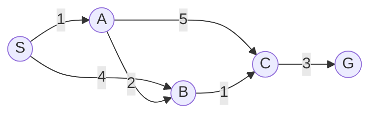

<!-- File: docs/ait2004-co-so-tri-tue-nhan-tao/00-muc-luc.md -->

# Mục lục ôn tập — AIT2004 Cơ sở Trí tuệ nhân tạo

Bộ tài liệu ôn tập chia theo từng chương, bám sát khung chương trình AIT2004 (17 bài chính + 4 bài bổ sung). Mỗi chương là một file `.md` độc lập, có thể đọc rời hoặc lắp trực tiếp vào cấu trúc `docs/` của VitePress.

::: tip Cách dùng
Những chương đã có link bên dưới là **đã hoàn thành đầy đủ** (ẩn dụ Feynman + sơ đồ Mermaid + bảng chạy từng bước + code C++ + bẫy thi). Chương chưa có link là **chưa biên soạn** — nói ở cuối trang xem chương nào sẽ làm tiếp theo.
:::

## Phần I — Giải quyết vấn đề bằng tìm kiếm

| Bài | Chủ đề | Trạng thái |
|---|---|---|
| 1 | Giới thiệu & Tác tử thông minh | ⏳ chưa làm |
| 2 | [Tìm kiếm mù](./02-tim-kiem-mu.md) (BFS, DFS, UCS, IDS) | ✅ xong |
| 3 | [Tìm kiếm dựa trên kinh nghiệm](./03-tim-kiem-kinh-nghiem.md) (Greedy, A\*, Admissible/Consistent, IDA\*) | ✅ xong |
| 4 | [Tìm kiếm có đối thủ](./04-tim-kiem-doi-khang.md) (Minimax, Alpha–Beta) | ✅ xong |
| Bổ sung 5 | Bài toán thoả mãn ràng buộc (CSP) | ⏳ chưa làm |

## Phần II — Ra quyết định dưới sự không chắc chắn

| Bài | Chủ đề | Trạng thái |
|---|---|---|
| 5 | Tính không chắc chắn và lợi ích (Utility Theory) | ⏳ chưa làm |
| 6 | Quá trình quyết định Markov I (MDP — Value/Policy Iteration) | ⏳ chưa làm |
| 7 | Quá trình quyết định Markov II | ⏳ chưa làm |
| 8 | Học tăng cường I (Reinforcement Learning) | ⏳ chưa làm |
| 9 | Học tăng cường II | ⏳ chưa làm |

## Phần III — Học máy

| Bài | Chủ đề | Trạng thái |
|---|---|---|
| 10 | Học máy — Naive Bayes | ⏳ chưa làm |
| 11 | Học máy — Perceptron & Hồi quy Logistic | ⏳ chưa làm |
| 12 | Mạng nơ-ron I | ⏳ chưa làm |
| 13 | Mạng nơ-ron II | ⏳ chưa làm |

## Phần IV — Logic, tri thức và suy luận xác suất

| Bài | Chủ đề | Trạng thái |
|---|---|---|
| Bổ sung 1 | Khái niệm về logic mệnh đề | ✅ gộp trong Chương 14 |
| Bổ sung 2 | Logic vị từ | ✅ gộp trong Chương 14 |
| 14 | [Logic & Biểu diễn tri thức](./14-logic-bieu-dien-tri-thuc.md) (FOL, Suy luận, Ontology) | ✅ xong |
| Bổ sung 3 | Giới thiệu Prolog | ⏳ chưa làm |
| 16 | Mạng Bayes I | ⏳ chưa làm |
| 17 | Suy luận bằng mạng Bayes II | ⏳ chưa làm |

---

## Đồ thị mẫu dùng xuyên suốt các chương tìm kiếm

Để việc so sánh giữa các chương nhất quán, Chương 2–4 đều dùng lại **cùng một đồ thị trạng thái** ($S,A,B,C,G$) với đáp án tối ưu đã biết trước ($=7$) — giúp thấy rõ BFS/DFS/Greedy sai ở đâu, còn UCS/A\* đúng như thế nào.

## Kế hoạch biên soạn tiếp theo

Thứ tự đề xuất cho các chương còn thiếu (theo đúng mạch chương trình):

1. **Chương 1** — Giới thiệu & Tác tử thông minh *(ngắn, làm nhanh để không đứt mạch đầu môn)*
2. **Chương 5 (CSP)** — nối liền mạch tìm kiếm trước khi rẽ sang xác suất
3. **Chương 5–9** — Utility Theory, MDP I–II, Reinforcement Learning I–II
4. **Chương 10–13** — Naive Bayes, Logistic Regression, Neural Networks I–II
5. **Chương 16–17** — Mạng Bayes I–II
6. **Bổ sung 3** — Prolog

::: warning Vì sao chia nhỏ thay vì làm một lần?
Mỗi chương đủ tiêu chuẩn (ẩn dụ + Mermaid + dry-run + code + bẫy thi) tốn dung lượng tương đương một bài giảng ~600–900 dòng. Làm cả 17+4 bài cùng lúc trong một lần trả lời sẽ buộc phải cắt giảm chất lượng từng chương. Nói cho tôi biết bạn muốn ưu tiên nhóm nào trước (ví dụ "làm tiếp MDP + Reinforcement Learning trước vì tuần sau kiểm tra"), tôi sẽ tập trung vào đúng nhóm đó.
:::
