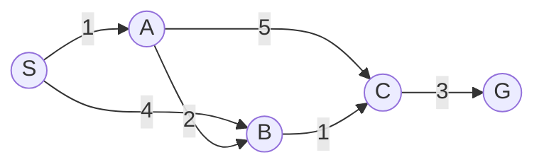
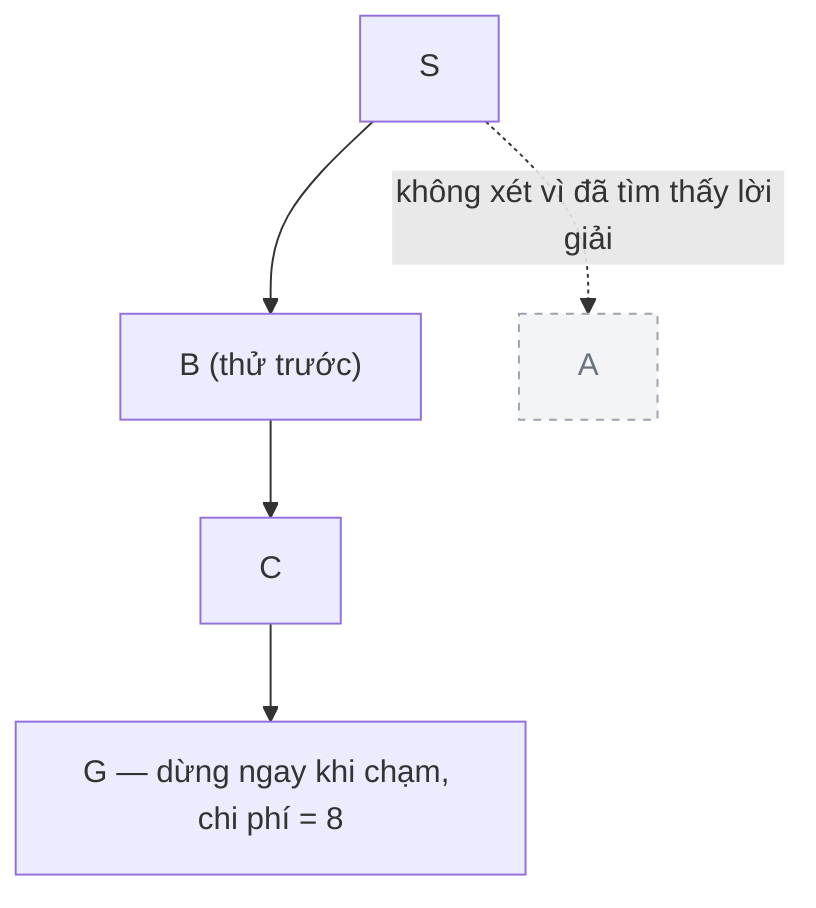

<!-- File: docs/ait2004-co-so-tri-tue-nhan-tao/02-tim-kiem-mu.md -->

# Chương 2 — Tìm kiếm mù (Uninformed / Blind Search)

*Bài 2 · AIT2004 Cơ sở Trí tuệ nhân tạo — Nguồn: Russell & Norvig, "Artificial Intelligence: A Modern Approach", chương 3.3–3.4; Cormen et al., "Introduction to Algorithms", chương 20 (BFS/DFS) & 22 (Dijkstra).*

← [Chương 1: Giới thiệu & Tác tử](./01-gioi-thieu-tac-tu.md) · [Mục lục](./00-muc-luc.md) · [Chương 3: Tìm kiếm kinh nghiệm →](./03-tim-kiem-kinh-nghiem.md)

::: info Bài này ôn tập gì?
Bốn thuật toán "mù" (không biết đích ở đâu, chỉ biết cấu trúc đồ thị): **BFS, DFS, UCS (Uniform-Cost Search), IDS (Iterative Deepening Search)**. Đây là nền để hiểu vì sao Chương 3 cần "kinh nghiệm" ($h(n)$) — tìm kiếm mù không nhìn được tương lai, nên phải nở ra *mọi hướng* một cách máy móc.
:::

## 2.1 Đồ thị mẫu dùng xuyên suốt chương

Để tiện so sánh, ta dùng lại đúng đồ thị sẽ xuất hiện ở các chương sau (Chương 3, 4):



Chi phí tối ưu thật sự (đã tính ở Chương 3) là $S \to A \to B \to C \to G$ với tổng $= 7$. Ta sẽ xem BFS/DFS/UCS "mù" tới đâu so với con số 7 này.

## 2.2 Breadth-First Search (BFS) — lan toả theo từng lớp

::: tip Ẩn dụ
Thả một giọt mực vào ly nước: vết mực lan ra thành **từng vòng tròn đồng tâm cách đều nhau theo thời gian** — không quan tâm vòng nào "đặc" hay "loãng" (chi phí cạnh), chỉ quan tâm **số bước nhảy**.
:::

BFS dùng hàng đợi FIFO, mở rộng theo từng lớp (độ sâu) một. Trên đồ thị mẫu, giả sử tại mỗi đỉnh ta luôn duyệt cạnh theo thứ tự bảng trên (A trước B):

| Lớp | Đỉnh được khám phá | Hàng đợi FIFO |
|---|---|---|
| 0 | S | [S] |
| 1 | A, B (từ S) | [A, B] |
| 2 | C (từ A; B→C bị bỏ vì C đã khám phá) | [B, C] |
| 3 | G (từ C) | [C, G] → **dừng, thấy G** |

Đường tìm được: $S \to A \to C \to G$ (3 bước nhảy) — nhưng **chi phí thật** $= 1+5+3 = \mathbf{9}$, tệ hơn hẳn đáp án tối ưu 7!

::: danger Bẫy thi #1 — "BFS luôn tối ưu"
**Chỉ đúng khi mọi hành động có chi phí bằng nhau** (ví dụ đếm số bước trong mê cung lưới ô vuông). Khi trọng số cạnh khác nhau, BFS chỉ tối ưu về **số cạnh (hops)**, không tối ưu về **tổng chi phí**. Đây là lỗi sai phổ biến nhất khi sinh viên nhầm BFS với UCS.
:::

## 2.3 Depth-First Search (DFS) — lao thẳng tới cùng rồi mới lùi

::: tip Ẩn dụ
Đi trong mê cung bằng cách **luôn rẽ trái tới khi đâm tường**, hết đường thì lùi lại ngã rẽ gần nhất và thử hướng khác. Không hề "ngó" xem hướng kia có thơm hơn hay gần đích hơn.
:::

Giả sử tại S ta ưu tiên thử cạnh **B trước A**:

$$
S \to B \to C \to G
$$

DFS dừng ngay khi chạm G — chi phí $= 4+1+3 = \mathbf{8}$, cũng không tối ưu, và **kết quả phụ thuộc hoàn toàn vào thứ tự duyệt cạnh** mà ta chọn lúc cài đặt (đổi thứ tự A/B sẽ ra một đường khác).



::: warning Bẫy thi #2 — DFS trong không gian có chu trình/vô hạn
DFS **không đầy đủ (incomplete)** nếu không gian trạng thái có chu trình mà không lưu tập đã thăm, hoặc có nhánh sâu vô hạn — nó có thể "lạc" mãi trong một nhánh không dẫn tới đích. Phải luôn giữ tập `visited`/`closed` khi cài đặt trên đồ thị (khác cây).
:::

## 2.4 Uniform-Cost Search (UCS) — "BFS nhưng theo thời gian thật"

::: tip Ẩn dụ
Vẫn là giọt mực lan trong nước, nhưng bây giờ mỗi hướng lan với **tốc độ khác nhau** (ứng với trọng số cạnh) — vết mực vẫn lan thành các "đường đồng mức" tròn đều, chỉ có điều đo bằng *thời gian trôi qua thật sự*, không phải số vòng.
:::

UCS chính là hàm $f(n) = g(n)$ (không có $h$) — về bản chất là **thuật toán Dijkstra** (xem Chương 3, mục 2.3, và CLRS chương 22.3). Chạy trên đồ thị mẫu:

| Bước | Đỉnh mở rộng | $g$ | Open (theo $g$) |
|---|---|---|---|
| 1 | S | 0 | A(1), B(4) |
| 2 | A | 1 | B(3, cập nhật), C(6) |
| 3 | B | 3 | C(4, cập nhật) |
| 4 | C | 4 | G(7) |
| 5 | **G** | 7 | ∅ → dừng khi **lấy G ra khỏi hàng đợi** |

Kết quả: $S \to A \to B \to C \to G$, chi phí $= \mathbf{7}$ — **tối ưu**, đúng như UCS được chứng minh là luôn tối ưu (miễn chi phí bước $\ge \epsilon > 0$).

::: danger Bẫy thi #3 — Điều kiện dừng của UCS/A*
Giống hệt bẫy ở A\* (Chương 3): UCS chỉ được dừng khi **lấy đích ra khỏi hàng đợi ưu tiên**, không phải khi đích *xuất hiện* trong hàng đợi lần đầu.
:::

## 2.5 Iterative Deepening Search (IDS) — "DFS lặp lại nhiều lần, sâu dần"

::: tip Ẩn dụ
Giống việc bạn dò tìm chìa khoá bị rơi trong sân tối bằng đèn pin có tầm chiếu **tăng dần từng mét một**: mỗi lượt soi tới đúng bán kính giới hạn rồi tắt đèn, bật lại với bán kính xa hơn. Có vẻ lãng phí (soi lại vùng gần nhiều lần), nhưng tổng công sức vẫn cùng cấp độ lớn với soi một lần bán kính xa nhất.
:::

IDS = DFS có giới hạn độ sâu (Depth-Limited Search), tăng dần giới hạn $\ell = 0, 1, 2, \ldots$ cho tới khi tìm thấy đích.

| Vòng lặp | Giới hạn độ sâu $\ell$ | Kết quả |
|---|---|---|
| 1 | 0 | Chỉ thấy S, chưa phải đích → thất bại |
| 2 | 1 | Thấy A, B (con của S) → chưa phải đích → thất bại |
| 3 | 2 | Thấy thêm B(qua A), C(qua A) → nếu đích ở đây thì dừng, nhưng G chưa xuất hiện → thất bại |
| 4 | 3 | Thấy thêm C(qua B), G(qua C, qua A) → **tìm thấy G** |

::: tip Vì sao không tốn nhiều thời gian hơn BFS bao nhiêu?
Số nút ở lớp gần đáy cây luôn áp đảo số nút ở các lớp phía trên (tỉ lệ $b^d$ so với $b^{d-1}, b^{d-2},\ldots$), nên việc soi lại các lớp nông nhiều lần chỉ cộng thêm một hằng số nhân, **không đổi bậc độ phức tạp**: IDS vẫn là $O(b^d)$ về thời gian, giống BFS, nhưng chỉ tốn $O(bd)$ bộ nhớ — bằng DFS!
:::

## 2.6 Bảng so sánh 4 thuật toán (thuộc lòng trước khi thi)

| Thuật toán | Đầy đủ? | Tối ưu? | Thời gian | Bộ nhớ |
|---|---|---|---|---|
| **BFS** | Có (nếu $b$ hữu hạn) | Chỉ khi chi phí bước đồng nhất | $O(b^d)$ | $O(b^d)$ |
| **DFS** | Không (đồ thị vô hạn/có chu trình); Có nếu không gian hữu hạn không lặp | Không | $O(b^m)$ | $O(bm)$ |
| **UCS** | Có (chi phí bước $\ge \epsilon>0$) | **Có** | $O(b^{1+\lfloor C^*/\epsilon\rfloor})$ | tương tự thời gian |
| **IDS** | Có | Chỉ khi chi phí bước đồng nhất | $O(b^d)$ | $O(bd)$ |

($b$ = hệ số nhánh, $d$ = độ sâu lời giải nông nhất, $m$ = độ sâu tối đa không gian trạng thái, $C^*$ = chi phí lời giải tối ưu.)

## 2.7 Code C++ tổng hợp

```cpp
#include <vector>
#include <queue>
#include <stack>
#include <unordered_set>
using namespace std;

struct Edge { int to; int cost; };
using Graph = vector<vector<Edge>>;

// ---------- BFS: chỉ đếm số cạnh, KHÔNG quan tâm trọng số ----------
vector<int> bfs(int start, int goal, const Graph& g) {
    queue<int> q;
    vector<int> parent(g.size(), -1);
    vector<bool> visited(g.size(), false);
    q.push(start); visited[start] = true;

    while (!q.empty()) {
        int u = q.front(); q.pop();
        if (u == goal) break;                 // BFS: đủ điều kiện dừng ngay khi PHÁT HIỆN đích
        for (const Edge& e : g[u]) {
            if (!visited[e.to]) {
                visited[e.to] = true;          // đánh dấu ngay khi đưa vào hàng đợi, tránh trùng lặp
                parent[e.to] = u;
                q.push(e.to);
            }
        }
    }
    vector<int> path;
    for (int v = goal; v != -1; v = parent[v]) path.push_back(v);
    reverse(path.begin(), path.end());
    return path;
}

// ---------- DFS đệ quy: chú ý stack overflow nếu đồ thị quá sâu ----------
bool dfs(int u, int goal, const Graph& g, vector<bool>& visited, vector<int>& path) {
    visited[u] = true;
    path.push_back(u);
    if (u == goal) return true;
    for (const Edge& e : g[u]) {
        if (!visited[e.to] && dfs(e.to, goal, g, visited, path)) return true;
    }
    path.pop_back();                           // quay lui khi nhánh này không dẫn tới đích
    return false;
}

// ---------- UCS: giống hệt Dijkstra, xem chi tiết ở Chương 3 (A*, h=0) ----------
// (dùng lại aStarSearch(start, goal, adj, /*h=*/vector<int>(n, 0)) từ Chương 3)

// ---------- IDS: lặp lại Depth-Limited DFS với giới hạn tăng dần ----------
bool depthLimitedDFS(int u, int goal, int limit, const Graph& g, vector<int>& path) {
    path.push_back(u);
    if (u == goal) return true;
    if (limit == 0) { path.pop_back(); return false; }   // hết ngân sách độ sâu -> cắt
    for (const Edge& e : g[u]) {
        // Không cần bảng visited toàn cục vì giới hạn độ sâu đã tự chặn chu trình vô hạn
        if (depthLimitedDFS(e.to, goal, limit - 1, g, path)) return true;
    }
    path.pop_back();
    return false;
}

vector<int> iterativeDeepeningSearch(int start, int goal, const Graph& g, int maxDepth) {
    for (int limit = 0; limit <= maxDepth; ++limit) {
        vector<int> path;
        if (depthLimitedDFS(start, goal, limit, g, path)) return path;
    }
    return {}; // không tìm thấy trong giới hạn cho phép
}
```

## 2.8 Bảng bẫy thi chương này

| # | Bẫy | Ghi nhớ |
|---|---|---|
| 1 | BFS luôn tối ưu | Chỉ đúng khi chi phí mỗi bước bằng nhau |
| 2 | DFS luôn đầy đủ | Sai trên không gian vô hạn/có chu trình nếu không lưu `visited` |
| 3 | UCS dừng khi thấy đích trong Open | Phải dừng khi **lấy đích ra khỏi** hàng đợi |
| 4 | IDS lãng phí vì soi lại nhiều lần | Vẫn cùng bậc $O(b^d)$ với BFS, nhưng bộ nhớ chỉ $O(bd)$ |

## Tài liệu tham khảo

- Russell & Norvig, *AIMA* 4th ed., mục 3.4 (Uninformed Search Strategies).
- Cormen et al., *Introduction to Algorithms* 4th ed., chương 20 (BFS/DFS) và 22.3 (Dijkstra ≈ UCS).
- Bài giảng gốc AIT2004 — [Bài 2: Tìm kiếm mù](https://courses.iaidev.com/ai-foundations/2627-1/lecture-lec-02-tim-kiem-mu.html).
- VisuAlgo — [visualgo.net/en/dfsbfs](https://visualgo.net/en/dfsbfs): minh hoạ trực quan BFS/DFS trên đồ thị.

---
← [Chương 1](./01-gioi-thieu-tac-tu.md) · [Mục lục](./00-muc-luc.md) · [Chương 3 →](./03-tim-kiem-kinh-nghiem.md)
