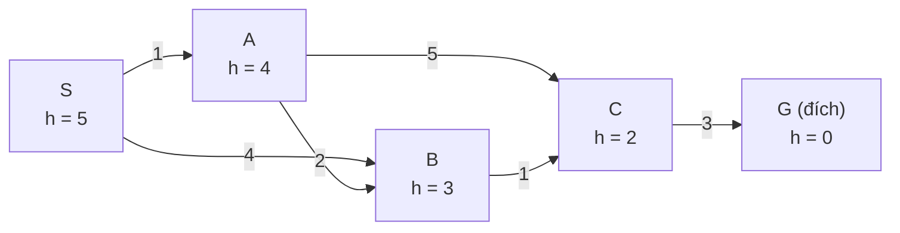
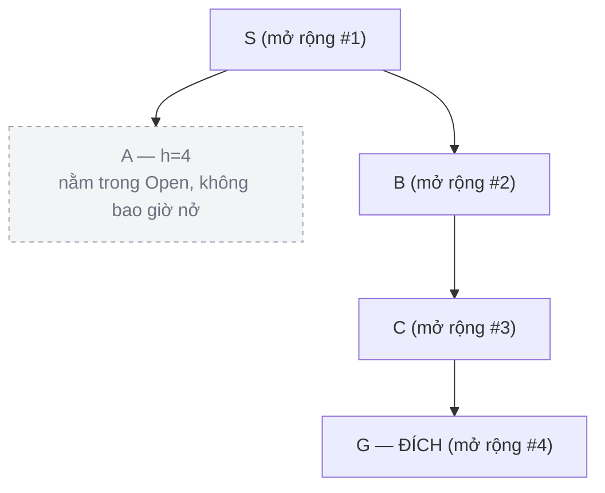
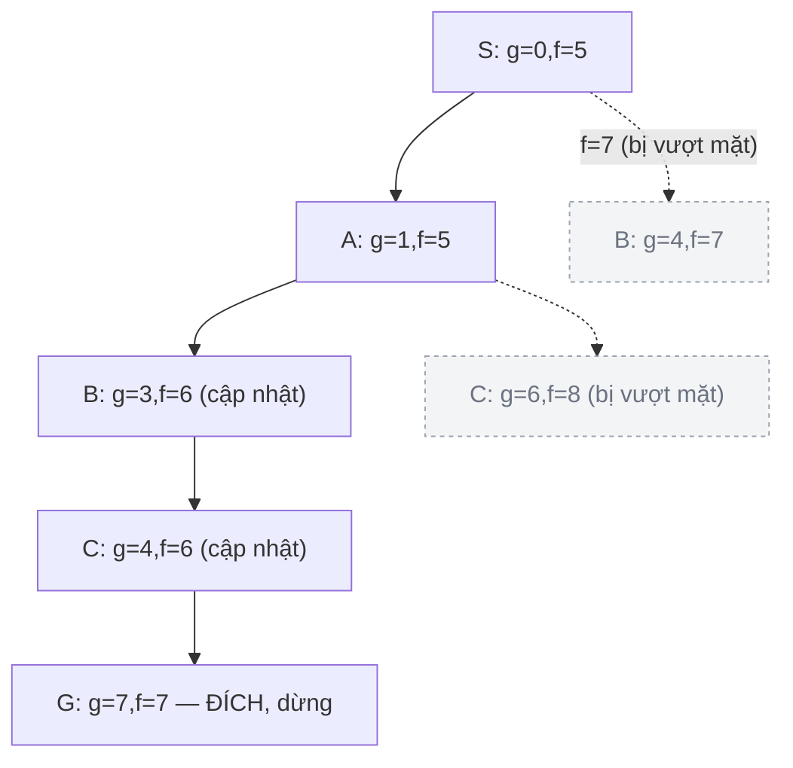
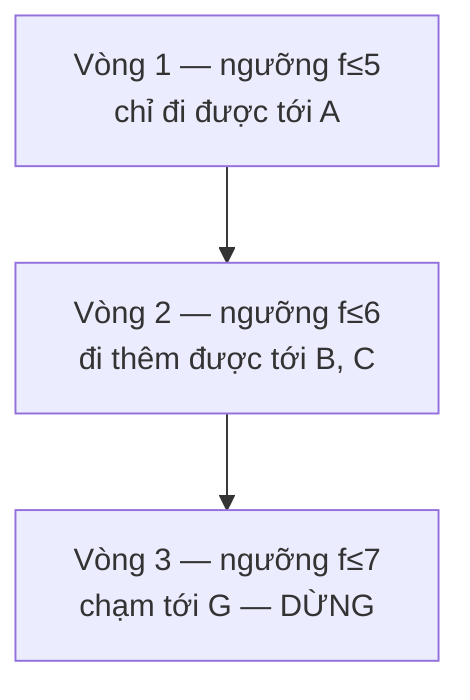

<!-- File: docs/ait2004-co-so-tri-tue-nhan-tao/03-tim-kiem-kinh-nghiem.md -->

# Chương 3 — Tìm kiếm dựa trên kinh nghiệm (Heuristic Search)

*Bài 3 · AIT2004 Cơ sở Trí tuệ nhân tạo — Nguồn: Russell & Norvig, "AIMA" 4th ed., chương 3.5–3.6; Cormen et al., "Introduction to Algorithms", chương 22.3 (Dijkstra).*

← [Chương 2: Tìm kiếm mù](./02-tim-kiem-mu.md) · [Mục lục](./00-muc-luc.md) · [Chương 4: Tìm kiếm đối kháng →](./04-tim-kiem-doi-khang.md)

::: info Bài này ôn tập gì?
1. **Tìm kiếm ăn tham (Greedy Best-First)** và **A\*** — dùng "kinh nghiệm" (heuristic) để đi nhanh hơn tìm kiếm mù ở Chương 2.
2. **Heuristic chấp nhận được (admissible)** và **nhất quán (consistent)** — điều kiện để A\* không "nói dối" mình.
3. **IDA\*** — phiên bản tiết kiệm bộ nhớ của A\*.
:::

## 3.0 Đồ thị mẫu (giống hệt Chương 2, có thêm giá trị $h$)



Chi phí tối ưu thật: $S \to A \to B \to C \to G = 7$. Ở Chương 2, BFS/DFS lần lượt trả về 9 và 8, chỉ UCS ($=$ A\* với $h{=}0$) tìm đúng 7. Câu hỏi của chương này: **thêm $h(n)$ vào có giúp A\* nhanh hơn UCS mà vẫn giữ được đáp án 7 không?**

## 3.1 Tìm kiếm ăn tham (Greedy Best-First Search)

::: tip Ẩn dụ
Một chú chó đánh hơi mồi: nó luôn lao về hướng có **mùi nồng nhất ngay lúc này** ($h(n)$ nhỏ nhất), bất kể quãng đường nó *đã* chạy dài hay ngắn. Nếu có một ngõ cụt thơm phức ngay đầu ngõ, chú chó vẫn lao vào — rồi phải quay ra, mất thời gian hơn là đi đường vòng nhưng thẳng tắp.
:::

**Hàm đánh giá:** chỉ nhìn tương lai, bỏ hoàn toàn quá khứ:

$$
f(n) = h(n)
$$

### Chạy từng bước

| Bước | Đỉnh mở rộng | $h(n)$ | Hàng đợi (Open, sắp theo $h$) | Tập đóng (Closed) |
|---|---|---|---|---|
| 1 | S | 5 | A(4), B(3) | {S} |
| 2 | B | 3 | A(4), C(2) | {S, B} |
| 3 | C | 2 | A(4), G(0) | {S, B, C} |
| 4 | **G** | 0 | A(4) — không bao giờ được xét | {S, B, C, G} → **DỪNG** |



Kết quả: đường đi $S \to B \to C \to G$, chi phí $4+1+3 = \mathbf{8}$ — **không tối ưu** (đáp án đúng là 7)! Vì $h(B)=3 < h(A)=4$, Greedy chọn B trước mà không hề biết cạnh $S \to B$ nặng tới 4, trong khi đi qua A chỉ tốn 1.

::: warning Bẫy thi hay gặp
Sinh viên hay nhầm "Greedy nhanh nên chắc cũng tối ưu". **Sai.** Greedy chỉ đảm bảo **đầy đủ** (complete) trên không gian hữu hạn, **không đảm bảo tối ưu**, và trường hợp xấu nhất độ phức tạp giống hệt DFS bị dẫn dắt tồi: $O(b^m)$.
:::

### Code C++

```cpp
#include <queue>
#include <vector>
#include <unordered_map>
using namespace std;

struct Edge { int to; int cost; };

struct GreedyCompare {
    bool operator()(const pair<int,int>& a, const pair<int,int>& b) const {
        return a.first > b.first; // đảo dấu để priority_queue thành min-heap theo h(n)
    }
};

vector<int> greedyBestFirst(int start, int goal,
                             const vector<vector<Edge>>& adj,
                             const vector<int>& h) {
    priority_queue<pair<int,int>, vector<pair<int,int>>, GreedyCompare> open;
    unordered_map<int,int> parent;
    vector<bool> closed(adj.size(), false);

    open.push({h[start], start});          // f(n) = h(n), không cộng g(n)
    parent[start] = -1;

    while (!open.empty()) {
        auto [hv, u] = open.top(); open.pop();
        if (closed[u]) continue;
        closed[u] = true;

        if (u == goal) {                   // dừng NGAY khi lấy ra khỏi hàng đợi
            vector<int> path;
            for (int v = u; v != -1; v = parent[v]) path.push_back(v);
            reverse(path.begin(), path.end());
            return path;
        }
        for (const Edge& e : adj[u]) {
            if (!closed[e.to]) {
                parent[e.to] = u;
                open.push({h[e.to], e.to}); // CHỈ dùng h(e.to), quên hẳn quãng đường đã đi
            }
        }
    }
    return {};
}
```

## 3.2 Tìm kiếm A\*

::: tip Ẩn dụ
Vẫn là người giao hàng, nhưng lần này họ **cộng dồn** hai thứ: quãng đường đã đạp xe ($g$) *và* ước lượng quãng đường còn lại ($h$). A\* = UCS (công bằng, biết quá khứ) + Greedy (nhanh nhạy, biết tương lai).
:::

$$
f(n) = g(n) + h(n)
$$

### Chạy từng bước

| Bước | Đỉnh mở rộng | $g$ | $h$ | $f=g+h$ | Open (cập nhật) | Closed |
|---|---|---|---|---|---|---|
| 1 | S | 0 | 5 | 5 | A(f=5), B(f=7) | {S} |
| 2 | A | 1 | 4 | 5 | B(f=**6**, cập nhật vì $1{+}2{+}3=6 < 7$), C(f=8) | {S, A} |
| 3 | B | 3 | 3 | 6 | C(f=**6**, cập nhật vì $3{+}1{+}2=6 < 8$) | {S, A, B} |
| 4 | C | 4 | 2 | 6 | G(f=7) | {S, A, B, C} |
| 5 | **G** | 7 | 0 | 7 | ∅ | → **DỪNG, lấy G ra khỏi hàng đợi** |



Kết quả: $S \to A \to B \to C \to G$, chi phí $= 7$ — **đúng bằng tối ưu**, và mở rộng ít đỉnh trùng lặp hơn UCS thuần (nhờ $h$ "hướng" tìm kiếm về phía G).

::: danger Bẫy thi #1 — "Thấy đích trong hàng đợi là dừng luôn"
**Sai.** A\* chỉ được phép báo cáo lời giải khi **lấy đích ra khỏi hàng đợi** (tức đích có $f$ nhỏ nhất trong Open), *không* phải ngay khi đích *xuất hiện* trong Open. Nếu dừng sớm ngay khi thấy đích, thuật toán có thể trả về một đường đi không tối ưu.
:::

### Vì sao A\* tối ưu? (khi $h$ chấp nhận được, tìm kiếm trên **cây**)

Gọi $C^*$ là chi phí tối ưu thật. Giả sử A\* mở rộng đỉnh đích $B$ không tối ưu trước đỉnh đích tối ưu $A$. Khi đó tồn tại một đỉnh $n$ trên đường đi tối ưu tới $A$ còn nằm trong hàng đợi. Ta có:

$$
f(n) = g(n) + h(n) \le g(n) + h^*(n) = g^*(A) = f(A) \qquad \text{(vì } h \text{ chấp nhận được)}
$$

$$
f(A) = g(A) \le g(B) \le f(B) \qquad \text{(vì } h(B)=0 \text{ tại đích, } g(A)=C^* \le g(B))
$$

Suy ra $f(n) \le f(A) \le f(B)$ → mọi tổ tiên của $A$ (và chính $A$) luôn được mở rộng **trước** $B$ → mâu thuẫn với giả thiết. Vậy A\* trên cây luôn trả về lời giải tối ưu nếu $h$ chấp nhận được. $\blacksquare$

::: info Đường đồng mức (contour)
UCS tạo ra các vòng tròn đồng tâm quanh điểm xuất phát (vì $h=0$), còn A\* với heuristic tốt sẽ "kéo dài" các đường đồng mức đó về phía đích, khiến vùng phải quét hẹp hơn hẳn.
:::

### Mở rộng: A\* khi $h = 0$ chính là thuật toán Dijkstra (CLRS)

Khi bỏ hẳn heuristic ($h(n) \equiv 0$), A\* suy biến thành UCS — về bản chất là **thuật toán Dijkstra** kinh điển (Cormen, Leiserson, Rivest, Stein, chương 22.3): thay hàng đợi FIFO của BFS bằng một **hàng đợi ưu tiên tối thiểu** khoá theo $g(n)$, lặp `EXTRACT-MIN` rồi "nới lỏng" (relax) các cạnh liền kề.

| Cách cài Open | Độ phức tạp Dijkstra / UCS |
|---|---|
| Mảng thường (duyệt tuyến tính tìm min) | $O(V^2)$ |
| Heap nhị phân (`std::priority_queue`) | $O((V+E)\log V)$ |
| Fibonacci heap | $O(V\log V + E)$ |

::: tip Mẹo nhớ nhanh
"A\* = Dijkstra được đeo thêm la bàn." Nếu la bàn đó không bao giờ chỉ sai đường (**admissible**), thì đeo la bàn chỉ giúp đi *nhanh hơn*, không bao giờ làm bạn đi *sai đường*.
:::

### Code C++

```cpp
#include <queue>
#include <vector>
#include <unordered_map>
#include <limits>
using namespace std;

struct AStarNode { int f, g, id; };
struct AStarCompare {
    bool operator()(const AStarNode& a, const AStarNode& b) const {
        return a.f > b.f; // min-heap theo f = g + h
    }
};

vector<int> aStarSearch(int start, int goal,
                         const vector<vector<Edge>>& adj,
                         const vector<int>& h) {
    priority_queue<AStarNode, vector<AStarNode>, AStarCompare> open;
    vector<int> bestG(adj.size(), numeric_limits<int>::max());
    unordered_map<int,int> parent;
    vector<bool> closed(adj.size(), false);

    bestG[start] = 0;
    open.push({h[start], 0, start});

    while (!open.empty()) {
        AStarNode cur = open.top(); open.pop();
        if (closed[cur.id]) continue;      // bản ghi cũ, đã có bản tốt hơn -> bỏ qua
        if (cur.id == goal) {              // CHỈ dừng khi lấy đích ra khỏi hàng đợi
            vector<int> path;
            for (int v = cur.id; ; v = parent[v]) {
                path.push_back(v);
                if (v == start) break;
            }
            reverse(path.begin(), path.end());
            return path;
        }
        closed[cur.id] = true;

        for (const Edge& e : adj[cur.id]) {
            int newG = cur.g + e.cost;
            if (newG < bestG[e.to]) {      // tìm được đường rẻ hơn tới e.to
                bestG[e.to] = newG;
                parent[e.to] = cur.id;
                open.push({newG + h[e.to], newG, e.to}); // đẩy bản ghi MỚI, không sửa bản cũ
            }
        }
    }
    return {};
}
```

::: info Vì sao code không "sửa" phần tử cũ trong hàng đợi?
`std::priority_queue` của C++ không hỗ trợ `decrease-key`. Kỹ thuật phổ biến là đẩy thêm một bản ghi mới rẻ hơn, rồi khi lấy ra một bản ghi mà đỉnh đó **đã đóng**, ta bỏ qua nó — đây là "lazy deletion", cách cài đặt thực tế phổ biến nhất cho A\*/Dijkstra.
:::

## 3.3 Heuristic: Chấp nhận được (Admissible) và Nhất quán (Consistent)

::: tip Ẩn dụ
- **Chấp nhận được:** một hướng dẫn viên **lạc quan nhưng không bao giờ nói dối theo hướng tệ hơn** — có thể đoán quãng đường còn lại *ngắn hơn* thực tế, nhưng tuyệt đối không đoán *dài hơn*.
- **Nhất quán:** phiên bản chặt chẽ hơn — lạc quan một cách **hợp lý ở từng bước** (giống bất đẳng thức tam giác: đi tắt không bao giờ dài hơn đi vòng qua đỉnh trung gian).
:::

**Admissible:** với mọi đỉnh $n$: $\quad 0 \le h(n) \le h^*(n)$ ($h^*(n)$ = chi phí thật rẻ nhất từ $n$ tới đích).

**Consistent:** với mọi đỉnh $n$, đỉnh con $n'$ qua hành động chi phí $c(n,a,n')$: $\quad h(n) \le c(n,a,n') + h(n')$, và $h(\text{đích})=0$.

**Quan hệ:** *Nhất quán $\Rightarrow$ Chấp nhận được* (chiều ngược lại không đúng). Vì consistent nên $f(n)=g(n)+h(n)$ **không bao giờ giảm** dọc theo một đường đi — đây là lý do A\* trên **đồ thị** (có tập đóng, không mở lại) chỉ tối ưu khi $h$ nhất quán.

### Kiểm tra heuristic đang dùng

| Cạnh $n \to n'$ | $c(n,n')$ | $h(n)$ | $c + h(n')$ | Nhất quán? |
|---|---|---|---|---|
| $S\to A$ | 1 | 5 | $1+4=5$ | ✅ |
| $S\to B$ | 4 | 5 | $4+3=7$ | ✅ |
| $A\to B$ | 2 | 4 | $2+3=5$ | ✅ |
| $A\to C$ | 5 | 4 | $5+2=7$ | ✅ |
| $B\to C$ | 1 | 3 | $1+2=3$ | ✅ |
| $C\to G$ | 3 | 2 | $3+0=3$ | ✅ |

→ Heuristic $(5,4,3,2,0)$ vừa admissible vừa consistent — đó là lý do A\* ở mục 3.2 cho kết quả tối ưu ngay lần đầu.

### Bẫy thi #2 — Admissible nhưng KHÔNG consistent làm A\* trên đồ thị sai

Đổi $h(A)$ từ 4 thành **6** (vẫn admissible vì $6 \le h^*(A){=}6$), giữ nguyên các giá trị còn lại. Kiểm tra cạnh $A \to B$: $h(A)=6 \le 2+h(B)=5$? **Sai** ($6>5$) → không nhất quán.

Chạy A\* trên **đồ thị** (cài đặt "ngây thơ": đỉnh đã đóng thì không mở lại) với heuristic hỏng này:

| Bước | Đỉnh mở rộng | $g$ | $f$ | Ghi chú |
|---|---|---|---|---|
| 1 | S | 0 | 5 | sinh A(f=7), B(f=7) |
| 2 | **B** | 4 | 7 | (tie-break chọn B trước) → sinh C(g=5,f=7); **đóng B** |
| 3 | A | 1 | 7 | sinh lại B với $g=1+2=3 < 4$ — **nhưng B đã đóng nên bị loại bỏ!** |
| 4 | C | 5 | 7 | sinh G(g=8,f=8) |
| 5 | G | 8 | 8 | trả về đường $S{-}B{-}C{-}G$, chi phí **8** |

Kết quả: A\* báo cáo chi phí **8**, trong khi tối ưu thật là **7**. Đường rẻ hơn qua A bị bỏ lỡ chỉ vì B đã nằm trong tập đóng.

::: danger Ghi nhớ
- **A\* trên CÂY (không có tập đóng):** chỉ cần $h$ **admissible** là đủ để tối ưu.
- **A\* trên ĐỒ THỊ (có tập đóng, không mở lại):** cần $h$ **consistent** thì mới đảm bảo tối ưu.
- Khắc phục: chọn heuristic có tính consistent (thường tự nhiên khi $h$ xây từ "bài toán nới lỏng ràng buộc"), hoặc cho phép mở lại đỉnh đã đóng khi tìm được đường rẻ hơn.
:::

## 3.4 IDA\* (Iterative-Deepening A\*)

::: tip Ẩn dụ
A\* giữ *toàn bộ* các đỉnh đã và đang xét trong bộ nhớ. **IDA\*** giống việc đào **nhiều giếng nhỏ nông dần rồi sâu dần**: mỗi lượt chỉ đào tới một "ngưỡng $f$" nhất định; nếu chưa chạm nước, lấp lại và đào sâu hơn ở lượt sau — tốn công đào lại, nhưng gần như không tốn đất chứa (bộ nhớ).
:::

Ý tưởng: DFS có giới hạn — nhưng giới hạn là **ngưỡng chi phí $f=g+h$**, không phải độ sâu. Ngưỡng mới mỗi vòng = giá trị $f$ nhỏ nhất từng bị vượt quá ở vòng trước.

| Vòng lặp | Ngưỡng $f$ | Thứ tự duyệt DFS | Kết quả |
|---|---|---|---|
| 1 | $f(S){=}5$ | $S(5)\to A(5)\to$ *cắt* $B(6),C(8)\to$ quay lại $S\to$ *cắt* $B(7)$ | Không tìm thấy. Ngưỡng mới $=\min(6,8,7)=6$ |
| 2 | $6$ | $S(5)\to A(5)\to B(6)\to C(6)\to$ *cắt* $G(7)\to \ldots$ | Không tìm thấy. Ngưỡng mới $=7$ |
| 3 | $7$ | $S(5)\to A(5)\to B(6)\to C(6)\to G(7)$ ✅ | **Tìm thấy, chi phí tối ưu = 7** |



### Code C++

```cpp
#include <vector>
#include <limits>
using namespace std;

struct IDAStarResult { bool found; vector<int> path; };

int idaStarDFS(vector<int>& path, int g, int threshold, int goal,
                const vector<vector<Edge>>& adj, const vector<int>& h,
                bool& found) {
    int node = path.back();
    int f = g + h[node];
    if (f > threshold) return f;              // vượt ngưỡng -> báo hiệu để tính ngưỡng mới
    if (node == goal) { found = true; return -1; }

    int minExceeded = numeric_limits<int>::max();
    for (const Edge& e : adj[node]) {
        bool visited = false;
        for (int v : path) if (v == e.to) { visited = true; break; }
        if (visited) continue;

        path.push_back(e.to);
        int t = idaStarDFS(path, g + e.cost, threshold, goal, adj, h, found);
        if (found) return -1;
        minExceeded = min(minExceeded, t);
        path.pop_back();                      // quay lui — lý do IDA* chỉ tốn O(d) bộ nhớ
    }
    return minExceeded;
}

IDAStarResult idaStar(int start, int goal, const vector<vector<Edge>>& adj,
                       const vector<int>& h) {
    int threshold = h[start];
    vector<int> path{start};
    while (true) {
        bool found = false;
        int t = idaStarDFS(path, 0, threshold, goal, adj, h, found);
        if (found) return {true, path};
        if (t == numeric_limits<int>::max()) return {false, {}};
        threshold = t;
    }
}
```

::: warning Bẫy thi #3 — Nhầm IDA\* với "Iterative Deepening DFS thường"
IDS (Chương 2) tăng dần **độ sâu**. IDA\* tăng dần **ngưỡng $f=g+h$**. Nếu heuristic bằng 0 khắp nơi, IDA\* mới trùng với IDS. Số vòng lặp của IDA\* bị chặn trên bởi $C^*$ khi mọi $f$ là số nguyên — ví dụ 8-puzzle khó nhất cũng không quá 31 vòng lặp.
:::

## 3.5 Bảng bẫy thi chương này

| # | Bẫy | Ghi nhớ |
|---|---|---|
| 1 | Greedy tối ưu vì "nhanh" | Chỉ dùng $h(n)$, **không** đảm bảo tối ưu |
| 2 | Dừng A\* ngay khi thấy đích trong Open | Chỉ dừng khi **lấy đích ra khỏi** hàng đợi |
| 3 | Admissible đủ cho A\* trên đồ thị | Cần **consistent** nếu có tập đóng không mở lại |
| 4 | IDA\* = Iterative Deepening DFS | Ngưỡng là $f=g+h$, không phải độ sâu |

## Tài liệu tham khảo

- Russell & Norvig, *AIMA* 4th ed., mục 3.5 (Informed Search) & 3.6 (Heuristic Functions).
- Cormen et al., *Introduction to Algorithms* 4th ed., chương 22.3 (Dijkstra), chương 6 (heap & hàng đợi ưu tiên).
- Bài giảng gốc AIT2004 — [Bài 3: Tìm kiếm dựa trên kinh nghiệm](https://courses.iaidev.com/ai-foundations/2627-1/lecture-lec-03-tim-kiem-dua-tren-kinh-nghiem.html).
- Red Blob Games — [Introduction to A\*](https://www.redblobgames.com/pathfinding/a-star/introduction.html).
- GeeksforGeeks — [A\* Search Algorithm](https://www.geeksforgeeks.org/dsa/a-search-algorithm/).

---
← [Chương 2](./02-tim-kiem-mu.md) · [Mục lục](./00-muc-luc.md) · [Chương 4 →](./04-tim-kiem-doi-khang.md)
