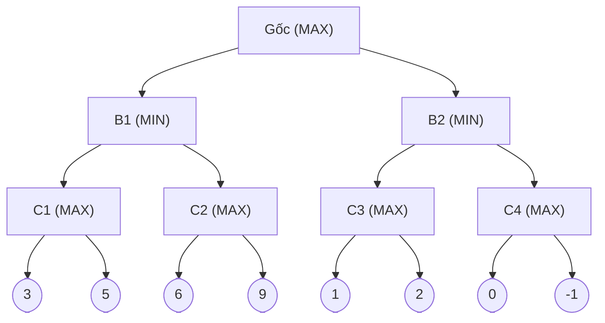
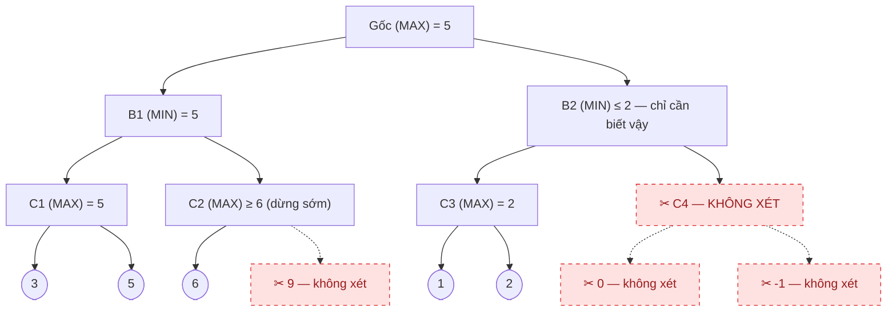

<!-- File: docs/ait2004-co-so-tri-tue-nhan-tao/04-tim-kiem-doi-khang.md -->

# Chương 4 — Tìm kiếm có đối thủ & Cây tìm kiếm trò chơi

*Bài 4 · AIT2004 Cơ sở Trí tuệ nhân tạo — Nguồn: Russell & Norvig, "AIMA" 4th ed., chương 5.2–5.3.*

← [Chương 3: Tìm kiếm kinh nghiệm](./03-tim-kiem-kinh-nghiem.md) · [Mục lục](./00-muc-luc.md) · [Chương 5: CSP →](./05-csp.md)

::: info Bài này ôn tập gì?
**Minimax** (chơi tối ưu chống một đối thủ luôn chơi tối ưu) và **cắt tỉa Alpha–Beta** (tăng tốc Minimax mà không đổi kết quả). Đây là nền tảng của mọi engine cờ vua/cờ vây kinh điển trước thời AlphaGo.
:::

## 4.1 Minimax

::: tip Ẩn dụ
Hai người chơi cờ ca-rô: bạn (MAX) luôn muốn điểm số cao nhất có thể; đối thủ (MIN) — người **không bao giờ mắc sai lầm** — luôn chọn nước đi khiến bạn tệ nhất có thể. Minimax là cách bạn "tưởng tượng" trước mọi nước đi của cả hai người, rồi lần ngược từ đáy cây lên để biết nước đi *tốt nhất trong tình huống xấu nhất*.
:::

$$
\text{Minimax}(s) =
\begin{cases}
\text{Utility}(s) & \text{nếu } s \text{ là trạng thái kết thúc} \\
\max_{a \in Actions(s)} \text{Minimax}(\text{Result}(s,a)) & \text{nếu đến lượt MAX} \\
\min_{a \in Actions(s)} \text{Minimax}(\text{Result}(s,a)) & \text{nếu đến lượt MIN}
\end{cases}
$$

### Cây trò chơi mẫu (dùng lại cho cả Alpha–Beta bên dưới)



**Tính ngược từ đáy lên:**
- $C_1=\max(3,5)=5$; $\ C_2=\max(6,9)=9$; $\ B_1=\min(5,9)=5$
- $C_3=\max(1,2)=2$; $\ C_4=\max(0,-1)=0$; $\ B_2=\min(2,0)=0$
- $\text{Gốc}=\max(B_1,B_2)=\max(5,0)=\mathbf{5}$ → chọn nhánh **B1**

### Code C++

```cpp
struct GameNode {
    bool isTerminal;
    int value;                 // chỉ có ý nghĩa nếu isTerminal = true
    vector<GameNode*> children;
};

int minimax(GameNode* node, bool maximizingPlayer) {
    if (node->isTerminal) return node->value;

    if (maximizingPlayer) {
        int v = INT_MIN;
        for (auto* child : node->children)
            v = max(v, minimax(child, false));   // lượt tiếp theo là MIN
        return v;
    } else {
        int v = INT_MAX;
        for (auto* child : node->children)
            v = min(v, minimax(child, true));    // lượt tiếp theo là MAX
        return v;
    }
}
```

::: warning Độ phức tạp
Giống hệt DFS: thời gian $O(b^m)$, bộ nhớ $O(bm)$ ($b$ = hệ số nhánh, $m$ = độ sâu cây trò chơi). Với cờ vua $b\approx35,\ m\approx100$ — **bất khả thi** nếu duyệt hết. Đây chính là động lực cho Alpha–Beta và hàm lượng giá cắt sâu.
:::

## 4.2 Cắt tỉa Alpha–Beta (Alpha–Beta Pruning)

::: tip Ẩn dụ
Bạn đang nếm một nồi canh chung để so xem canh nào mặn hơn. Vừa nếm muỗng đầu bạn đã thấy nồi B mặn hơn nồi A rồi — bạn **không cần nếm hết nồi B** để kết luận "sẽ chọn A". Alpha–Beta chính là việc dừng "nếm" (mở rộng) sớm ngay khi biết chắc nhánh đó **không thể** thay đổi quyết định cuối cùng.
:::

- $\alpha$ = giá trị tốt nhất mà **MAX** đảm bảo được dọc theo đường đi từ gốc tới hiện tại (cận dưới).
- $\beta$ = giá trị tốt nhất mà **MIN** đảm bảo được dọc theo đường đi từ gốc tới hiện tại (cận trên).
- **Cắt tỉa** khi $\alpha \ge \beta$: nhánh còn lại chắc chắn không ảnh hưởng tới quyết định ở gốc.

### Áp dụng lên chính cây ở mục 4.1



**Bảng theo dõi $\alpha,\beta$ theo đúng thứ tự duyệt trái→phải (DFS):**

| # | Nút đang xét | $(\alpha,\beta)$ nhận vào | Diễn biến | Hành động |
|---|---|---|---|---|
| 1 | Root (MAX) | $(-\infty,+\infty)$ | gọi B1 | mở rộng |
| 2 | B1 (MIN) | $(-\infty,+\infty)$ | gọi C1 | mở rộng |
| 3 | C1 (MAX) | $(-\infty,+\infty)$ | lá 3 → $v{=}3$; lá 5 → $v{=}5$ | C1 trả về **5** |
| 4 | B1 | — | nhận C1=5 → $\beta \leftarrow \min(\infty,5)=5$ | gọi C2 với $(-\infty, 5)$ |
| 5 | C2 (MAX) | $(-\infty, 5)$ | lá 6 → $v{=}6 \ge \beta(5)$ | **✂ CẮT** — bỏ qua lá 9; C2 trả về 6 |
| 6 | B1 | — | nhận C2=6 → $\min(5,6)=5$ | B1 trả về **5** |
| 7 | Root | — | nhận B1=5 → $\alpha \leftarrow \max(-\infty,5)=5$ | gọi B2 với $(5,+\infty)$ |
| 8 | B2 (MIN) | $(5,+\infty)$ | gọi C3 | mở rộng |
| 9 | C3 (MAX) | $(5,+\infty)$ | lá 1 → $v{=}1$; lá 2 → $v{=}2$ (không vượt $\beta$) | C3 trả về **2** |
| 10 | B2 | — | nhận C3=2 → $v{=}2 \le \alpha(5)$ | **✂ CẮT** — bỏ qua toàn bộ C4 (2 lá); B2 trả về 2 |
| 11 | Root | — | nhận B2=2 → $\max(5,2)=5$ | **Root = 5, chọn nhánh B1** |

→ Kết quả **giống hệt Minimax đầy đủ (giá trị gốc = 5)**, nhưng chỉ cần thăm **5/8** lá.

::: danger Bẫy thi #1 — "Alpha-Beta cho kết quả khác Minimax"
**Sai.** Alpha–Beta **không bao giờ** đổi giá trị minimax của gốc — nó chỉ bỏ qua những phần chắc chắn thừa. Nhưng đề hay hỏi xoáy: *giá trị của các nút bị cắt/nút trung gian có thể không chính xác* (chỉ là cận trên/cận dưới, ví dụ C2 chỉ biết "$\ge 6$" chứ không biết chính xác 9), nên **không được dùng giá trị của nút con bị cắt tỉa để so sánh hay suy luận thêm**.
:::

### Thứ tự duyệt quyết định hiệu quả cắt tỉa

Nếu đổi thứ tự lá của $C_2$ thành $(9,6)$ thay vì $(6,9)$: gặp lá 9 trước ($v{=}9\ge\beta(5)$) → cắt ngay từ lá đầu, tiết kiệm hơn nữa. Ngược lại nếu con **tệ nhất** (theo MIN) được xét trước thì **không cắt được gì cả**. Với thứ tự duyệt tối ưu, độ phức tạp giảm từ $O(b^m)$ xuống:

$$
O\!\left(b^{m/2}\right)
$$

tức hệ số nhánh hiệu dụng chỉ còn $\sqrt{b}$ — với cờ vua $b\approx35$ giảm còn $\approx6$: cùng thời gian, Alpha–Beta với thứ tự duyệt tốt tìm sâu **gấp đôi** Minimax thường.

::: tip Mẹo thi
Câu hỏi "cho cây X, hãy chỉ ra các nút bị cắt tỉa" — luôn duyệt **trái sang phải, từ trên xuống** (DFS tiền tự), cập nhật $\alpha$ ở nút MAX, cập nhật $\beta$ ở nút MIN, và chỉ cắt khi giá trị hiện tại của nút **vi phạm** cận đã nhận từ tổ tiên ($v\ge\beta$ ở nút MAX, $v\le\alpha$ ở nút MIN — KHÔNG so $\alpha$ với $\beta$ của cùng một nút cùng lúc).
:::

### Code C++

```cpp
int alphaBetaMax(GameNode* node, int alpha, int beta) {
    if (node->isTerminal) return node->value;
    int v = INT_MIN;
    for (auto* child : node->children) {
        v = max(v, alphaBetaMin(child, alpha, beta));
        if (v >= beta) return v;      // MIN ở trên sẽ không bao giờ chọn đường này -> cắt
        alpha = max(alpha, v);        // cập nhật cận dưới tốt nhất MAX đang có
    }
    return v;
}

int alphaBetaMin(GameNode* node, int alpha, int beta) {
    if (node->isTerminal) return node->value;
    int v = INT_MAX;
    for (auto* child : node->children) {
        v = min(v, alphaBetaMax(child, alpha, beta));
        if (v <= alpha) return v;     // MAX ở trên sẽ không bao giờ chọn đường này -> cắt
        beta = min(beta, v);          // cập nhật cận trên tốt nhất MIN đang có
    }
    return v;
}
// Gọi: alphaBetaMax(root, INT_MIN, INT_MAX);
```

### Khi cây quá sâu: hàm lượng giá & cắt độ sâu

Với trò chơi thật (cờ vua, cờ vây), ta không thể duyệt tới tận lá. Thay `Utility` bằng hàm lượng giá $\text{Eval}(s)$ áp dụng ở một độ sâu cắt (cutoff):

$$
\text{Eval}(s) = w_1 f_1(s) + w_2 f_2(s) + \dots + w_n f_n(s)
$$

(ví dụ cờ vua: $f_1$ = số Hậu trắng trừ Hậu đen, v.v.)

::: warning Hiệu ứng đường chân trời (horizon effect)
Nếu cắt ở độ sâu cố định, chương trình có thể bị đối thủ "câu giờ" bằng vài nước hy sinh vô nghĩa để đẩy một thất bại chắc chắn ra ngoài tầm nhìn. Khắc phục bằng **quiescence search** (chỉ dừng ở vị trí "yên tĩnh") hoặc **singular extension**.
:::

## 4.3 Bảng bẫy thi chương này

| # | Bẫy | Ghi nhớ |
|---|---|---|
| 1 | Alpha-Beta cho kết quả khác Minimax | Giá trị **gốc luôn giống hệt**; chỉ nút bị cắt là cận không chính xác |
| 2 | So $\alpha$ với $\beta$ sai chỗ | Cắt khi **giá trị đang tính** vi phạm cận **nhận từ tổ tiên** |
| 3 | Nghĩ thứ tự duyệt không ảnh hưởng | Thứ tự tối ưu cho $O(b^{m/2})$; thứ tự tệ = không cắt được gì |

## Tài liệu tham khảo

- Russell & Norvig, *AIMA* 4th ed., mục 5.2 (Minimax) & 5.3 (Alpha-Beta Tree Search).
- Bài giảng gốc AIT2004 — [Bài 4: Tìm kiếm có đối thủ](https://courses.iaidev.com/ai-foundations/2627-1/lecture-lec-04-tim-kiem-co-doi-thu.html).
- GeeksforGeeks — [Minimax & Alpha-Beta Pruning](https://www.geeksforgeeks.org/artificial-intelligence/alpha-beta-pruning-in-adversarial-search-algorithms/).
- MIT OCW — [6.034 Artificial Intelligence, Fall 2010](https://ocw.mit.edu/courses/6-034-artificial-intelligence-fall-2010/) (bài giảng video Adversarial Search).

---
← [Chương 3](./03-tim-kiem-kinh-nghiem.md) · [Mục lục](./00-muc-luc.md) · [Chương 5: CSP →](./05-csp.md)
