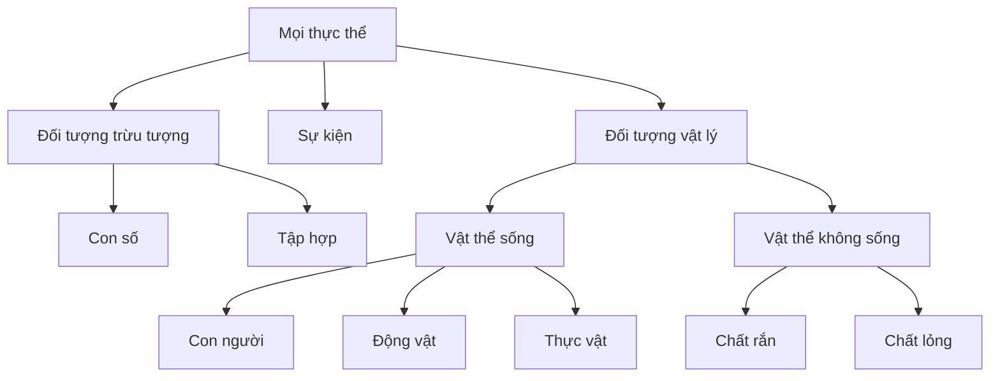
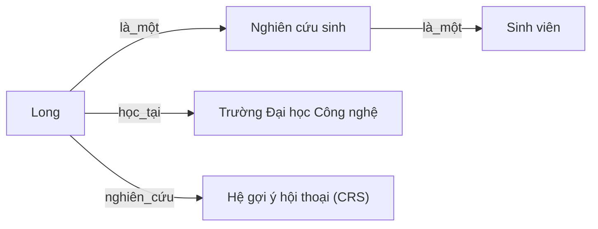

<!-- File: docs/ait2004-co-so-tri-tue-nhan-tao/14-logic-bieu-dien-tri-thuc.md -->

# Chương 14 — Logic & Biểu diễn tri thức

*Bài 14 (Logic) + Bài bổ sung 1–2 (Propositional/Predicate Logic) · AIT2004 — Nguồn: Russell & Norvig, "AIMA" 4th ed., chương 7 (Logical Agents), 8 (First-Order Logic), 10 (Knowledge Representation).*

← [Chương 4: Tìm kiếm đối kháng](./04-tim-kiem-doi-khang.md) · [Mục lục](./00-muc-luc.md) · [Chương 16: Mạng Bayes I →](./16-mang-bayes.md)

::: info Bài này ôn tập gì?
1. Vì sao **logic mệnh đề** không đủ mạnh → cần **logic vị từ bậc nhất (FOL)**.
2. Cú pháp, ngữ nghĩa, và **suy luận** trong FOL (hợp nhất hoá, Modus Ponens tổng quát).
3. **Ontology (bản thể luận)** và mạng ngữ nghĩa — cách tổ chức tri thức về cả thế giới.
:::

## 14.1 Vì sao logic mệnh đề chưa đủ?

::: tip Ẩn dụ
Logic mệnh đề giống một cuốn **sổ tay liệt kê từng sự thật rời rạc**: "Bình là sinh viên", "An là sinh viên", "Long là sinh viên"... Muốn nói "mọi sinh viên đều phải học Cơ sở Trí tuệ nhân tạo", ta phải chép lại quy tắc cho *từng người một* — không có cách nói "chung". Logic vị từ bậc nhất (FOL) giống việc được cấp thêm **đại từ và lượng từ** ("mọi", "có một") để nói một câu áp dụng cho *cả một lớp đối tượng*.
:::

Hạn chế cụ thể của mệnh đề (theo đúng ví dụ trong bài giảng gốc):
- Không tham số hoá được: "Mọi sinh viên đều biết logic" phải viết riêng cho từng người (`BietLogic_Binh`, `BietLogic_An`, ...) — không có biến.
- Không mô tả được **quan hệ** giữa các đối tượng, chỉ mô tả sự kiện đóng gói sẵn.
- Muốn nói "ô kề bên hố có gió" trong Wumpus World, phải viết lặp lại một luật cho **từng ô** ($B_{1,1} \Leftrightarrow P_{1,2}\lor P_{2,1}$, rồi lại một câu tương tự cho $B_{1,2}$, v.v.) thay vì nói một câu tổng quát duy nhất.

## 14.2 Ba viên gạch của FOL

| Thành tố | Vai trò | Ví dụ |
|---|---|---|
| **Đối tượng** (constant) | Một thực thể cụ thể | `Long`, `UET`, `MonAIT2004` |
| **Vị từ** (predicate) | Trả về true/false, mô tả thuộc tính/quan hệ | `SinhVien(x)`, `Hoc(x, y)` |
| **Hàm** (function) | Trả về một *đối tượng* liên quan tới đối tượng khác | `GiaoVienHuongDan(x)` |
| **Lượng từ** | $\forall$ (với mọi), $\exists$ (tồn tại) | $\forall x\, \text{SinhVien}(x) \Rightarrow \ldots$ |

**Câu nguyên tố:** `predicate(term1, ..., termn)` hoặc `term1 = term2`. **Câu phức:** ghép bằng $\neg, \land, \lor, \Rightarrow, \Leftrightarrow$ như logic mệnh đề, cộng thêm $\forall, \exists$.

## 14.3 Chuyển câu tiếng Việt sang FOL — ví dụ miền đại học

> "Mọi sinh viên đều phải học ít nhất một môn cơ sở ngành."

$$
\forall x \; \big(\text{SinhVien}(x) \Rightarrow \exists y\, (\text{MonCoSo}(y) \land \text{Hoc}(x,y))\big)
$$

> "Có một giảng viên dạy tất cả các môn của Khoa CNTT."

$$
\exists x \; \big(\text{GiangVien}(x) \land \forall y\, (\text{MonCuaKhoa}(y,\text{CNTT}) \Rightarrow \text{Day}(x,y))\big)
$$

So sánh với câu **nghĩa khác hẳn**:

$$
\forall y \; \exists x \; \big(\text{MonCuaKhoa}(y,\text{CNTT}) \Rightarrow \text{Day}(x,y)\big)
$$

câu sau chỉ nói "**mỗi** môn đều có (**có thể là**) một giảng viên khác nhau dạy" — yếu hơn hẳn câu $\exists x \forall y$ (một giảng viên dạy *tất cả*).

::: danger Bẫy thi #1 — Đảo thứ tự lượng từ
$\exists x \,\forall y\, P(x,y)$ **KHÔNG tương đương** $\forall y\, \exists x\, P(x,y)$.

- $\exists x \forall y\, \text{Yeu}(x,y)$: "có một người yêu **tất cả mọi người**".
- $\forall y \exists x\, \text{Yeu}(x,y)$: "**mỗi người** đều được ai đó yêu" (có thể mỗi người một người yêu khác nhau — yếu hơn nhiều).

Chiều ngược lại ($\forall\forall$ hay $\exists\exists$) thì **được phép đảo tự do**: $\forall x\forall y \equiv \forall y \forall x$, và $\exists x \exists y \equiv \exists y \exists x$.
:::

::: danger Bẫy thi #2 — Sai liên từ chính đi kèm lượng từ
Lỗi sinh viên mắc **nhiều nhất**:

- Với $\forall$: liên từ chính phải là $\Rightarrow$.
  - ✅ $\forall x\,(\text{SinhVien}(x) \Rightarrow \text{ChamChi}(x))$ — "mọi sinh viên đều chăm chỉ".
  - ❌ $\forall x\, \text{SinhVien}(x) \land \text{ChamChi}(x)$ — nói "**mọi thứ trên đời** vừa là sinh viên vừa chăm chỉ" (vô lý).
- Với $\exists$: liên từ chính phải là $\land$.
  - ✅ $\exists x\,(\text{SinhVien}(x) \land \text{DiemA}(x))$ — "có sinh viên đạt điểm A".
  - ❌ $\exists x\, (\text{SinhVien}(x) \Rightarrow \text{DiemA}(x))$ — câu này **luôn đúng một cách tầm thường** (chỉ cần tồn tại một vật bất kỳ không phải sinh viên) — không diễn tả đúng ý!
:::

## 14.4 Ngữ nghĩa: mô hình và diễn giải

Một câu FOL đúng/sai phụ thuộc vào **mô hình** (tập đối tượng + quan hệ) và **diễn giải** (ánh xạ: ký hiệu hằng → đối tượng, ký hiệu vị từ → quan hệ, ký hiệu hàm → hàm). Cùng một câu $\text{Brother}(Richard, John)$ có thể đúng trong mô hình này, sai trong mô hình khác — **luôn có thể tồn tại nhiều mô hình thoả mãn cùng một cơ sở tri thức**, đó là lý do suy luận logic phải đúng trong **mọi** mô hình thoả mãn tiền đề (entailment), không phải chỉ một mô hình cụ thể.

## 14.5 Suy luận: hợp nhất hoá (Unification) & Modus Ponens tổng quát

Để áp dụng luật suy diễn, cần tìm phép thế $\theta$ khiến hai biểu thức "khớp" nhau:

$$
\text{Unify}(\alpha, \beta) = \theta \quad \text{sao cho } \alpha\theta = \beta\theta
$$

Ví dụ: $\text{Unify}(\text{Hoc}(x,\text{AIT2004}),\ \text{Hoc}(\text{Long}, y)) = \{x/\text{Long},\ y/\text{AIT2004}\}$.

**Modus Ponens tổng quát:** với tri thức $p_1', p_2', \ldots, p_n'$ và luật $p_1 \land \cdots \land p_n \Rightarrow q$, nếu tồn tại $\theta$ hợp nhất được $p_i'$ với $p_i$ cho mọi $i$, ta suy ra $q\theta$.

**Hai hướng đưa FOL về mệnh đề để suy luận (theo bài giảng gốc):**
1. **Mệnh đề hoá (propositionalize):** thay biến bằng mọi hằng có trong mô hình (xoá $\forall$), thay biến tồn tại bằng hằng Skolem mới (xoá $\exists$) — rồi suy luận như logic mệnh đề thường.
2. **Suy luận trực tiếp trên vị từ:** hợp nhất hoá + suy luận tiến (forward chaining, chỉ áp dụng được cho câu Horn) hoặc **hợp giải phản chứng (resolution-refutation)** sau khi đưa mọi câu về dạng chuẩn CNF.

::: warning Bẫy thi #3 — Mệnh đề hoá sinh câu thừa
Mệnh đề hoá một cách "ngây thơ" (thay mọi biến bằng mọi hằng) sẽ sinh ra **rất nhiều câu không liên quan** tới truy vấn đang cần (ví dụ nếu có $k$ vị từ, $n$ hằng số, số mệnh đề sinh ra tăng theo cấp số nhân với số biến trong mỗi vị từ). Đây là lý do các hệ suy luận thực tế ưu tiên hợp nhất hoá trực tiếp thay vì mệnh đề hoá toàn bộ.
:::

::: tip Mẹo thi
Khi đề cho cơ sở tri thức và hỏi "suy ra được gì", hãy tìm phép thế $\theta$ hợp nhất trước — đừng đoán bằng trực giác. Một biến trùng tên ở hai luật khác nhau *phải* được đổi tên (standardize apart) trước khi hợp nhất, nếu không dễ tính sai.
:::

## 14.6 Ontology (Bản thể luận) & Mạng ngữ nghĩa

::: tip Ẩn dụ
Nếu FOL là **từ vựng và ngữ pháp**, thì ontology là **cách sắp xếp cả một thư viện**: quyết định "ngăn nào chứa cái gì" trước khi bắt đầu viết câu. Một bản thể luận bậc trên (upper ontology) giống khung tủ hồ sơ gốc — chưa biết chi tiết bên trong từng ngăn, nhưng đã có sẵn chỗ để nhét kiến thức mới vào mà không phải đập lại cả tủ.
:::

### Một bản thể luận bậc trên tự thiết kế

Mỗi liên kết nghĩa là "chuyên biệt hoá của" (is-a); các nhánh **không nhất thiết tách rời** — ví dụ "Robot hình người" có thể vừa thuộc `PHYS` vừa mang thuộc tính hành vi của `HUMAN`.

### Mạng ngữ nghĩa (semantic network)

Ưu điểm: trực quan, suy luận kế thừa thuộc tính theo liên kết `là_một` rất nhanh. Nhược điểm hay bị hỏi thi: mạng ngữ nghĩa **không có ngữ nghĩa hình thức chuẩn** cho tới khi được ánh xạ tương đương sang FOL.

### Logic mô tả (Description Logic)

$$
\text{SinhVien} \sqsubseteq \text{NguoiHoc} \sqcap \exists\text{hoc}.\text{MonHoc}
$$

đọc là: "Sinh viên là một Người-học **và** có học ít nhất một Môn học" — tương đương một câu FOL nhưng thiết kế để suy luận (subsumption, phân loại lớp) trong thời gian đa thức, đánh đổi lại **biểu đạt yếu hơn** FOL đầy đủ.

::: warning Bẫy thi #4 — "Ontology càng tổng quát càng tốt"
AIMA chương 10 chỉ rõ: nỗ lực xây một **bản thể luận tổng quát duy nhất cho cả thế giới** cho tới nay **chưa có ứng dụng lớn nào thành công hoàn toàn** — mọi hệ thống AI hàng đầu đều dùng bản thể luận **chuyên biệt cho từng miền** kết hợp học máy, không phải một ontology vạn năng. Đừng trả lời "ontology tổng quát luôn tốt hơn" trong bài tự luận — hãy nêu được sự đánh đổi.
:::

## 14.7 Bảng bẫy thi chương này

| # | Bẫy | Ghi nhớ |
|---|---|---|
| 1 | Đảo lượng từ $\exists\forall \leftrightarrow \forall\exists$ | Không tương đương — chỉ $\forall\forall$, $\exists\exists$ được đảo tự do |
| 2 | Sai liên từ chính | $\forall$ đi với $\Rightarrow$; $\exists$ đi với $\land$ |
| 3 | Mệnh đề hoá vô tội vạ | Sinh câu thừa không liên quan tới truy vấn |
| 4 | "Ontology càng tổng quát càng tốt" | Đánh đổi biểu đạt ↔ khả năng suy luận |

## Tài liệu tham khảo

- Russell & Norvig, *AIMA* 4th ed., chương 8 (First-Order Logic) & 10 (Knowledge Representation).
- Bài giảng gốc AIT2004 — [Bài 14: Logic](https://courses.iaidev.com/ai-foundations/2627-1/lecture-lec-14-suy-luan-logic-todo.html), [Bổ sung 1: Khái niệm về logic](https://courses.iaidev.com/ai-foundations/2627-1/lecture-extra-01-propositional-logic.html), [Bổ sung 2: Logic vị từ](https://courses.iaidev.com/ai-foundations/2627-1/lecture-extra-02-predicate-logic.html).
- Stanford CS221 — ghi chú về Logic (Percy Liang), tham khảo thêm cách trình bày song song với FOL.

---
← [Chương 4](./04-tim-kiem-doi-khang.md) · [Mục lục](./00-muc-luc.md) · [Chương 16 →](./16-mang-bayes.md)
