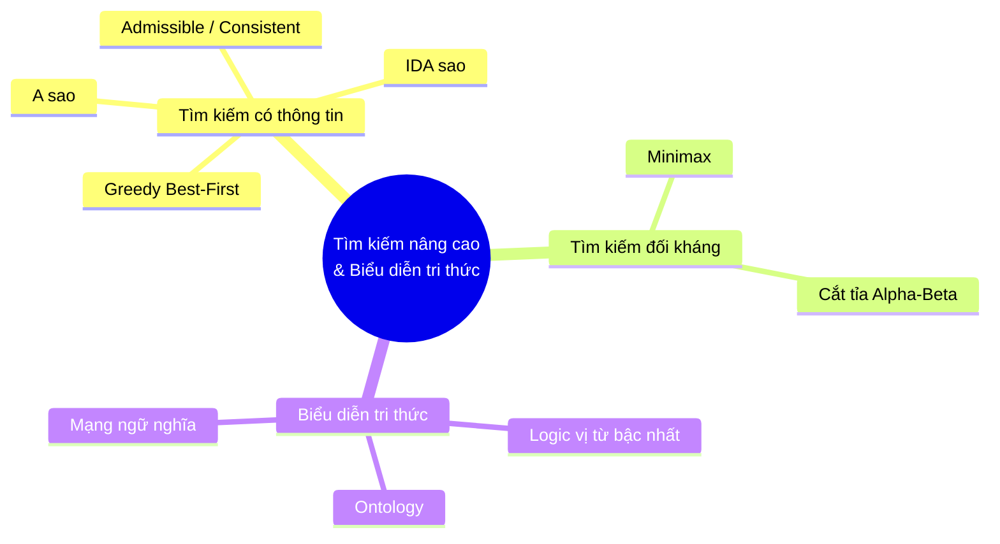
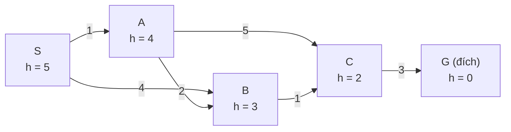
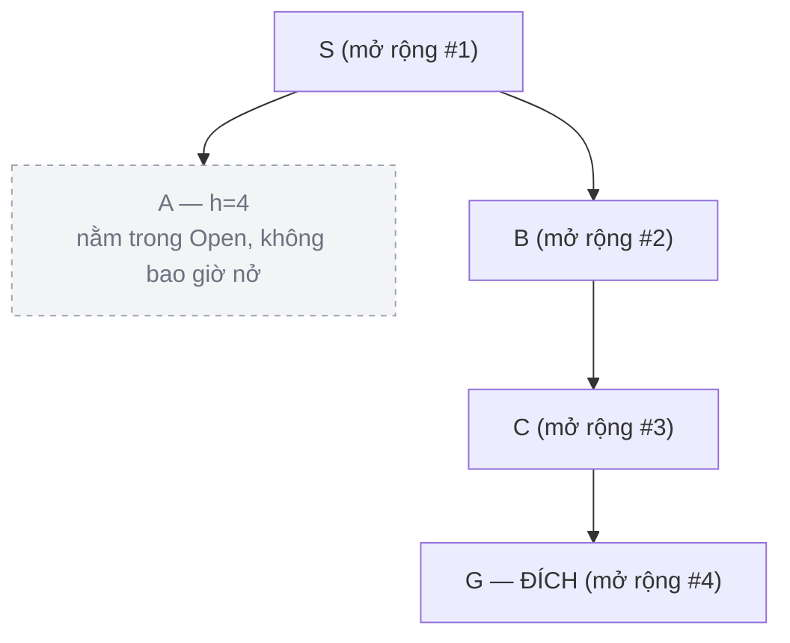
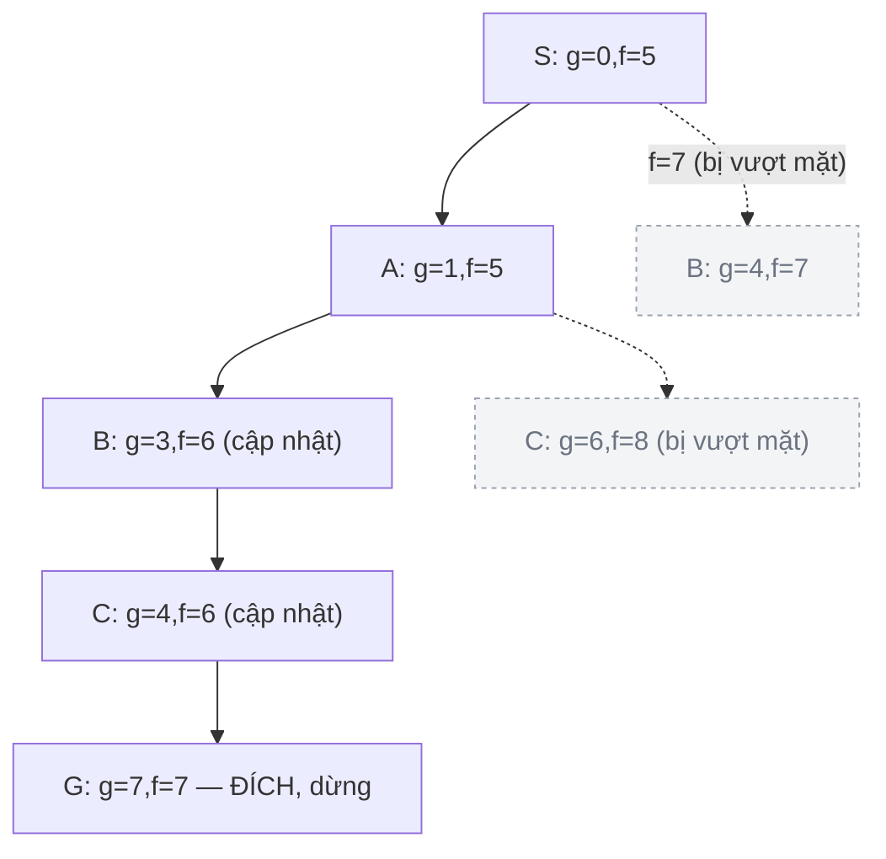
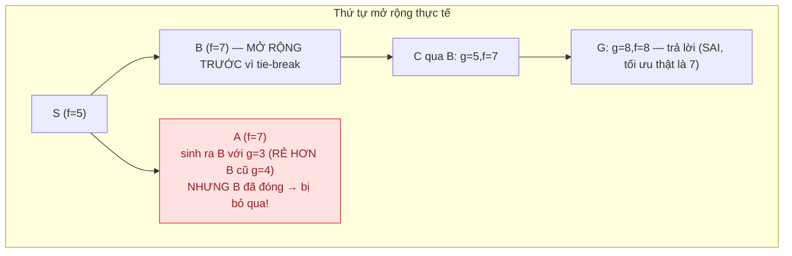
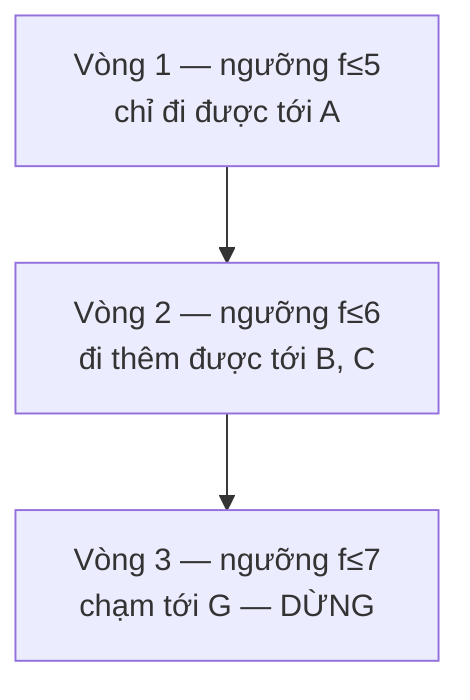
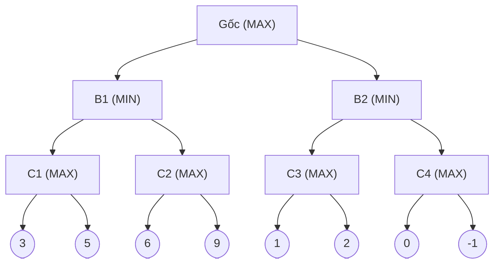
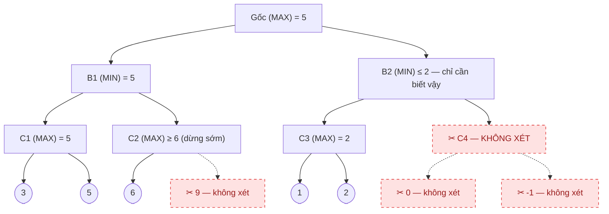
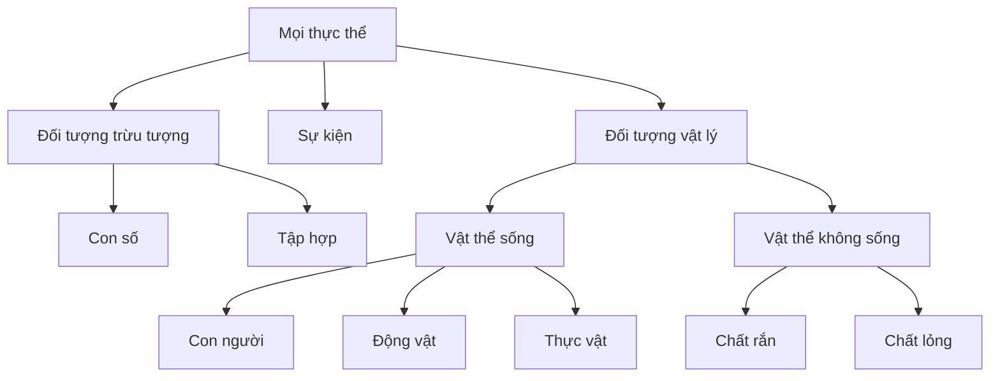
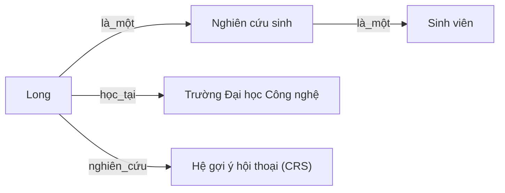

<!-- File: docs/ait2004-co-so-tri-tue-nhan-tao/bieu-dien-tri-thuc-va-tim-kiem-nang-cao.md -->

# Biểu diễn tri thức & Tìm kiếm nâng cao

*Bài ôn tập chuyên đề — AIT2004 Cơ sở Trí tuệ nhân tạo · Tổng hợp từ Russell & Norvig, "Artificial Intelligence: A Modern Approach" (chương 3, 5, 8, 10), Cormen et al., "Introduction to Algorithms" (chương 3, 22), và bài giảng gốc của học phần.*

::: info Bài này ôn tập gì?
Bốn "cây đinh" hay xuất hiện trong đề thi giữa kỳ/cuối kỳ AIT2004:

1. **Tìm kiếm ăn tham (Greedy Best-First)** và **A\*** — dùng "kinh nghiệm" (heuristic) để đi nhanh hơn tìm kiếm mù.
2. **Heuristic chấp nhận được (admissible)** và **nhất quán (consistent)** — điều kiện để A\* không "nói dối" mình.
3. **Minimax** và **cắt tỉa Alpha–Beta** — chơi cờ với một đối thủ luôn chơi tối ưu.
4. **Logic vị từ bậc nhất (FOL)** và **bản thể luận (ontology)** — cách "viết" tri thức về thế giới sao cho máy suy luận được.

Mỗi phần đều có: ẩn dụ đời thường, sơ đồ Mermaid, bảng chạy từng bước, code C++, và khung "bẫy thi".
:::



[[toc]]

## 0. Nhắc lại: vì sao "tìm kiếm mù" chưa đủ?

BFS, DFS, UCS chỉ biết **quá khứ**: chúng biết mình đã đi bao xa (chi phí $g(n)$), nhưng hoàn toàn "mù" về việc đích còn cách bao xa. Đó là lý do UCS phải nở đều ra mọi hướng như sóng nước lan trên mặt hồ — kể cả những hướng chắc chắn đi ngược đích.

::: tip Ẩn dụ cốt lõi
Tìm kiếm mù giống một người bịt mắt dò đường bằng cách đo từng bước chân. Tìm kiếm có thông tin giống người đó được đưa thêm một **la bàn ước lượng** — không hoàn toàn chính xác, nhưng đủ để biết "hướng nào có vẻ gần đích hơn". La bàn đó chính là **hàm kinh nghiệm (heuristic) $h(n)$**.
:::

Từ đây, ta dùng **một đồ thị trạng thái mẫu duy nhất** cho mọi ví dụ Greedy / A\* / IDA\*, để tiện so sánh:



Chi phí đường đi thật ngắn nhất tới G: $S \to A \to B \to C \to G$, tổng chi phí $1+2+1+3 = 7$. Đây là **đáp án tối ưu** mà một thuật toán "tốt" phải tìm ra — ta sẽ dùng con số 7 này làm mốc kiểm tra cho từng thuật toán bên dưới.

---

## 1. Tìm kiếm ăn tham (Greedy Best-First Search)

::: tip Ẩn dụ
Một chú chó đánh hơi mồi: nó luôn lao về hướng có **mùi nồng nhất ngay lúc này** ($h(n)$ nhỏ nhất), bất kể quãng đường nó *đã* chạy dài hay ngắn. Nếu có một ngõ cụt thơm phức ngay đầu ngõ, chú chó vẫn lao vào — rồi phải quay ra, mất thời gian hơn là đi đường vòng nhưng thẳng tắp.
:::

**Hàm đánh giá:** chỉ nhìn tương lai, bỏ hoàn toàn quá khứ:

$$
f(n) = h(n)
$$

### 1.1 Chạy từng bước trên đồ thị mẫu

| Bước | Đỉnh mở rộng | $h(n)$ | Hàng đợi (Open, sắp theo $h$) | Tập đóng (Closed) |
|---|---|---|---|---|
| 1 | S | 5 | A(4), B(3) | {S} |
| 2 | B | 3 | A(4), C(2) | {S, B} |
| 3 | C | 2 | A(4), G(0) | {S, B, C} |
| 4 | **G** | 0 | A(4) — không bao giờ được xét | {S, B, C, G} → **DỪNG** |



Kết quả: đường đi $S \to B \to C \to G$, chi phí $4+1+3 = \mathbf{8}$ — **không tối ưu** (đáp án đúng là 7)! Vì $h(B)=3 < h(A)=4$, Greedy chọn B trước mà không hề biết cạnh $S \to B$ nặng tới 4, trong khi đi qua A chỉ tốn 1.

::: warning Bẫy thi hay gặp
Sinh viên hay nhầm "Greedy nhanh nên chắc cũng tối ưu". **Sai.** Greedy chỉ đảm bảo **đầy đủ** (complete) trên không gian hữu hạn, **không đảm bảo tối ưu**, và trường hợp xấu nhất độ phức tạp giống hệt DFS bị dẫn dắt tồi: $O(b^m)$.
:::

### 1.2 Code C++ minh hoạ

```cpp
#include <queue>
#include <vector>
#include <unordered_map>
using namespace std;

struct Edge { int to; int cost; };

// So sánh để priority_queue lấy ra phần tử có h(n) NHỎ NHẤT trước
struct GreedyCompare {
    // pair<h(n), đỉnh>
    bool operator()(const pair<int,int>& a, const pair<int,int>& b) const {
        return a.first > b.first; // priority_queue mặc định là max-heap -> đảo dấu để thành min-heap
    }
};

vector<int> greedyBestFirst(int start, int goal,
                             const vector<vector<Edge>>& adj,
                             const vector<int>& h) {
    priority_queue<pair<int,int>, vector<pair<int,int>>, GreedyCompare> open;
    unordered_map<int,int> parent;
    vector<bool> closed(adj.size(), false);

    open.push({h[start], start});          // f(n) = h(n), không cộng g(n)
    parent[start] = -1;

    while (!open.empty()) {
        auto [hv, u] = open.top(); open.pop();
        if (closed[u]) continue;           // đã đóng rồi thì bỏ qua (đồ thị có nhiều đường tới u)
        closed[u] = true;

        if (u == goal) {                   // dừng NGAY khi lấy ra khỏi hàng đợi
            vector<int> path;
            for (int v = u; v != -1; v = parent[v]) path.push_back(v);
            reverse(path.begin(), path.end());
            return path;
        }
        for (const Edge& e : adj[u]) {
            if (!closed[e.to]) {
                parent[e.to] = u;
                open.push({h[e.to], e.to}); // CHỈ dùng h(e.to), quên hẳn quãng đường đã đi
            }
        }
    }
    return {}; // không tìm thấy
}
```

---

## 2. Tìm kiếm A\*

::: tip Ẩn dụ
Vẫn là người giao hàng, nhưng lần này họ **cộng dồn** hai thứ: quãng đường đã đạp xe ($g$) *và* ước lượng quãng đường còn lại ($h$). A\* = UCS (công bằng, biết quá khứ) + Greedy (nhanh nhạy, biết tương lai).
:::

$$
f(n) = g(n) + h(n)
$$

trong đó $g(n)$ là chi phí thật từ gốc tới $n$, còn $h(n)$ là ước lượng chi phí còn lại tới đích.

### 2.1 Chạy từng bước trên đồ thị mẫu

| Bước | Đỉnh mở rộng | $g$ | $h$ | $f=g+h$ | Open (cập nhật) | Closed |
|---|---|---|---|---|---|---|
| 1 | S | 0 | 5 | 5 | A(f=5), B(f=7) | {S} |
| 2 | A | 1 | 4 | 5 | B(f=**6**, cập nhật lại vì $1{+}2{+}3=6 < 7$), C(f=8) | {S, A} |
| 3 | B | 3 | 3 | 6 | C(f=**6**, cập nhật vì $3{+}1{+}2=6 < 8$) | {S, A, B} |
| 4 | C | 4 | 2 | 6 | G(f=7) | {S, A, B, C} |
| 5 | **G** | 7 | 0 | 7 | ∅ | → **DỪNG, lấy G ra khỏi hàng đợi** |



Kết quả: $S \to A \to B \to C \to G$, chi phí $= 7$ — **đúng bằng tối ưu**.

::: danger Bẫy thi #1 — "Thấy đích trong hàng đợi là dừng luôn"
**Sai.** A\* chỉ được phép báo cáo lời giải khi **lấy đích ra khỏi hàng đợi** (tức đích có $f$ nhỏ nhất trong Open), *không* phải ngay khi đích *xuất hiện* trong Open. Nếu dừng sớm ngay khi thấy đích, thuật toán có thể trả về một đường đi không tối ưu, vì có thể còn một đỉnh khác trong Open với $f$ nhỏ hơn dẫn tới một đường tới đích rẻ hơn.
:::

### 2.2 Vì sao A\* tối ưu? (khi $h$ chấp nhận được, tìm kiếm trên **cây**)

Gọi $C^*$ là chi phí tối ưu thật. Giả sử A\* mở rộng đỉnh đích $B$ không tối ưu trước đỉnh đích tối ưu $A$. Khi đó tồn tại một đỉnh $n$ trên đường đi tối ưu tới $A$ còn nằm trong hàng đợi. Ta có:

$$
f(n) = g(n) + h(n) \le g(n) + h^*(n) = g^*(A) = f(A) \qquad \text{(vì } h \text{ chấp nhận được)}
$$

$$
f(A) = g(A) \le g(B) \le f(B) \qquad \text{(vì } h(B)=0 \text{ tại đích, } g(A)=C^* \le g(B))
$$

Suy ra $f(n) \le f(A) \le f(B)$, nghĩa là $n$ (và mọi tổ tiên của $A$) luôn được mở rộng **trước** $B$ → $A$ chắc chắn được mở rộng trước $B$ → mâu thuẫn với giả thiết. Vậy A\* trên cây luôn trả về lời giải tối ưu nếu $h$ chấp nhận được. $\blacksquare$

::: info Đường đồng mức (contour)
Vẽ các đường bao quanh những đỉnh có cùng giá trị $f$ (giống đường đồng mức địa hình): UCS tạo ra các vòng tròn đồng tâm quanh điểm xuất phát (vì $h=0$), còn A\* với heuristic tốt sẽ "kéo dài" các đường đồng mức đó về phía đích, khiến vùng phải quét hẹp hơn hẳn.
:::

### 2.3 Mở rộng: A\* khi $h = 0$ chính là thuật toán Dijkstra (CLRS)

Khi bỏ hẳn thông tin heuristic ($h(n) \equiv 0$), A\* suy biến thành **Uniform-Cost Search**, về bản chất là **thuật toán Dijkstra** kinh điển (Cormen, Leiserson, Rivest, Stein — *Introduction to Algorithms*, chương 22.3): thay vì hàng đợi FIFO của BFS, Dijkstra dùng một **hàng đợi ưu tiên tối thiểu (min-priority queue)** khoá theo $g(n)$, lặp lại thao tác `EXTRACT-MIN` rồi "nới lỏng" (relax) các cạnh liền kề.

| Cách cài Open (hàng đợi ưu tiên) | Độ phức tạp Dijkstra / UCS |
|---|---|
| Mảng thường (duyệt tuyến tính tìm min) | $O(V^2)$ |
| Heap nhị phân (`std::priority_queue` trong C++) | $O((V+E)\log V)$ |
| Fibonacci heap | $O(V\log V + E)$ |

::: tip Mẹo nhớ nhanh
"A\* = Dijkstra được đeo thêm la bàn." Nếu la bàn đó không bao giờ chỉ sai đường (**admissible**), thì đeo la bàn chỉ giúp đi *nhanh hơn*, không bao giờ làm bạn đi *sai đường*.
:::

### 2.4 Code C++

```cpp
#include <queue>
#include <vector>
#include <unordered_map>
#include <limits>
using namespace std;

struct AStarNode { int f, g, id; };
struct AStarCompare {
    bool operator()(const AStarNode& a, const AStarNode& b) const {
        return a.f > b.f; // min-heap theo f = g + h
    }
};

vector<int> aStarSearch(int start, int goal,
                         const vector<vector<Edge>>& adj,
                         const vector<int>& h) {
    priority_queue<AStarNode, vector<AStarNode>, AStarCompare> open;
    vector<int> bestG(adj.size(), numeric_limits<int>::max());
    unordered_map<int,int> parent;
    vector<bool> closed(adj.size(), false);

    bestG[start] = 0;
    open.push({h[start], 0, start});

    while (!open.empty()) {
        AStarNode cur = open.top(); open.pop();
        if (closed[cur.id]) continue;      // bản ghi cũ, đã có bản tốt hơn -> bỏ qua
        if (cur.id == goal) {              // CHỈ dừng khi lấy đích ra khỏi hàng đợi
            vector<int> path;
            for (int v = cur.id; v != -1; v = parent.count(v) ? parent[v] : -1) {
                path.push_back(v);
                if (v == start) break;
            }
            reverse(path.begin(), path.end());
            return path;
        }
        closed[cur.id] = true;

        for (const Edge& e : adj[cur.id]) {
            int newG = cur.g + e.cost;
            if (newG < bestG[e.to]) {      // tìm được đường rẻ hơn tới e.to
                bestG[e.to] = newG;
                parent[e.to] = cur.id;
                open.push({newG + h[e.to], newG, e.to}); // đẩy bản ghi MỚI, không sửa bản cũ
            }
        }
    }
    return {};
}
```

::: info Vì sao code không "sửa" phần tử cũ trong hàng đợi?
`std::priority_queue` của C++ không hỗ trợ `decrease-key`. Kỹ thuật phổ biến (và đúng) là đẩy thêm một bản ghi mới rẻ hơn, rồi khi lấy ra một bản ghi mà đỉnh đó **đã đóng**, ta bỏ qua nó (dòng `if (closed[cur.id]) continue;`). Đây chính là "lazy deletion" — kỹ thuật cài đặt thực tế phổ biến nhất cho A\*/Dijkstra.
:::

---

## 3. Heuristic: Chấp nhận được (Admissible) và Nhất quán (Consistent)

::: tip Ẩn dụ
- **Chấp nhận được (admissible):** một hướng dẫn viên du lịch **lạc quan nhưng không bao giờ nói dối theo hướng tệ hơn** — có thể đoán quãng đường còn lại *ngắn hơn* thực tế, nhưng tuyệt đối không bao giờ đoán *dài hơn*.
- **Nhất quán (consistent):** phiên bản "chặt chẽ" hơn — không chỉ lạc quan ở đích, mà lạc quan một cách **hợp lý ở từng bước đi** (giống bất đẳng thức tam giác: đi tắt không bao giờ dài hơn đi vòng qua đỉnh trung gian).
:::

### 3.1 Định nghĩa

**Admissible:** với mọi đỉnh $n$,
$$
0 \le h(n) \le h^*(n)
$$
($h^*(n)$ là chi phí thật rẻ nhất từ $n$ tới đích gần nhất — không bao giờ được ước lượng *thừa*).

**Consistent (nhất quán):** với mọi đỉnh $n$ và đỉnh con $n'$ sinh ra từ hành động $a$ có chi phí $c(n,a,n')$,
$$
h(n) \le c(n,a,n') + h(n')
$$
và $h(\text{đích}) = 0$.

**Quan hệ:** *Nhất quán $\Rightarrow$ Chấp nhận được* (chiều ngược lại không đúng). Vì consistent nên $f(n) = g(n)+h(n)$ **không bao giờ giảm** dọc theo một đường đi — đây chính là lý do A\* trên **đồ thị** (có tập đóng, không mở rộng lại) chỉ tối ưu khi $h$ nhất quán.

### 3.2 Ví dụ đồ thị mẫu: kiểm tra tính admissible/consistent

Với đồ thị ở mục 0, chi phí tối ưu tới đích thật sự là $h^*(S){=}7,\ h^*(A){=}6,\ h^*(B){=}4,\ h^*(C){=}3,\ h^*(G){=}0$.

Heuristic ta đã dùng $h = (5,4,3,2,0)$ cho $(S,A,B,C,G)$ — kiểm tra nhanh:

| Cạnh $n \to n'$ | $c(n,n')$ | $h(n)$ | $c + h(n')$ | Nhất quán? |
|---|---|---|---|---|
| $S\to A$ | 1 | 5 | $1+4=5$ | ✅ ($5\le5$) |
| $S\to B$ | 4 | 5 | $4+3=7$ | ✅ |
| $A\to B$ | 2 | 4 | $2+3=5$ | ✅ |
| $A\to C$ | 5 | 4 | $5+2=7$ | ✅ |
| $B\to C$ | 1 | 3 | $1+2=3$ | ✅ |
| $C\to G$ | 3 | 2 | $3+0=3$ | ✅ |

→ Heuristic này vừa **admissible** vừa **consistent** — đó là lý do A\* ở mục 2 cho kết quả tối ưu ngay lần đầu, không phải quay lại sửa đỉnh đã đóng.

### 3.3 Bẫy thi #2 — Admissible nhưng KHÔNG consistent làm A\* trên đồ thị sai

Đổi duy nhất $h(A)$ từ 4 thành **6** (vẫn admissible vì $6 \le h^*(A){=}6$), giữ nguyên $h(S){=}5, h(B){=}3, h(C){=}2, h(G){=}0$.

Kiểm tra lại cạnh $A \to B$: $h(A) = 6 \le c(A,B) + h(B) = 2+3=5$? **Sai!** $6 > 5$ → **không nhất quán**.

Chạy lại A\* trên **đồ thị** (cài đặt "ngây thơ": khi một đỉnh đã bị đóng thì **không bao giờ mở lại**, kể cả khi sau này tìm được đường rẻ hơn tới nó) với heuristic hỏng này:



| Bước | Đỉnh mở rộng | $g$ | $f$ | Ghi chú |
|---|---|---|---|---|
| 1 | S | 0 | 5 | sinh A(f=7), B(f=7) |
| 2 | **B** | 4 | 7 | (giả sử tie-break chọn B trước) → sinh C(g=5,f=7); **đóng B** |
| 3 | A | 1 | 7 | sinh lại B với $g=1+2=3 < 4$ — **nhưng B đã đóng nên bị loại bỏ** |
| 4 | C | 5 | 7 | sinh G(g=8,f=8) |
| 5 | G | 8 | 8 | trả về đường $S{-}B{-}C{-}G$, chi phí **8** |

Kết quả: A\* báo cáo chi phí **8**, trong khi tối ưu thật là **7** ($S{-}A{-}B{-}C{-}G$). Đường rẻ hơn qua A bị bỏ lỡ chỉ vì B đã nằm trong tập đóng.

::: danger Ghi nhớ
- **A\* trên CÂY (Tree-Search, không có tập đóng):** chỉ cần $h$ **admissible** là đủ để tối ưu.
- **A\* trên ĐỒ THỊ (Graph-Search, có tập đóng, không mở lại đỉnh):** cần $h$ **consistent** thì mới đảm bảo tối ưu. Admissible không chưa đủ!
- Cách khắc phục: hoặc chọn heuristic có tính consistent (thường xảy ra tự nhiên khi $h$ xây từ "bài toán nới lỏng ràng buộc"), hoặc cho phép **mở lại đỉnh đã đóng** khi tìm được đường rẻ hơn (tốn thêm bộ nhớ/thời gian).
:::

---

## 4. IDA\* (Iterative-Deepening A\*)

::: tip Ẩn dụ
A\* giữ *toàn bộ* các đỉnh đã và đang xét trong bộ nhớ — giống đào một cái giếng khổng lồ rồi mới biết có nước hay không. **IDA\*** giống việc đào **nhiều giếng nhỏ nông dần rồi sâu dần**: mỗi lượt chỉ đào tới một "ngưỡng $f$" nhất định; nếu chưa chạm nước, lấp lại và đào sâu hơn ở lượt sau — tốn công đào lại, nhưng gần như không tốn đất chứa (bộ nhớ).
:::

**Ý tưởng:** DFS có giới hạn — nhưng giới hạn không phải là *độ sâu* mà là **ngưỡng chi phí $f = g+h$**. Ở mỗi vòng lặp, ngưỡng mới = giá trị $f$ nhỏ nhất từng bị vượt quá ở vòng trước.

### 4.1 Chạy từng bước trên đồ thị mẫu (dùng heuristic tốt ở mục 2)

| Vòng lặp | Ngưỡng $f$ | Thứ tự duyệt DFS | Kết quả |
|---|---|---|---|
| 1 | $f(S){=}5$ | $S(5)\to A(5)\to$ *cắt* $B(6),C(8)\to$ quay lại $S\to$ *cắt* $B(7)$ | Không tìm thấy đích. Ngưỡng mới = $\min(6,8,7)=6$ |
| 2 | $6$ | $S(5)\to A(5)\to B(6)\to C(6)\to$ *cắt* $G(7)\to$ quay lại, *cắt* $C\text{ qua }A(8)$, *cắt* $B\text{ qua }S(7)$ | Không tìm thấy đích. Ngưỡng mới = $7$ |
| 3 | $7$ | $S(5)\to A(5)\to B(6)\to C(6)\to G(7)$ ✅ | **Tìm thấy, chi phí tối ưu = 7** |



Ba lần lặp, mỗi lần lại duyệt lại từ $S$ — đó là cái giá phải trả để đổi lấy bộ nhớ $O(d)$ thay vì $O(b^d)$ như A\*.

### 4.2 Code C++

```cpp
#include <vector>
#include <limits>
using namespace std;

struct IDAStarResult { bool found; vector<int> path; };

// path: đường đi hiện tại (đỉnh), g: chi phí tích luỹ, threshold: ngưỡng f hiện tại
// trả về: chi phí f nhỏ nhất bị VƯỢT NGƯỠNG (để làm ngưỡng cho vòng sau), hoặc -1 nếu tìm thấy đích
int idaStarDFS(vector<int>& path, int g, int threshold, int goal,
                const vector<vector<Edge>>& adj, const vector<int>& h,
                bool& found) {
    int node = path.back();
    int f = g + h[node];
    if (f > threshold) return f;              // vượt ngưỡng -> báo hiệu để tính ngưỡng mới
    if (node == goal) { found = true; return -1; }

    int minExceeded = numeric_limits<int>::max();
    for (const Edge& e : adj[node]) {
        // tránh quay lại đỉnh vừa đi qua trong CÙNG một đường (tránh chu trình đơn giản)
        bool visited = false;
        for (int v : path) if (v == e.to) { visited = true; break; }
        if (visited) continue;

        path.push_back(e.to);
        int t = idaStarDFS(path, g + e.cost, threshold, goal, adj, h, found);
        if (found) return -1;                 // lan truyền tín hiệu "đã tìm thấy" lên trên
        minExceeded = min(minExceeded, t);
        path.pop_back();                      // quay lui — đây là lý do IDA* chỉ tốn O(d) bộ nhớ
    }
    return minExceeded;
}

IDAStarResult idaStar(int start, int goal, const vector<vector<Edge>>& adj,
                       const vector<int>& h) {
    int threshold = h[start];
    vector<int> path{start};
    while (true) {
        bool found = false;
        int t = idaStarDFS(path, 0, threshold, goal, adj, h, found);
        if (found) return {true, path};
        if (t == numeric_limits<int>::max()) return {false, {}}; // hết không gian tìm kiếm
        threshold = t;                          // ngưỡng mới = f nhỏ nhất vừa bị vượt quá
    }
}
```

::: warning Bẫy thi #3 — Nhầm IDA\* với "Iterative Deepening DFS thường"
IDDFS tăng dần **độ sâu**. IDA\* tăng dần **ngưỡng $f = g+h$**. Nếu heuristic bằng 0 khắp nơi, IDA\* mới trùng với IDDFS. Số vòng lặp của IDA\* bị chặn trên bởi $C^*$ (chi phí tối ưu) khi mọi $f$ là số nguyên — ví dụ bài toán 8-puzzle khó nhất cũng không quá 31 vòng lặp.
:::

---

## 5. Tìm kiếm đối kháng: Minimax

::: tip Ẩn dụ
Hai người chơi cờ ca-rô: bạn (MAX) luôn muốn điểm số cao nhất có thể; đối thủ (MIN) — người **không bao giờ mắc sai lầm** — luôn chọn nước đi khiến bạn tệ nhất có thể. Minimax là cách bạn "tưởng tượng" trước mọi nước đi của cả hai người, rồi lần ngược từ đáy cây lên để biết nước đi *tốt nhất trong tình huống xấu nhất*.
:::

$$
\text{Minimax}(s) =
\begin{cases}
\text{Utility}(s) & \text{nếu } s \text{ là trạng thái kết thúc} \\
\max_{a \in Actions(s)} \text{Minimax}(\text{Result}(s,a)) & \text{nếu đến lượt MAX} \\
\min_{a \in Actions(s)} \text{Minimax}(\text{Result}(s,a)) & \text{nếu đến lượt MIN}
\end{cases}
$$

### 5.1 Cây trò chơi mẫu (dùng lại cho cả Alpha–Beta bên dưới)



**Tính ngược từ đáy lên:**
- $C_1 = \max(3,5) = 5$; $\quad C_2 = \max(6,9) = 9$; $\quad B_1 = \min(5,9) = 5$
- $C_3 = \max(1,2) = 2$; $\quad C_4 = \max(0,-1) = 0$; $\quad B_2 = \min(2,0) = 0$
- $\text{Gốc} = \max(B_1, B_2) = \max(5, 0) = \mathbf{5}$ → chọn nhánh **B1**

### 5.2 Code C++

```cpp
struct GameNode {
    bool isTerminal;
    int value;                 // chỉ có ý nghĩa nếu isTerminal = true
    vector<GameNode*> children;
};

int minimax(GameNode* node, bool maximizingPlayer) {
    if (node->isTerminal) return node->value;

    if (maximizingPlayer) {
        int v = INT_MIN;
        for (auto* child : node->children)
            v = max(v, minimax(child, false));   // lượt tiếp theo là MIN
        return v;
    } else {
        int v = INT_MAX;
        for (auto* child : node->children)
            v = min(v, minimax(child, true));    // lượt tiếp theo là MAX
        return v;
    }
}
```

::: warning Độ phức tạp
Giống hệt DFS: thời gian $O(b^m)$, bộ nhớ $O(bm)$ ($b$ = hệ số nhánh, $m$ = độ sâu cây trò chơi). Với cờ vua $b\approx35,\ m\approx100$ — **bất khả thi** nếu duyệt hết. Đây chính là động lực cho Alpha–Beta và hàm lượng giá cắt sâu.
:::

---

## 6. Cắt tỉa Alpha–Beta (Alpha–Beta Pruning)

::: tip Ẩn dụ
Bạn đang nếm một nồi canh chung để so xem canh nào mặn hơn. Vừa nếm muỗng đầu bạn đã thấy nồi B mặn hơn nồi A rồi — bạn **không cần nếm hết nồi B** để kết luận "sẽ chọn A". Alpha–Beta chính là việc dừng "nếm" (mở rộng) sớm ngay khi biết chắc nhánh đó **không thể** thay đổi quyết định cuối cùng.
:::

- $\alpha$ = giá trị tốt nhất mà **MAX** đảm bảo được dọc theo đường đi từ gốc tới hiện tại (cận dưới).
- $\beta$ = giá trị tốt nhất mà **MIN** đảm bảo được dọc theo đường đi từ gốc tới hiện tại (cận trên).
- **Cắt tỉa** khi $\alpha \ge \beta$ tại một nút: nhánh còn lại chắc chắn không ảnh hưởng tới quyết định ở gốc.

### 6.1 Áp dụng lên chính cây ở mục 5.1



**Bảng theo dõi $\alpha,\beta$ theo đúng thứ tự duyệt trái→phải (DFS):**

| # | Nút đang xét | $(\alpha,\beta)$ nhận vào | Diễn biến | Hành động |
|---|---|---|---|---|
| 1 | Root (MAX) | $(-\infty,+\infty)$ | gọi B1 | mở rộng |
| 2 | B1 (MIN) | $(-\infty,+\infty)$ | gọi C1 | mở rộng |
| 3 | C1 (MAX) | $(-\infty,+\infty)$ | lá 3 → $v{=}3$; lá 5 → $v{=}5$ | C1 trả về **5** |
| 4 | B1 | — | nhận C1=5 → $\beta \leftarrow \min(\infty,5)=5$ | gọi C2 với $(-\infty, 5)$ |
| 5 | C2 (MAX) | $(-\infty, 5)$ | lá 6 → $v{=}6 \ge \beta(5)$ | **✂ CẮT** — bỏ qua lá 9; C2 trả về 6 |
| 6 | B1 | — | nhận C2=6 → $\min(5,6)=5$ | B1 trả về **5** |
| 7 | Root | — | nhận B1=5 → $\alpha \leftarrow \max(-\infty,5)=5$ | gọi B2 với $(5,+\infty)$ |
| 8 | B2 (MIN) | $(5,+\infty)$ | gọi C3 | mở rộng |
| 9 | C3 (MAX) | $(5,+\infty)$ | lá 1 → $v{=}1$; lá 2 → $v{=}2$ (không vượt $\beta$) | C3 trả về **2** |
| 10 | B2 | — | nhận C3=2 → $v{=}2 \le \alpha(5)$ | **✂ CẮT** — bỏ qua toàn bộ C4 (2 lá); B2 trả về 2 |
| 11 | Root | — | nhận B2=2 → $\max(5,2)=5$ | **Root = 5, chọn nhánh B1** |

→ Kết quả **giống hệt Minimax đầy đủ (giá trị gốc = 5)**, nhưng chỉ cần thăm **5/8** lá — tiết kiệm hẳn nhánh $C_4$ và một lá của $C_2$.

::: danger Bẫy thi #4 — "Alpha-Beta cho kết quả khác Minimax"
**Sai.** Alpha–Beta **không bao giờ** đổi giá trị minimax của gốc — nó chỉ bỏ qua những phần chắc chắn thừa. Tuy nhiên, đề hay hỏi xoáy: *giá trị của các nút bị cắt/nút trung gian có thể không chính xác* (chỉ là cận trên/cận dưới, ví dụ C2 chỉ biết "$\ge 6$" chứ không biết chính xác 9), nên **không được dùng giá trị của nút con bị cắt tỉa để so sánh hay suy luận thêm**.
:::

### 6.2 Thứ tự duyệt quyết định hiệu quả cắt tỉa

Nếu ta đổi thứ tự lá của $C_2$ thành $(9, 6)$ thay vì $(6,9)$: gặp lá 9 trước ($v{=}9 \ge \beta(5)$) → cắt ngay từ lá đầu, tiết kiệm hơn nữa. Ngược lại nếu con **tệ nhất** (theo MIN) được xét trước thì **không cắt được gì cả**. Với thứ tự duyệt tối ưu, độ phức tạp giảm từ $O(b^m)$ xuống còn:

$$
O\!\left(b^{m/2}\right)
$$

tức hệ số nhánh hiệu dụng chỉ còn $\sqrt{b}$ — với cờ vua $b\approx35$ giảm còn $\approx 6$, nghĩa là trong cùng thời gian, Alpha–Beta với thứ tự duyệt tốt có thể tìm sâu **gấp đôi** Minimax thường.

::: tip Mẹo thi
Câu hỏi "cho cây X, hãy chỉ ra các nút bị cắt tỉa" — luôn duyệt **trái sang phải, từ trên xuống** (DFS tiền tự), cập nhật $\alpha$ khi ở nút MAX, cập nhật $\beta$ khi ở nút MIN, và chỉ cắt khi giá trị hiện tại của nút **vi phạm** cận đã nhận từ tổ tiên ($v \ge \beta$ ở nút MAX, hoặc $v \le \alpha$ ở nút MIN — chú ý: KHÔNG so $\alpha$ với $\beta$ của cùng một nút, mà so giá trị $v$ đang tính với cận **nhận từ bên ngoài truyền vào**).
:::

### 6.3 Code C++

```cpp
int alphaBetaMax(GameNode* node, int alpha, int beta) {
    if (node->isTerminal) return node->value;
    int v = INT_MIN;
    for (auto* child : node->children) {
        v = max(v, alphaBetaMin(child, alpha, beta));
        if (v >= beta) return v;      // MIN ở trên sẽ không bao giờ chọn đường này -> cắt
        alpha = max(alpha, v);        // cập nhật cận dưới tốt nhất MAX đang có
    }
    return v;
}

int alphaBetaMin(GameNode* node, int alpha, int beta) {
    if (node->isTerminal) return node->value;
    int v = INT_MAX;
    for (auto* child : node->children) {
        v = min(v, alphaBetaMax(child, alpha, beta));
        if (v <= alpha) return v;     // MAX ở trên sẽ không bao giờ chọn đường này -> cắt
        beta = min(beta, v);          // cập nhật cận trên tốt nhất MIN đang có
    }
    return v;
}

// Gọi: alphaBetaMax(root, INT_MIN, INT_MAX);
```

### 6.4 Khi cây quá sâu: hàm lượng giá & cắt độ sâu

Với trò chơi thật (cờ vua, cờ vây), ta không thể duyệt tới tận lá. Thay `Utility` bằng hàm lượng giá $\text{Eval}(s)$ áp dụng ở một độ sâu cắt (cutoff), thường là tổng có trọng số các đặc trưng:

$$
\text{Eval}(s) = w_1 f_1(s) + w_2 f_2(s) + \dots + w_n f_n(s)
$$

(ví dụ cờ vua: $f_1$ = số Hậu trắng trừ Hậu đen, v.v.)

::: warning Hiệu ứng đường chân trời (horizon effect)
Nếu cắt ở độ sâu cố định, chương trình có thể bị đối thủ "câu giờ" bằng vài nước hy sinh vô nghĩa để đẩy một thất bại chắc chắn ra ngoài tầm nhìn (qua "đường chân trời"). Khắc phục bằng **quiescence search** (chỉ dừng ở vị trí "yên tĩnh", không có nước ăn quân đang treo) hoặc **singular extension**.
:::

---

## 7. Biểu diễn tri thức: từ Logic mệnh đề tới Logic vị từ bậc nhất (FOL)

::: tip Ẩn dụ
Logic mệnh đề giống một cuốn **sổ tay liệt kê từng sự thật rời rạc**: "Bình là sinh viên", "An là sinh viên", "Long là sinh viên"... Muốn nói "mọi sinh viên đều phải học Cơ sở Trí tuệ nhân tạo", ta phải chép lại quy tắc cho *từng người một* — không có cách nói "chung". Logic vị từ bậc nhất (FOL) giống việc được cấp thêm **đại từ và lượng từ** ("mọi", "có một") để nói một câu áp dụng cho *cả một lớp đối tượng*.
:::

### 7.1 Ba viên gạch của FOL

| Thành tố | Vai trò | Ví dụ |
|---|---|---|
| **Đối tượng** (constant) | Một thực thể cụ thể | `Long`, `UET`, `MonAIT2004` |
| **Vị từ** (predicate) | Trả về true/false, mô tả thuộc tính/quan hệ | `SinhVien(x)`, `Hoc(x, y)` |
| **Hàm** (function) | Trả về một *đối tượng* liên quan tới đối tượng khác | `GiaoVienHuongDan(x)` |
| **Lượng từ** | $\forall$ (với mọi), $\exists$ (tồn tại) | $\forall x\, \text{SinhVien}(x) \Rightarrow \ldots$ |

### 7.2 Chuyển câu tiếng Việt sang FOL — ví dụ miền đại học

> "Mọi sinh viên đều phải học ít nhất một môn cơ sở ngành."

$$
\forall x \; \big(\text{SinhVien}(x) \Rightarrow \exists y\, (\text{MonCoSo}(y) \land \text{Hoc}(x,y))\big)
$$

> "Có một giảng viên dạy tất cả các môn của Khoa CNTT."

$$
\exists x \; \big(\text{GiangVien}(x) \land \forall y\, (\text{MonCuaKhoa}(y,\text{CNTT}) \Rightarrow \text{Day}(x,y))\big)
$$

So sánh với câu **nghĩa khác hẳn**:

$$
\forall y \; \exists x \; \big(\text{MonCuaKhoa}(y,\text{CNTT}) \Rightarrow \text{Day}(x,y)\big)
$$

câu sau chỉ nói "**mỗi** môn đều có (**có thể là**) một giảng viên khác nhau dạy" — yếu hơn hẳn câu có $\exists x \forall y$ (một giảng viên dạy *tất cả*).

::: danger Bẫy thi #5 — Đảo thứ tự lượng từ
$\exists x \,\forall y\, P(x,y)$ **KHÔNG tương đương** $\forall y\, \exists x\, P(x,y)$.

- $\exists x \forall y\, \text{Yeu}(x,y)$: "có một người yêu **tất cả mọi người**" (một người, một tình yêu bao la).
- $\forall y \exists x\, \text{Yeu}(x,y)$: "**mỗi người** đều được ai đó yêu" (có thể mỗi người một người yêu khác nhau — yếu hơn nhiều).

Chiều ngược lại ($\forall\forall$ hay $\exists\exists$) thì **được phép đảo tự do**: $\forall x\forall y \equiv \forall y \forall x$, và $\exists x \exists y \equiv \exists y \exists x$.
:::

::: danger Bẫy thi #6 — Sai liên từ chính đi kèm lượng từ
Đây là lỗi sinh viên mắc **nhiều nhất** khi làm bài:

- Với $\forall$: liên từ chính phải là $\Rightarrow$.
  - ✅ Đúng: $\forall x\,(\text{SinhVien}(x) \Rightarrow \text{ChamChi}(x))$ — "mọi sinh viên đều chăm chỉ".
  - ❌ Sai: $\forall x\, \text{SinhVien}(x) \land \text{ChamChi}(x)$ — câu này nói "**mọi thứ trên đời** đều vừa là sinh viên vừa chăm chỉ" (vô lý, vì $x$ không bị ràng buộc là sinh viên trước khi khẳng định).
- Với $\exists$: liên từ chính phải là $\land$.
  - ✅ Đúng: $\exists x\,(\text{SinhVien}(x) \land \text{DiemA}(x))$ — "có sinh viên đạt điểm A".
  - ❌ Sai: $\exists x\, (\text{SinhVien}(x) \Rightarrow \text{DiemA}(x))$ — câu này **luôn đúng một cách tầm thường** (chỉ cần tồn tại *một vật bất kỳ không phải sinh viên*, phép kéo theo tự động đúng) — hoàn toàn không diễn tả ý "có sinh viên điểm A"!
:::

### 7.3 Suy luận: hợp nhất (Unification) & Modus Ponens tổng quát

Để áp dụng luật suy diễn, ta cần tìm phép thế $\theta$ khiến hai biểu thức "khớp" nhau — gọi là **hợp nhất hoá**:

$$
\text{Unify}(\alpha, \beta) = \theta \quad \text{sao cho } \alpha\theta = \beta\theta
$$

Ví dụ: $\text{Unify}(\text{Hoc}(x,\text{AIT2004}),\ \text{Hoc}(\text{Long}, y)) = \{x/\text{Long},\ y/\text{AIT2004}\}$.

**Modus Ponens tổng quát:** với tri thức $p_1', p_2', \ldots, p_n'$ và luật $p_1 \land \cdots \land p_n \Rightarrow q$, nếu tồn tại $\theta$ hợp nhất được $p_i'$ với $p_i$ cho mọi $i$, ta suy ra $q\theta$.

::: info Mẹo thi
Khi đề cho một cơ sở tri thức và hỏi "suy ra được gì", hãy tìm phép thế $\theta$ hợp nhất trước — đừng cố "đoán" bằng trực giác. Một biến bị dùng trùng tên ở hai luật khác nhau *phải* được đổi tên (standardize apart) trước khi hợp nhất, nếu không dễ tính sai.
:::

---

## 8. Ontology (Bản thể luận) & Mạng ngữ nghĩa

::: tip Ẩn dụ
Nếu FOL là **từ vựng và ngữ pháp**, thì ontology là **cách sắp xếp cả một thư viện**: quyết định "ngăn nào chứa cái gì" trước khi bắt đầu viết câu. Một bản thể luận tổng quát giống khung tủ hồ sơ gốc — chưa biết chi tiết bên trong từng ngăn, nhưng đã có sẵn chỗ để nhét kiến thức mới vào mà không phải đập lại cả tủ.
:::

### 8.1 Một bản thể luận bậc trên (upper ontology) tự thiết kế



Mỗi liên kết nghĩa là "chuyên biệt hoá của" (is-a); các nhánh **không nhất thiết tách rời** — ví dụ một "Robot hình người" có thể vừa thuộc `PHYS` vừa mang một số thuộc tính hành vi của `HUMAN`.

### 8.2 Mạng ngữ nghĩa (semantic network) — ví dụ nhỏ



Ưu điểm: trực quan, suy luận kế thừa thuộc tính theo liên kết `là_một` rất nhanh. Nhược điểm kinh điển hay bị hỏi thi: mạng ngữ nghĩa **không có ngữ nghĩa hình thức chuẩn** cho tới khi được ánh xạ tương đương sang FOL — hai người vẽ cùng một mạng có thể "đọc" ra hai câu logic khác nhau nếu không thống nhất quy ước.

### 8.3 Logic mô tả (Description Logic) — cú pháp rất ngắn gọn

$$
\text{SinhVien} \sqsubseteq \text{NguoiHoc} \sqcap \exists\text{hoc}.\text{MonHoc}
$$

đọc là: "Sinh viên là một Người-học **và** có học ít nhất một Môn học" — về bản chất tương đương một câu FOL nhưng được thiết kế để suy luận (subsumption, phân loại lớp) trong thời gian đa thức, đánh đổi lại là **biểu đạt yếu hơn** FOL đầy đủ.

::: warning Bẫy thi #7 — "Ontology càng tổng quát càng tốt"
Sách AIMA (chương 10) chỉ rõ: nỗ lực xây một **bản thể luận tổng quát duy nhất cho cả thế giới** cho tới nay **chưa có ứng dụng lớn nào thành công hoàn toàn** — mọi hệ thống AI hàng đầu đều dùng bản thể luận **chuyên biệt cho từng miền** kết hợp học máy, không phải một ontology vạn năng. Đừng trả lời rằng "ontology tổng quát luôn tốt hơn ontology chuyên biệt" trong bài tự luận — hãy nêu được sự đánh đổi.
:::

---

## 9. Bảng tổng hợp bẫy thi UET (ôn nhanh trước giờ thi)

| # | Chủ đề | Bẫy | Ghi nhớ |
|---|---|---|---|
| 1 | Greedy | Nghĩ Greedy tối ưu vì "nhanh" | Chỉ dùng $h(n)$, **không** đảm bảo tối ưu |
| 2 | A* | Dừng ngay khi thấy đích trong Open | Chỉ dừng khi **lấy đích ra khỏi** hàng đợi |
| 3 | Admissible vs Consistent | Admissible là đủ cho A\* trên đồ thị | Cần **consistent** nếu có tập đóng không mở lại |
| 4 | IDA* | Nhầm với Iterative Deepening DFS | Ngưỡng là $f=g+h$, không phải độ sâu |
| 5 | Alpha–Beta | Nghĩ kết quả khác Minimax | Giá trị **gốc luôn giống hệt**, chỉ nút con/nút bị cắt có thể là cận không chính xác |
| 6 | Alpha–Beta | So $\alpha$ với $\beta$ sai chỗ | Cắt khi **giá trị đang tính** vi phạm cận **nhận từ tổ tiên**, không phải so $\alpha,\beta$ nội bộ cùng lúc |
| 7 | FOL | Đảo lượng từ $\exists\forall \leftrightarrow \forall\exists$ | Không tương đương — chỉ $\forall\forall$ và $\exists\exists$ được đảo tự do |
| 8 | FOL | Sai liên từ chính | $\forall$ đi với $\Rightarrow$; $\exists$ đi với $\land$ |
| 9 | Ontology | "Càng tổng quát càng tốt" | Đánh đổi biểu đạt ↔ khả năng suy luận; chưa có ontology vạn năng thành công |

---

## 10. Tài liệu tham khảo

- Russell, S. & Norvig, P. — *Artificial Intelligence: A Modern Approach*, 4th ed., chương 3 (Search), 5 (Adversarial Search), 8–10 (Logic & Knowledge Representation). Bộ mã nguồn tham khảo chính thức: [github.com/aimacode](https://github.com/aimacode).
- Cormen, T. H., Leiserson, C. E., Rivest, R. L., Stein, C. — *Introduction to Algorithms*, 4th ed., chương 3 (ký hiệu $O,\Omega,\Theta$), chương 22.3 (thuật toán Dijkstra), chương 6 (heap & hàng đợi ưu tiên — nền tảng cài đặt A\*/UCS hiệu quả).
- Bài giảng gốc học phần AIT2004 (dịch & phỏng theo CS188, UC Berkeley — Dan Klein & Pieter Abbeel): [Bài 3 — Tìm kiếm dựa trên kinh nghiệm](https://courses.iaidev.com/ai-foundations/2627-1/lecture-lec-03-tim-kiem-dua-tren-kinh-nghiem.html), [Bài 4 — Tìm kiếm có đối thủ](https://courses.iaidev.com/ai-foundations/2627-1/lecture-lec-04-tim-kiem-co-doi-thu.html), [Bài bổ sung 2 — Logic vị từ](https://courses.iaidev.com/ai-foundations/2627-1/lecture-extra-02-predicate-logic.html).
- Red Blob Games — [Introduction to A\*](https://www.redblobgames.com/pathfinding/a-star/introduction.html): minh hoạ tương tác cực trực quan cho A\*, Dijkstra, Greedy Best-First.
- GeeksforGeeks — [A\* Search Algorithm](https://www.geeksforgeeks.org/dsa/a-search-algorithm/), [Alpha-Beta Pruning](https://www.geeksforgeeks.org/artificial-intelligence/alpha-beta-pruning-in-adversarial-search-algorithms/).
- MIT OpenCourseWare — [6.034 Artificial Intelligence](https://ocw.mit.edu/courses/6-034-artificial-intelligence-fall-2010/) (video bài giảng Search, Games, Logic).
- VisuAlgo — [visualgo.net](https://visualgo.net) — minh hoạ trực quan các cấu trúc dữ liệu/thuật toán đồ thị nền tảng (BFS/DFS/Dijkstra) hỗ trợ trực giác trước khi học A\*.

::: tip Gợi ý luyện tập thêm
Thử tự tay đổi vài trọng số cạnh hoặc giá trị $h$ trong đồ thị mẫu ở mục 0, rồi chạy lại cả ba thuật toán Greedy/A\*/IDA\* bằng tay — đó là cách luyện phản xạ nhanh nhất trước khi vào phòng thi trắc nghiệm có giới hạn thời gian.
:::
