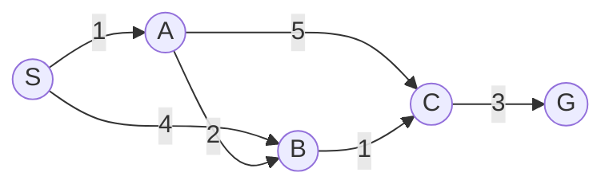

# Mục lục & Lộ trình — AIT2004 Biểu diễn tri thức & Tìm kiếm nâng cao 🧠🔍

Môn học **Biểu diễn tri thức và Tìm kiếm nâng cao** (AIT2004 Cơ sở Trí tuệ nhân tạo) là môn học cốt lõi của chuyên ngành Trí tuệ Nhân tạo tại UET. Bộ tài liệu ôn tập được chia theo từng chương độc lập, bám sát khung chương trình chuẩn (Russell & Norvig, "Artificial Intelligence: A Modern Approach").

::: tip Trạng thái các bài học
Những chương có link bên dưới đã **hoàn thành 100%** (ẩn dụ Feynman + sơ đồ Mermaid trực quan + bảng chạy từng bước dry-run + code C++ + tổng hợp bẫy thi hay gặp).
:::

## Phần I — Giải quyết vấn đề bằng tìm kiếm

| Bài | Chủ đề | Trạng thái |
|---|---|---|
| 1 | [Giới thiệu & Tác tử thông minh](./01-gioi-thieu-tac-tu.md) | ⏳ đang cập nhật |
| 2 | [**Chương 2: Tìm kiếm mù**](./02-tim-kiem-mu.md) (BFS, DFS, UCS, IDS) | ✅ **xong** |
| 3 | [**Chương 3: Tìm kiếm dựa trên kinh nghiệm**](./03-tim-kiem-kinh-nghiem.md) (Greedy, A\*, Admissible/Consistent, IDA\*) | ✅ **xong** |
| 4 | [**Chương 4: Tìm kiếm có đối thủ**](./04-tim-kiem-doi-khang.md) (Minimax, Cắt tỉa Alpha–Beta) | ✅ **xong** |
| 5 | [Bài toán thoả mãn ràng buộc (CSP)](./05-csp.md) | ⏳ đang cập nhật |

## Phần II — Ra quyết định dưới sự không chắc chắn

| Bài | Chủ đề | Trạng thái |
|---|---|---|
| 5 | Tính không chắc chắn và lợi ích (Utility Theory) | ⏳ chưa làm |
| 6 | Quá trình quyết định Markov I (MDP — Value/Policy Iteration) | ⏳ chưa làm |
| 7 | Quá trình quyết định Markov II | ⏳ chưa làm |
| 8 | Học tăng cường I (Reinforcement Learning) | ⏳ chưa làm |
| 9 | Học tăng cường II | ⏳ chưa làm |

## Phần III — Học máy

| Bài | Chủ đề | Trạng thái |
|---|---|---|
| 10 | Học máy — Naive Bayes | ⏳ chưa làm |
| 11 | Học máy — Perceptron & Hồi quy Logistic | ⏳ chưa làm |
| 12 | Mạng nơ-ron I | ⏳ chưa làm |
| 13 | Mạng nơ-ron II | ⏳ chưa làm |

## Phần IV — Logic, tri thức và suy luận xác suất

| Bài | Chủ đề | Trạng thái |
|---|---|---|
| Bổ sung 1 | Khái niệm về logic mệnh đề | ✅ gộp trong Chương 14 |
| Bổ sung 2 | Logic vị từ | ✅ gộp trong Chương 14 |
| 14 | [**Chương 14: Logic & Biểu diễn tri thức**](./14-logic-bieu-dien-tri-thuc.md) (FOL, Suy luận, Ontology) | ✅ **xong** |
| Bổ sung 3 | Giới thiệu Prolog | ⏳ chưa làm |
| 16 | [Mạng Bayes I & Suy luận](./16-mang-bayes.md) | ⏳ đang cập nhật |
| 17 | Suy luận bằng mạng Bayes II | ⏳ chưa làm |

---

## Đồ thị mẫu dùng xuyên suốt các chương tìm kiếm

Để việc so sánh giữa các chương nhất quán, Chương 2–4 đều dùng lại **cùng một đồ thị trạng thái** ($S,A,B,C,G$) với đáp án tối ưu đã biết trước ($=7$) — giúp thấy rõ BFS/DFS/Greedy sai ở đâu, còn UCS/A\* đúng như thế nào.

---

## 🌐 Tài nguyên Tham khảo Chất lượng Cao
- [UC Berkeley CS188: Introduction to Artificial Intelligence](https://inst.eecs.berkeley.edu/~cs188/) - Khóa học AI kinh điển số 1 thế giới về Tìm kiếm nâng cao, CSP và Minimax (có bài tập Pacman).
- [Stanford CS221: Artificial Intelligence - Principles and Techniques](https://cs221.stanford.edu/)
- [Sách "Artificial Intelligence: A Modern Approach" (AIMA - Stuart Russell & Peter Norvig)](https://aima.cs.berkeley.edu/) - Giáo trình chuẩn của môn học.
