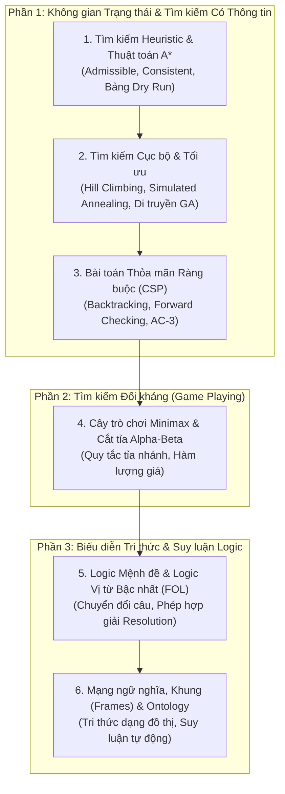

# Biểu Diễn Tri Thức & Tìm Kiếm Nâng Cao 🧠🔍

Môn học **Biểu diễn tri thức và Tìm kiếm nâng cao** (Knowledge Representation & Advanced Search) là môn học cốt lõi của chuyên ngành Trí tuệ Nhân tạo tại UET. Môn học này cung cấp nền tảng giải quyết các bài toán tìm kiếm không gian trạng thái phức tạp và cách máy tính mô hình hóa, suy luận tri thức từ dữ liệu.

---

## 🗺️ Lộ trình Ôn tập Trọng tâm

---

## 📚 Danh mục Bài học

- [x] [**Chuyên đề trọng tâm:** Tìm kiếm Heuristic ($A^*$), Minimax, Cắt tỉa Alpha-Beta & Logic FOL](./bieu-dien-tri-thuc-va-tim-kiem-nang-cao.md)
  - Tìm kiếm Greedy Best-First vs $A^*$
  - Điều kiện Heuristic Admissible & Consistent
  - Cây trò chơi Minimax và cắt tỉa $\alpha$-$\beta$
  - Logic vị từ bậc nhất (FOL) & Bản thể luận (Ontology)
- [ ] **Chương 2:** Thuật toán Tìm kiếm Nâng cao ($IDA^*$, $SMA^*$, Bi-directional Search)
- [ ] **Chương 3:** Tìm kiếm Cục bộ & Tối ưu hóa (Leo đồi, Simulated Annealing)
- [ ] **Chương 4:** Bài toán Thỏa mãn Ràng buộc (Constraint Satisfaction Problems - CSP)
- [ ] **Chương 5:** Cây trò chơi Minimax và Kỹ thuật Cắt tỉa Alpha-Beta
- [ ] **Chương 6:** Biểu diễn Tri thức bằng Logic Vị từ Bậc nhất (First-Order Logic)
- [ ] **Chương 7:** Phép Hợp giải (Resolution) và Suy diễn tự động
- [ ] **Chương 8:** Mạng ngữ nghĩa (Semantic Networks) và Ontology trong AI

---

## 🌐 Tài nguyên Tham khảo Quốc tế Đỉnh cao

- [UC Berkeley CS188: Introduction to Artificial Intelligence](https://inst.eecs.berkeley.edu/~cs188/) - Khóa học AI kinh điển số 1 thế giới về Tìm kiếm nâng cao, CSP và Minimax (có bài tập Pacman tuyệt đẹp).
- [Stanford CS221: Artificial Intelligence - Principles and Techniques](https://cs221.stanford.edu/)
- [Sách "Artificial Intelligence: A Modern Approach" (AIMA - Stuart Russell & Peter Norvig)](https://aima.cs.berkeley.edu/) - Giáo trình tiêu chuẩn vàng cho môn học này.
