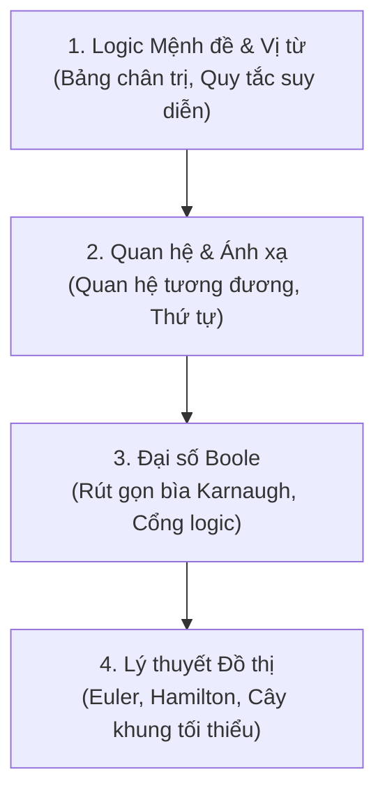

# Toán Rời Rạc (Discrete Mathematics) 📐

Toán rời rạc là ngôn ngữ nền tảng của toàn bộ ngành Khoa học Máy tính. Khác với Toán giải tích làm việc với các đại lượng liên tục (đạo hàm, tích phân), Toán rời rạc làm việc với các đối tượng đếm được, logic và cấu trúc.

---

## 🗺️ Các Chuyên đề Trọng tâm

### 1. [Logic Mệnh đề & Vị từ](./logic.md)
- Bảng chân trị các phép toán: $\land$ (AND), $\lor$ (OR), $\neg$ (NOT), $\rightarrow$ (Kéo theo), $\leftrightarrow$ (Tương đương).
- Các luật logic tương đương: De Morgan, phân phối, giao hoán.
- Lượng từ $\forall$ (với mọi) và $\exists$ (tồn tại).

### 2. [Quan hệ & Ánh xạ](./relations.md)
- Tính chất quan hệ: Phản xạ, Đối xứng, Phản đối xứng, Bắc cầu.
- Quan hệ tương đương & Lớp tương đương.
- Quan hệ thứ tự bộ phận (Poset) & Biểu đồ Hasse.

### 3. [Lý thuyết Đồ thị trong Toán rời rạc](./graph-theory.md)
- Định lý bắt tay: $\sum \text{deg}(v) = 2|E|$.
- Đồ thị Euler (chu trình & đường đi Euler).
- Đồ thị Hamilton.
- Đồ thị phẳng & Công thức Euler cho mặt phẳng: $V - E + F = 2$.

---

## 🌐 Nguồn Tham khảo Đánh giá cao

- [Discrete Mathematics by Kenneth H. Rosen](https://www.mheducation.com/) - Cuốn sách giáo khoa tiêu chuẩn vàng toàn cầu cho môn Toán rời rạc.
- [Kênh YouTube TrevTutor - Discrete Math](https://www.youtube.com/playlist?list=PLDDGPdw7e6Ag1EIznZ-m-qXu4XX3A0cIz) - Chuỗi bài giảng ngắn 5-10 phút giải thích từng khái niệm cực kỳ dễ hiểu.
