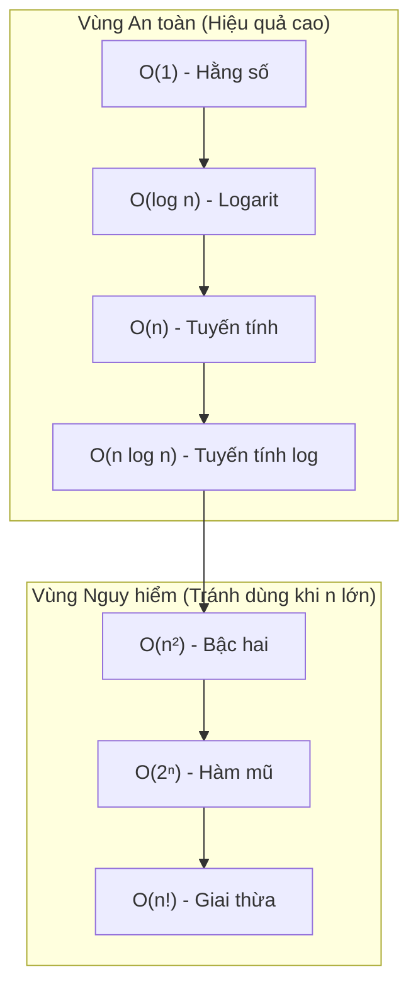

# Phân tích Độ phức tạp Thuật toán (Big-O Notation) ⏱️

Khi mới bắt đầu học lập trình, bạn chỉ quan tâm: *"Chương trình chạy ra kết quả đúng chưa?"*.  
Nhưng khi học Cấu trúc Dữ liệu & Giải thuật tại UET, câu hỏi quan trọng gấp 10 lần là:  
👉 **"Chương trình chạy đúng, nhưng nếu dữ liệu tăng từ 1.000 phần tử lên 10.000.000 phần tử thì máy tính chạy trong 0.1 giây hay chạy mất 3 ngày?"**

Đó chính là lý do **Ký hiệu Big-O** ra đời.

---

## 1. Ẩn dụ Dễ hiểu: Ký hiệu Big-O là gì?

Hãy tưởng tượng bạn cần gửi một tập tài liệu 100 GB cho một người bạn ở TP. Hồ Chí Minh:

- **Cách 1: Gửi qua mạng Internet.**  
  Nếu mạng có tốc độ cố định, 1 GB mất 1 phút $\rightarrow$ 100 GB mất 100 phút. Nếu gửi 1.000 GB sẽ mất 1.000 phút.  
  $\Rightarrow$ Thời gian tăng tuyến tính theo kích thước dữ liệu: **$\mathcal{O}(n)$**.

- **Cách 2: Chép vào USB rồi đi máy bay mang vào.**  
  Dù USB chứa 1 file text 1 KB hay chứa đầy 100 GB dữ liệu, thời gian bay từ Hà Nội vào TP.HCM vẫn cố định là 2 tiếng.  
  $\Rightarrow$ Thời gian không đổi bất kể dữ liệu lớn thế nào: **$\mathcal{O}(1)$**.

::: tip Định nghĩa Feynman
**Big-O** không đo bằng "giây" hay "mili-giây" (vì máy tính mỗi người mạnh yếu khác nhau).  
Big-O đo **tốc độ tăng số phép tính** khi kích thước đầu vào $n$ tăng lên vô hạn.
:::

---

## 2. Bảng Xếp hạng Tốc độ từ Nhanh đến Chậm

Dưới đây là các độ phức tạp bạn sẽ gặp liên tục trong mọi bài thi và bài kiểm tra:

| Ký hiệu | Tên gọi | Tốc độ | Ví dụ thực tế |
| :--- | :--- | :--- | :--- |
| $\mathcal{O}(1)$ | Hằng số (Constant) | 🚀 Nhanh nhất | Truy cập phần tử mảng bằng chỉ số `a[i]`, Push/Pop đỉnh Stack |
| $\mathcal{O}(\log n)$ | Logarit (Logarithmic) | ⚡ Rất nhanh | Tìm kiếm nhị phân (Binary Search), Tìm kiếm trên cây BST cân bằng |
| $\mathcal{O}(n)$ | Tuyến tính (Linear) | 🟢 Tốt | Duyệt tìm kiếm tuần tự từ đầu đến cuối mảng 1 vòng `for` |
| $\mathcal{O}(n \log n)$ | Tuyến tính Log | 🟡 Khá | MergeSort, QuickSort (trung bình), HeapSort |
| $\mathcal{O}(n^2)$ | Bậc hai (Quadratic) | 🟠 Chậm | 2 vòng lặp lồng nhau (BubbleSort, SelectionSort) |
| $\mathcal{O}(2^n)$ | Hàm mũ (Exponential) | 🔴 Cực chậm | Đệ quy quay lui giải bài toán cái túi hoặc tháp Hà Nội |
| $\mathcal{O}(n!)$ | Giai thừa (Factorial) | ☠️ Không khả thi | Vét cạn người du lịch (TSP) thử mọi hoán vị |



---

## 3. Mẹo Tính Nhanh Độ phức tạp Trong Bài Thi

### Quy tắc 1: Bỏ qua Hằng số & Phần tử bậc thấp
- Thuật toán chạy $f(n) = 5n^2 + 100n + 9999$ phép tính.
- Khi $n$ tiến ra vô cùng (ví dụ $n = 1.000.000$), $n^2$ sẽ áp đảo hoàn toàn $100n$ và $9999$.
- $\Rightarrow$ Độ phức tạp đơn giản là **$\mathcal{O}(n^2)$**.

### Quy tắc 2: Vòng lặp đơn và Vòng lặp lồng nhau

```cpp
// Vòng lặp O(n)
for (int i = 0; i < n; i++) {
    // Thực hiện thao tác O(1)
}

// Hai vòng lặp lồng nhau O(n^2)
for (int i = 0; i < n; i++) {
    for (int j = 0; j < n; j++) {
        // Thực hiện thao tác O(1)
    }
}
```

### Quy tắc 3: Biến đếm nhân đôi hoặc chia đôi $\rightarrow \mathcal{O}(\log n)$

```cpp
// Biến i tăng theo cấp số nhân: i = 1, 2, 4, 8, 16...
// Số bước lặp k thỏa mãn 2^k = n  ==> k = log2(n)
for (int i = 1; i < n; i = i * 2) {
    cout << i << "\n";
}
```
Mỗi khi bạn thấy vòng lặp bước nhảy nhân đôi `i *= 2` hoặc chia đôi `n /= 2`, độ phức tạp chắc chắn là **$\mathcal{O}(\log n)$**.

---

## 4. Phân biệt: Time Complexity vs Space Complexity

- **Time Complexity (Độ phức tạp thời gian):** Đếm tổng số thao tác cơ bản của thuật toán.
- **Space Complexity (Độ phức tạp không gian / bộ nhớ):** Đếm lượng bộ nhớ phụ trội mà thuật toán cấp phát thêm (không tính bộ nhớ chứa dữ liệu mảng ban đầu).
  - Ví dụ: Đảo ngược mảng ngay trên mảng ban đầu $\rightarrow$ Bộ nhớ phụ $\mathcal{O}(1)$ (In-place).
  - Tạo thêm một mảng mới kích thước $n$ để chứa kết quả $\rightarrow$ Bộ nhớ phụ $\mathcal{O}(n)$.

---

## 🌐 Nguồn Tham khảo & Trực quan Đánh giá cao

- [Big-O Cheat Sheet](https://www.bigocheatsheet.com/) - Bảng tra cứu trực quan đồ thị các hàm Big-O và độ phức tạp của toàn bộ cấu trúc dữ liệu.
- [Video: Big O Notation in 5 Minutes (FreeCodeCamp)](https://www.youtube.com/watch?v=kS_JgG8dAMc) - Video giải thích trực quan, dễ hiểu nhất về Big-O.
- [MIT OCW 6.006 - Lecture 1: Algorithmic Thinking, Peak Finding](https://ocw.mit.edu/courses/6-006-introduction-to-algorithms-fall-2011/resources/lecture-1-algorithmic-thinking-peak-finding/)
