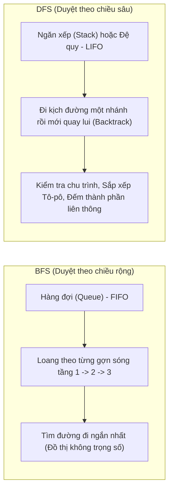

# Đồ thị & Các Thuật toán Duyệt (Graph Algorithms) 🕸️

Đồ thị là cấu trúc dữ liệu mô hình hóa thế giới thực mạnh mẽ nhất: mạng xã hội Facebook (người dùng là đỉnh, quan hệ bạn bè là cạnh), bản đồ Google Maps (ngã tư là đỉnh, đường phố là cạnh có trọng số độ dài), hay mạng Internet.

---

## 1. Biểu diễn Đồ thị: Ma trận kề vs Danh sách kề

Cho đồ thị có $V$ đỉnh và $E$ cạnh:

| Phương pháp | Bộ nhớ | Kiểm tra 2 đỉnh $(u, v)$ có kề nhau? | Duyệt mọi đỉnh kề của $u$ | Thích hợp khi |
| :--- | :--- | :--- | :--- | :--- |
| **Ma trận kề (Adjacency Matrix)** | $\mathcal{O}(V^2)$ | $\mathcal{O}(1)$ (truy cập `matrix[u][v]`) | $\mathcal{O}(V)$ | Đồ thị dày (nhiều cạnh, $E \approx V^2$) |
| **Danh sách kề (Adjacency List)** | $\mathcal{O}(V + E)$ | $\mathcal{O}(\text{deg}(u))$ | $\mathcal{O}(\text{deg}(u))$ | Đồ thị thưa (ít cạnh, $E \ll V^2$) - Thực tế 95% dùng loại này |

---

## 2. So sánh Trực quan: BFS vs DFS

### 💡 Ẩn dụ Dễ nhớ:
- **BFS (Breadth-First Search):** Giống như hòn đá ném xuống mặt hồ phẳng lặng, sóng lan tròn đều theo từng vòng ra xa dần. Đỉnh nào gần điểm xuất phát sẽ được ghé thăm trước.
- **DFS (Depth-First Search):** Giống như bạn đi khám phá một mê cung. Cứ gặp ngã rẽ là bạn đi sâu mãi vào một nhánh cho đến khi đâm vào ngõ cụt thì mới quay lui lại ngã ba trước đó để thử nhánh khác.

---

## 3. Thuật toán Dijkstra: Tìm Đường đi Ngắn nhất

Dijkstra tìm đường đi ngắn nhất từ một đỉnh nguồn $S$ đến tất cả các đỉnh còn lại trên đồ thị có **trọng số không âm** ($w \ge 0$).

### 🚀 Nguyên lý Tham lam (Greedy Strategy):
1. Khởi tạo mảng khoảng cách `dist[i] = vô cùng`, riêng `dist[S] = 0`.
2. Dùng hàng đợi ưu tiên (Min-Priority Queue / `std::priority_queue` trong C++) để luôn chọn ra **đỉnh $u$ chưa xét có khoảng cách nhỏ nhất**.
3. Thử "thư giãn" (Relaxation) tất cả các cạnh kề $(u, v)$ với trọng số $w$:
   $$\text{Nếu } dist[u] + w < dist[v] \implies dist[v] = dist[u] + w$$
4. Lặp lại cho đến khi xét hết mọi đỉnh.

::: warning Cảnh báo Đi thi
Thuật toán Dijkstra **KHÔNG** chạy đúng trên đồ thị có cạnh mang **trọng số âm**! Khi gặp trọng số âm, bạn phải dùng thuật toán **Bellman-Ford**.
:::

---

## 🌐 Nguồn Tham khảo & Trực quan Đồ thị

- [VisuAlgo - Graph Traversal & Dijkstra](https://visualgo.net/en/sssp) - Chạy mô phỏng từng bước thuật toán Dijkstra trực tiếp.
- [CP-Algorithms - Graph Theory](https://cp-algorithms.com/graph/breadth-first-search.html) - Tài liệu thuật toán thi đấu quốc tế giải thích cực kỳ chuẩn xác và có sẵn code C++ tối ưu.
