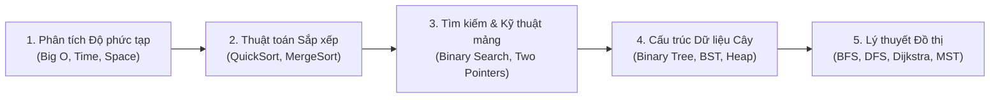

# Cấu trúc Dữ liệu & Giải thuật (DSA) ⚡

Chào mừng bạn đến với chuyên đề **Cấu trúc dữ liệu và Giải thuật** — một trong những môn học nền tảng quan trọng nhất của sinh viên Công nghệ Thông tin UET.

::: tip Triết lý học tại Hub
Môn DSA không nhằm mục đích bắt bạn "học thuộc lòng" từng dòng code C/C++. Mục tiêu tối thượng là **hiểu bản chất tư duy giải quyết vấn đề**:
1. Tại sao cấu trúc dữ liệu / thuật toán này lại ra đời?
2. Nó giải quyết bài toán gì tốt hơn cách thông thường?
3. Khi nào nên dùng và khi nào không nên dùng?
:::

---

## 🗺️ Lộ trình Ôn tập Trọng tâm

Dưới đây là các chuyên đề cốt lõi được chia nhỏ theo từng học phần:

### 1. [Phân tích Độ phức tạp Thuật toán (Big-O)](./complexity.md)
- Hiểu bản chất ký hiệu $\mathcal{O}(1), \mathcal{O}(\log n), \mathcal{O}(n), \mathcal{O}(n \log n), \mathcal{O}(n^2)$.
- Cách tính nhanh thời gian chạy của vòng lặp và đệ quy mà không cần toán cao cấp.

### 2. [Thuật toán Sắp xếp (Sorting Algorithms)](./sorting.md)
- Phân tích chi tiết: **MergeSort** (Chia để trị) và **QuickSort** (Phân hoạch Hoare/Lomuto).
- Bảng mô phỏng từng bước (dry run) với mảng số thực tế.
- So sánh tính ổn định (Stability) và bộ nhớ phụ.

### 3. [Thuật toán Tìm kiếm (Searching)](./searching.md)
- Tìm kiếm nhị phân (Binary Search) và các biến thể tìm vị trí đầu/cuối.
- Kỹ thuật Hai con trỏ (Two Pointers) & Cửa sổ trượt (Sliding Window).

### 4. [Cấu trúc Cây & Cây nhị phân (Trees)](./trees.md)
- Cây nhị phân tìm kiếm (Binary Search Tree - BST): Thêm, xóa, tìm kiếm.
- Duyệt cây: Tiền thứ tự (Preorder), Trung thứ tự (Inorder), Hậu thứ tự (Postorder).
- Giới thiệu Cây cân bằng (AVL Tree) và Heap.

### 5. [Đồ thị & Các thuật toán duyệt (Graphs)](./graphs.md)
- Biểu diễn đồ thị: Ma trận kề vs Danh sách kề.
- Thuật toán duyệt: BFS (Hàng đợi) và DFS (Ngăn xếp/Đệ quy).
- Tìm đường đi ngắn nhất: Thuật toán Dijkstra.

---

## 🌐 Các nguồn tham khảo quốc tế tốt nhất

Trong quá trình học các bài viết dưới đây, bạn có thể tham khảo thêm các công cụ trực quan hàng đầu thế giới:
- [VisuAlgo.net](https://visualgo.net/en) - Trang web trực quan hóa trực tiếp mọi thuật toán bằng hoạt họa.
- [NeetCode.io](https://neetcode.io/) - Lộ trình thực hành thuật toán từ cơ bản đến nâng cao.
- [GeeksforGeeks - DSA](https://www.geeksforgeeks.org/data-structures/) - Bách khoa toàn thư ví dụ mã nguồn C++/Java/Python.
- [MIT OpenCourseWare 6.006](https://ocw.mit.edu/courses/6-006-introduction-to-algorithms-fall-2011/) - Giáo trình nhập môn giải thuật kinh điển của MIT.
