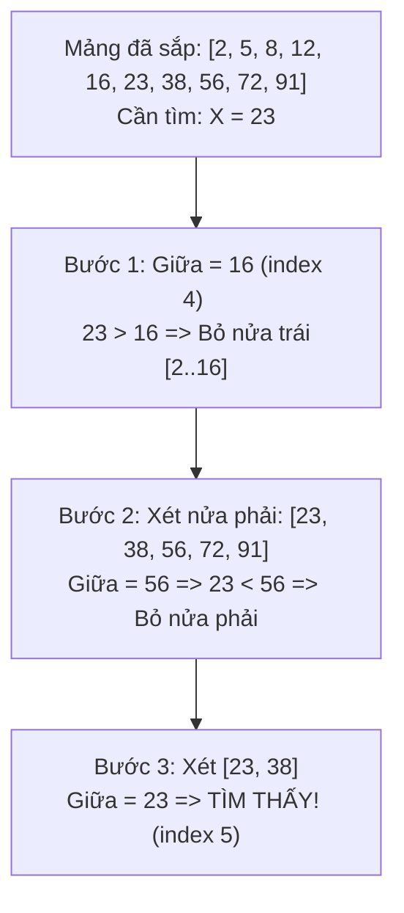

# Thuật toán Tìm kiếm (Searching Algorithms) 🔍

Tìm kiếm là một trong những thao tác cơ bản nhất khi làm việc với dữ liệu. Từ tìm kiếm một sinh viên theo mã số đến tìm kiếm từ khóa trong cơ sở dữ liệu hàng tỷ bản ghi.

---

## 1. Tìm kiếm Nhị phân (Binary Search)

::: danger Điều kiện Tiên quyết Bắt buộc
**Mảng phải được sắp xếp trước!** Nếu mảng chưa sắp xếp, bạn không thể dùng Binary Search mà phải dùng Linear Search $\mathcal{O}(n)$ hoặc sắp xếp trước.
:::

### 💡 Trực giác Đơn giản
Giống như trò chơi đoán số từ $1$ đến $100$:
- Người kia nghĩ số $73$.
- Lần 1: Bạn đoán $50$ $\rightarrow$ Báo "Lớn hơn". Bạn loại ngay được 50 số đầu ($1 \rightarrow 50$).
- Lần 2: Bạn đoán ở giữa đoạn $51 \rightarrow 100$, tức là $75$ $\rightarrow$ Báo "Nhỏ hơn". Bạn loại tiếp được đoạn $75 \rightarrow 100$.
- Cứ mỗi lần đoán, bạn **cắt đôi không gian tìm kiếm**.

Độ phức tạp chỉ mất $\log_2(100) \approx 7$ lần đoán! Với mảng $1.000.000$ phần tử, Binary Search tìm ra trong tối đa **20 phép so sánh**.



### 💻 Mã Cài đặt C++ Chống Tràn Số

```cpp
int binarySearch(const vector<int>& arr, int target) {
    int left = 0;
    int right = arr.size() - 1;

    while (left <= right) {
        // Tránh tràn số (overflow) thay vì dùng (left + right) / 2
        int mid = left + (right - left) / 2;

        if (arr[mid] == target) {
            return mid; // Tìm thấy tại chỉ số mid
        }
        if (arr[mid] < target) {
            left = mid + 1;  // Tìm tiếp bên nửa phải
        } else {
            right = mid - 1; // Tìm tiếp bên nửa trái
        }
    }
    return -1; // Không tìm thấy
}
```

---

## 2. Kỹ thuật Hai Con Trỏ (Two Pointers)

Kỹ thuật Hai con trỏ là phương pháp cực kỳ lợi hại để giảm độ phức tạp từ $\mathcal{O}(n^2)$ xuống $\mathcal{O}(n)$ trên mảng đã sắp xếp.

### 📌 Bài toán 2-Sum: Tìm hai số có tổng bằng $S$
- Đặt con trỏ `left = 0` (số nhỏ nhất) và `right = n - 1` (số lớn nhất).
- Tính `sum = arr[left] + arr[right]`:
  - Nếu `sum == S` $\rightarrow$ Tìm thấy cặp số!
  - Nếu `sum < S` $\rightarrow$ Cần tổng lớn hơn $\rightarrow$ Tăng `left++`.
  - Nếu `sum > S` $\rightarrow$ Cần tổng nhỏ hơn $\rightarrow$ Giảm `right--`.

```cpp
bool hasPairWithSum(const vector<int>& arr, int targetSum) {
    int left = 0;
    int right = arr.size() - 1;
    while (left < right) {
        int currentSum = arr[left] + arr[right];
        if (currentSum == targetSum) return true;
        if (currentSum < targetSum) left++;
        else right--;
    }
    return false;
}
```

---

## 🌐 Nguồn Tham khảo
- [LeetCode Explore - Binary Search](https://leetcode.com/explore/learn/card/binary-search/)
- [VisuAlgo - Binary Search](https://visualgo.net/en/bst)
