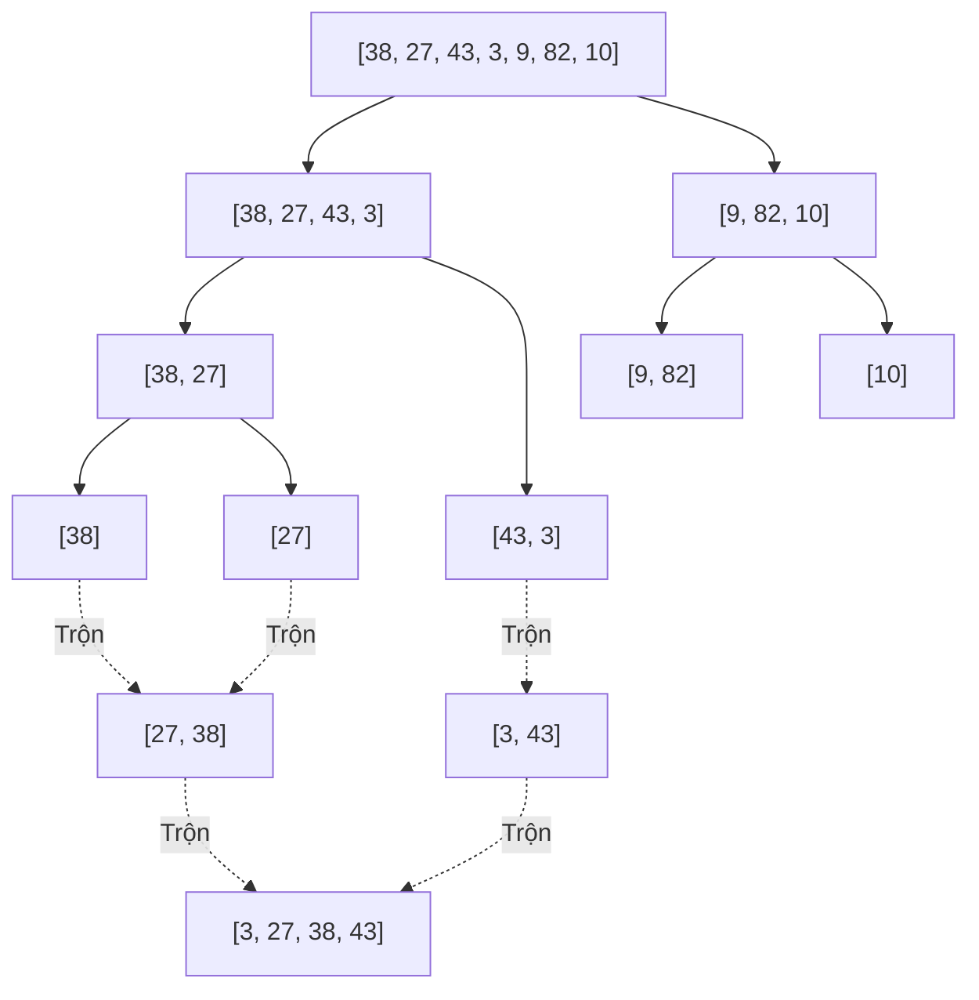
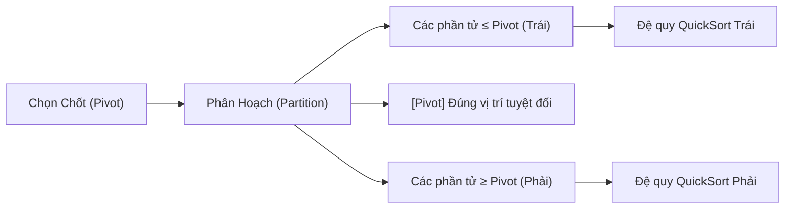

# Thuật toán Sắp xếp (Sorting Algorithms) 🔄

Sắp xếp là bài toán kinh điển nhất trong khoa học máy tính: *Cho một danh sách các phần tử, hãy sắp xếp chúng theo thứ tự tăng dần (hoặc giảm dần).*

Trong các đề thi UET, các thuật toán đơn giản $\mathcal{O}(n^2)$ như BubbleSort hay SelectionSort rất hiếm khi hỏi sâu. Trọng tâm 90% sẽ rơi vào hai thuật toán $\mathcal{O}(n \log n)$ mạnh mẽ nhất: **MergeSort** và **QuickSort**.

---

## 1. Bảng So sánh Nhanh (Cheat Sheet Đi Thi)

| Thuật toán | Tốt nhất | Trung bình | Xấu nhất | Bộ nhớ phụ | Ổn định (Stable)? | Phương pháp |
| :--- | :--- | :--- | :--- | :--- | :--- | :--- |
| **Bubble / Insertion** | $\mathcal{O}(n)$ | $\mathcal{O}(n^2)$ | $\mathcal{O}(n^2)$ | $\mathcal{O}(1)$ | Có | So sánh từng cặp |
| **MergeSort** | $\mathcal{O}(n \log n)$ | $\mathcal{O}(n \log n)$ | $\mathcal{O}(n \log n)$ | $\mathcal{O}(n)$ | **Có** | Chia để trị (Divide & Conquer) |
| **QuickSort** | $\mathcal{O}(n \log n)$ | $\mathcal{O}(n \log n)$ | $\mathcal{O}(n^2)$ | $\mathcal{O}(\log n)$ | **Không** | Phân hoạch quanh Pivot |
| **HeapSort** | $\mathcal{O}(n \log n)$ | $\mathcal{O}(n \log n)$ | $\mathcal{O}(n \log n)$ | $\mathcal{O}(1)$ | **Không** | Dùng Max-Heap |

::: info Khái niệm "Tính Ổn Định" (Stability) là gì?
Một thuật toán sắp xếp là **Stable** nếu hai phần tử có giá trị bằng nhau vẫn giữ nguyên thứ tự xuất hiện trước sau như ban đầu.  
*Ví dụ:* Danh sách sinh viên đã sắp theo Tên, nếu dùng thuật toán Stable để sắp lại theo Điểm số thì các bạn cùng điểm vẫn sẽ giữ nguyên thứ tự tên ban đầu.
:::

---

## 2. MergeSort: Thuật toán Chia để Trị Hoàn hảo

### 💡 Ý tưởng Cốt lõi
MergeSort dựa trên 3 bước **Chia để trị (Divide & Conquer)**:
1. **Chia (Divide):** Chia đôi mảng thành 2 nửa bằng nhau cho đến khi mỗi mảng con chỉ còn 1 phần tử (mảng 1 phần tử hiển nhiên đã được sắp xếp).
2. **Trị (Conquer):** Đệ quy sắp xếp từng nửa mảng con.
3. **Trộn (Combine/Merge):** Trộn 2 mảng con đã sắp xếp thành 1 mảng lớn hoàn chỉnh.



### 🔬 Kỹ thuật Trộn Hai Mảng Đã Sắp Xếp (Merge Step)
Cho 2 mảng: $A = [2, 7]$ và $B = [3, 5]$.  
- Dùng 2 con trỏ `i` trỏ vào $A$, `j` trỏ vào $B$.
- So sánh $A[i]$ và $B[j]$, phần tử nào nhỏ hơn thì đưa vào mảng kết quả và tăng con trỏ tương ứng.
- Bước này duyệt qua toàn bộ phần tử $\rightarrow$ Thời gian trộn là **$\mathcal{O}(n)$**.
- Vì cây đệ quy chia đôi mảng có chiều cao là $\log_2(n)$ tầng, mỗi tầng tốn $\mathcal{O}(n)$ $\rightarrow$ **Tổng thời gian luôn là $\mathcal{O}(n \log n)$** trong mọi trường hợp!

---

## 3. QuickSort: Sắp xếp Nhanh bằng Phân Hoạch

### 💡 Ý tưởng Cốt lõi
Thay vì chia đôi cố định ở giữa như MergeSort, QuickSort chọn một phần tử làm **Chốt (Pivot)** và phân hoạch:
- Đẩy toàn bộ các số **nhỏ hơn Pivot** sang bên trái.
- Đẩy toàn bộ các số **lớn hơn Pivot** sang bên phải.
- Lúc này, Pivot đã nằm **chính xác 100%** tại vị trí cuối cùng của nó trong mảng đã sắp xếp!
- Tiếp tục đệ quy phân hoạch nửa bên trái và nửa bên phải của Pivot.



### ⚠️ Bẫy Đi Thi: Khi nào QuickSort bị tụt xuống $\mathcal{O}(n^2)$?
- Nếu mảng đã có thứ tự sẵn (hoặc ngược chiều) mà bạn luôn chọn **phần tử đầu tiên hoặc cuối cùng** làm Pivot:
  - Một bên sẽ có $0$ phần tử, bên còn lại có $n - 1$ phần tử.
  - Cây đệ quy bị lệch hẳn 1 bên thành cây thoái hóa sâu $n$ tầng.
  - Tổng số bước: $(n-1) + (n-2) + \dots + 1 = \frac{n(n-1)}{2} \approx \mathcal{O}(n^2)$.
- **Giải pháp khắc phục:** 
  - Chọn Pivot ngẫu nhiên (Randomized QuickSort).
  - Chọn Pivot là trung vị của 3 phần tử: Đầu, Giữa, Cuối (Median-of-three).

---

## 4. Mã Cài đặt Mẫu Chuẩn C++ (Kèm Chú Thích Dễ Hiểu)

```cpp
#include <iostream>
#include <vector>
using namespace std;

// Hàm phân hoạch Lomuto cho QuickSort
int partition(vector<int>& arr, int low, int high) {
    int pivot = arr[high]; // Chọn phần tử cuối làm Pivot
    int i = low - 1;       // i đánh dấu ranh giới vùng số nhỏ hơn pivot

    for (int j = low; j < high; j++) {
        if (arr[j] < pivot) {
            i++;
            swap(arr[i], arr[j]);
        }
    }
    swap(arr[i + 1], arr[high]); // Đưa pivot về đúng vị trí ở giữa
    return i + 1;                // Trả về vị trí của pivot
}

void quickSort(vector<int>& arr, int low, int high) {
    if (low < high) {
        int pi = partition(arr, low, high);
        quickSort(arr, low, pi - 1);  // Đệ quy nửa trái
        quickSort(arr, pi + 1, high); // Đệ quy nửa phải
    }
}
```

---

## 🌐 Nguồn Tham khảo & Trực quan Xuất sắc

- [VisuAlgo - Sorting Visualization](https://visualgo.net/en/sorting) - Xem hoạt họa chạy từng dòng code của QuickSort và MergeSort theo thời gian thực.
- [Video: QuickSort by mycodeschool (YouTube)](https://www.youtube.com/watch?v=COk73CPpweg) - Video giải thích thuật toán phân hoạch trực quan số 1 thế giới.
- [GeeksforGeeks - Sorting Algorithms Overview](https://www.geeksforgeeks.org/sorting-algorithms/)
