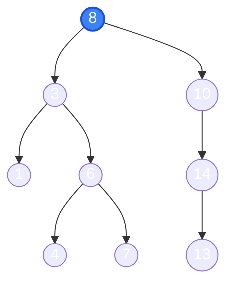

# Cấu trúc Cây & Cây Nhị Phân Tìm Kiếm (BST) 🌲

Cấu trúc cây (Tree) là một cấu trúc dữ liệu phi tuyến tính (non-linear), mô phỏng quan hệ phân cấp như cây gia phả, cấu trúc thư mục trên ổ đĩa, hay DOM trong HTML.

---

## 1. Cây Nhị Phân Tìm Kiếm (Binary Search Tree - BST)

Một cây nhị phân được gọi là **BST** nếu với mọi nút (Node):
- Mọi nút trên **cây con trái** đều có giá trị **nhỏ hơn** nút hiện tại.
- Mọi nút trên **cây con phải** đều có giá trị **lớn hơn** nút hiện tại.

::: tip Tính chất Thần thánh của BST
Khi duyệt cây BST theo thứ tự **Inorder (Trái $\rightarrow$ Gốc $\rightarrow$ Phải)**, bạn luôn thu được một dãy số **tăng dần có thứ tự hoàn hảo**!  
*Ví dụ cây trên:* $1 \rightarrow 3 \rightarrow 4 \rightarrow 6 \rightarrow 7 \rightarrow 8 \rightarrow 10 \rightarrow 13 \rightarrow 14$.
:::

---

## 2. Các Phép Duyệt Cây (Tree Traversals)

| Cách duyệt | Thứ tự đi | Ứng dụng phổ biến |
| :--- | :--- | :--- |
| **Tiền thứ tự (Preorder)** | **Gốc** $\rightarrow$ Trái $\rightarrow$ Phải | Sao chép cây, biểu diễn tiền tố (Ba Lan) |
| **Trung thứ tự (Inorder)** | Trái $\rightarrow$ **Gốc** $\rightarrow$ Phải | Xuất dữ liệu BST theo thứ tự tăng dần |
| **Hậu thứ tự (Postorder)**| Trái $\rightarrow$ Phải $\rightarrow$ **Gốc** | Giải phóng/xóa bộ nhớ cây từ dưới lên |
| **Theo mức (Level-order)** | Từng tầng từ trên xuống (BFS) | Tìm đường đi ngắn nhất hoặc in cây theo tầng |

---

## 3. Thao tác Xóa trên BST (Thường Xuất hiện trong Đề thi UET)

Xóa một nút trên cây BST chia làm 3 trường hợp:
1. **Trường hợp 1 (Nút lá):** Không có con $\rightarrow$ Xóa trực tiếp nút đó.
2. **Trường hợp 2 (Nút có 1 con):** Nối thẳng con của nó vào cha của nó rồi xóa nút.
3. **Trường hợp 3 (Nút có 2 con):**
   - Tìm **phần tử nhỏ nhất bên cây con phải** (Inorder Successor) hoặc phần tử lớn nhất bên cây con trái.
   - Sao chép giá trị đó đè lên nút cần xóa.
   - Xóa nút thay thế đó (lúc này nút thay thế chỉ rơi vào Trường hợp 1 hoặc 2).

---

## 4. Hiện tượng Suy biến & Cây Cân bằng (AVL Tree)

Nếu bạn chèn một dãy số đã sắp xếp sẵn: `1, 2, 3, 4, 5` vào BST thông thường:
- Cây sẽ biến thành một danh sách liên kết thẳng đứng (chiều cao $h = n$).
- Tốc độ tìm kiếm bị tụt từ $\mathcal{O}(\log n)$ xuống $\mathcal{O}(n)$.

Để khắc phục, người ta phát minh ra **Cây cân bằng (AVL Tree / Red-Black Tree)**:
- Tự động xoay cây (Left Rotation, Right Rotation) khi hệ số cân bằng (chênh lệch chiều cao 2 nhánh) $> 1$ hoặc $< -1$.
- Giữ chiều cao luôn đạt mức $\mathcal{O}(\log n)$.

---

## 🌐 Nguồn Tham khảo & Mô phỏng Trực quan

- [VisuAlgo - BST & AVL Tree Simulator](https://visualgo.net/en/bst) - Thử chèn, xóa và quan sát cây tự động xoay cân bằng.
- [GeeksforGeeks - Binary Search Tree Operations](https://www.geeksforgeeks.org/binary-search-tree-data-structure/)
