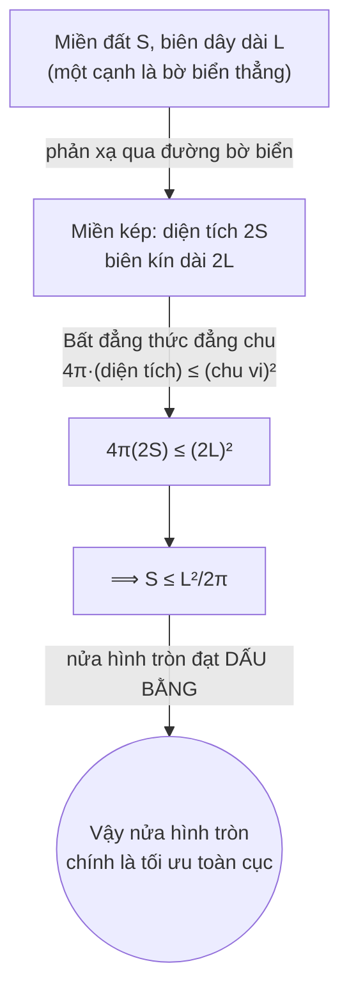
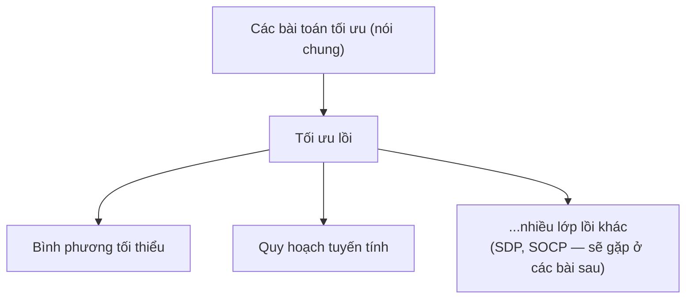
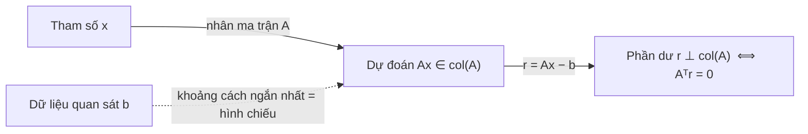
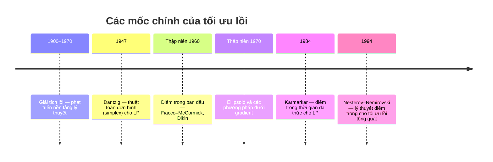

<!-- File: docs/co-so-toan-ai/bai-01-nhap-mon-toi-uu.md -->
---
title: "Bài 01 · Nhập môn: Giới thiệu về Tối ưu"
description: "Ôn tập chuyên đề: mô hình hoá bài toán tối ưu, bài toán Dido, bình phương tối thiểu, quy hoạch tuyến tính và tính lồi."
---

# Bài 01 · Nhập môn: Giới thiệu về Tối ưu

> *"Mô hình hóa trước, thuật toán sau."* — bài học đầu tiên và quan trọng nhất của cả môn học nằm gọn trong một câu này.

[[toc]]

## 0. Vì sao một câu chuyện 3000 năm tuổi lại là bài mở đầu của AI?

Hãy tưởng tượng bạn được tặng một sợi dây thừng dài **L mét**, đặt trên một bờ biển thẳng, và được quyền sở hữu toàn bộ phần đất mà sợi dây đó bao quanh (bờ biển thì không tốn dây). Bạn sẽ căng sợi dây theo hình gì để có **nhiều đất nhất**?

Đây chính là *bài toán Dido* — theo truyền thuyết, nữ hoàng Dido được phép lấy phần đất bao quanh bởi một tấm da bò; bà đã cắt tấm da thành sợi dây mảnh để tối đa hoá diện tích đất chiếm được [H1][H2].

::: tip Vì sao Claude/AI hiện đại vẫn cần câu chuyện này?
Toàn bộ Machine Learning là các bài toán "căng sợi dây" trừu tượng: bạn có một **ngân sách hữu hạn** (dữ liệu, tham số, bộ nhớ, thời gian huấn luyện) và cần **sắp xếp nó tối ưu** để đạt một mục tiêu (độ chính xác, log-likelihood, reward...). Dido dạy ta thứ tự tư duy đúng: **xác định biến — mục tiêu — ràng buộc**, rồi mới bàn thuật toán.
:::


Với cùng độ dài dây L, ba lựa chọn "trực giác" là **hình chữ nhật**, **hình tam giác**, **nửa hình tròn**. Trước khi đọc tiếp, hãy tự hỏi: bạn đang *đoán theo hình vẽ* hay đã có *một lập luận chứng minh*? Phần 2 sẽ trả lời triệt để câu hỏi này.

---

## 1. Giải phẫu một bài toán tối ưu: ba mảnh ghép bắt buộc

**Ẩn dụ:** đi siêu thị với một số tiền cố định trong ví. Bạn phải quyết định *mua gì và bao nhiêu* (biến), sao cho *độ hài lòng là lớn nhất* (mục tiêu), miễn là *không vượt quá số tiền trong ví* (ràng buộc). Mọi bài toán tối ưu — từ Dido đến huấn luyện GPT — đều có đúng ba mảnh ghép này.

### 1.1 Định nghĩa hình thức

$$
\begin{aligned}
\underset{x \in \mathbb{R}^n}{\text{minimize}} \quad & f_0(x) \\
\text{subject to} \quad & f_i(x) \le b_i, \quad i = 1, \dots, m
\end{aligned}
$$

| Ký hiệu | Tên gọi | Ý nghĩa |
|---|---|---|
| $x = (x_1,\dots,x_n)$ | Biến quyết định | Đại lượng ta *được phép chọn* |
| $f_0 : \mathbb{R}^n \to \mathbb{R}$ | Hàm mục tiêu | "Chấm điểm" mỗi lựa chọn — càng nhỏ càng tốt |
| $f_i(x) \le b_i$ | Ràng buộc | Lựa chọn nào được chấp nhận |
| $b_i$, tham số trong $f_i$ | **Dữ liệu** | Không phải biến quyết định |
| $\mathcal{F} = \{x : f_i(x)\le b_i\ \forall i\}$ | Miền khả thi | Tập tất cả lựa chọn hợp lệ |
| $x^\*$ | Nghiệm tối ưu | $x^\*\in\mathcal F$ và $f_0(x^\*)\le f_0(x)\ \forall x\in\mathcal F$ |
| $v^\* = \inf_{x\in\mathcal F} f_0(x)$ | Giá trị tối ưu | Có thể tồn tại dù $x^\*$ không tồn tại |

::: warning Bẫy thi cử #1 — "tối đa hóa" không phải bài toán khác
$\max_x g(x) \iff \min_x -g(x)$: **nghiệm $x^\*$ giữ nguyên**, chỉ giá trị tối ưu đổi dấu. Đề thi hay yêu cầu bạn chuyển một bài `maximize` về dạng chuẩn `minimize` trước khi áp dụng lý thuyết — quên đổi dấu là lỗi phổ biến nhất.
:::

### 1.2 Khả thi ≠ Tối ưu, và ba cách một bài toán "gãy"

Không phải bài toán nào cũng có nghiệm. Đây là bảng phân loại — **học thuộc bảng này gần như chắc chắn xuất hiện trong đề thi**:

| # | Tình huống | Ví dụ | Hệ quả |
|---|---|---|---|
| 1 | **Không khả thi** | $\min x^2$ với $x\ge 2,\ x\le 1$ | $\mathcal F=\varnothing$, không có gì để bàn |
| 2 | **Không bị chặn dưới** | $\min_{x\in\mathbb R}(-x)$ | $v^\*=-\infty$ |
| 3 | **Có cận nhưng không đạt** | $\min_{x>0} x$ | $v^\*=0$ nhưng **không tồn tại** $x^\*$ (luôn có $x/2$ tốt hơn) |

::: danger Câu hỏi "nghiệm nằm ở đâu?" là vô nghĩa nếu chưa kiểm tra 3 điều trên
Đây là lỗi tư duy phổ biến nhất của người mới học tối ưu: nhảy thẳng vào giải phương trình đạo hàm = 0 mà quên hỏi liệu bài toán có khả thi, có bị chặn, và giá trị tối ưu có *đạt được* hay không.
:::

### 1.3 Ba ví dụ AI kinh điển đọc theo khuôn "biến – mục tiêu – ràng buộc"

| Bài toán | Biến | Mục tiêu | Ràng buộc |
|---|---|---|---|
| Danh mục đầu tư | Tỉ trọng vốn vào từng tài sản | Giảm rủi ro/phương sai | Ngân sách; lợi nhuận tối thiểu |
| Thiết kế mạch điện | Kích thước linh kiện | Giảm công suất tiêu thụ | Giới hạn chế tạo, thời gian đáp ứng |
| Khớp dữ liệu (curve fitting) | Tham số mô hình | Giảm sai lệch dự đoán–quan sát | Thông tin tiên nghiệm, giới hạn tham số |

::: info Toán học này dùng ở đâu trong AI?
Mọi vòng lặp huấn luyện — từ hồi quy tuyến tính đến fine-tune LLM — đều là **`minimize loss(θ) subject to (có thể) ràng buộc trên θ`**. "Khớp dữ liệu" ở trên chính là ML nói chung: $x=\theta$ (trọng số mô hình), $f_0=$ hàm mất mát (MSE, cross-entropy...), và các ràng buộc chính là các kỹ thuật *regularization* (giới hạn chuẩn của $\theta$) mà ta sẽ gặp lại xuyên suốt môn học.
:::

---

## 2. Giải trọn vẹn bài toán Dido — một case study về mô hình hoá

### 2.1 Bước 1: Tối ưu trong lớp "hình chữ nhật"

Mô hình hoá: cạnh song song bờ biển là $y$, hai cạnh vuông góc là $x$ (không rào cạnh sát biển). Ràng buộc dây: $2x+y=L \Rightarrow y = L-2x$.

$$S(x) = x(L-2x), \qquad 0\le x\le L/2$$

**Kỹ thuật hoàn thành bình phương** — kỹ năng đại số nền tảng sẽ dùng lại nhiều lần trong LS/ridge:

$$S(x) = \frac{L^2}{8} - 2\left(x - \frac{L}{4}\right)^2$$

Vì số hạng bình phương $\ge 0$, giá trị lớn nhất đạt tại $x^\*=L/4$:

$$x^\*=\frac{L}{4},\quad y^\*=\frac{L}{2},\quad S^\*_{\text{cn}}=\frac{L^2}{8}$$

::: warning Bẫy thi cử #2
Đây **chỉ** là nghiệm tối ưu *trong lớp hình chữ nhật*. Chưa có gì đảm bảo nó tốt nhất trong *mọi* hình dạng — một lỗi lập luận rất hay gặp là "tối ưu cục bộ trong một họ hàm ⇒ tối ưu tuyệt đối", trong khi thực ra cần chứng minh riêng.
:::

### 2.2 Bước 2: Nửa hình tròn — một ứng viên tốt hơn

Với nửa hình tròn bán kính $r$: chu vi cung tròn $L=\pi r \Rightarrow r = L/\pi$, diện tích:

$$S_{\text{nửa tròn}} = \frac{\pi r^2}{2} = \frac{L^2}{2\pi}$$

**Dry run so sánh số (L = 100 m):**

| Đại lượng | Hình chữ nhật tốt nhất | Nửa hình tròn |
|---|---|---|
| Công thức | $L^2/8$ | $L^2/2\pi$ |
| Giá trị số | $1250\ \text{m}^2$ | $\approx 1591.55\ \text{m}^2$ |
| So với hình chữ nhật | — | **tăng ≈ 27.3%**, cùng một độ dài dây |

### 2.3 Bước 3: Chứng minh nửa hình tròn là tối ưu — mẹo "phản xạ"

Đây là điểm sáng chói nhất của bài giảng: biến một bài toán *ràng buộc bởi bờ biển* thành một bài toán *đối xứng hoàn toàn*, rồi áp dụng một định lý có sẵn.



**Bất đẳng thức đẳng chu** (isoperimetric inequality — không chứng minh trong bài, dùng như một công cụ có sẵn [H4]): với miền phẳng có biên kín dài $P$,

$$4\pi \cdot (\text{diện tích miền}) \le P^2$$

Áp dụng cho miền kép: $4\pi(2S)\le (2L)^2 \Rightarrow S\le \dfrac{L^2}{2\pi}$. Nửa hình tròn đạt dấu bằng ở công thức Bước 2 ⟹ nó **là** nghiệm tối ưu toàn cục, không chỉ là "ứng viên tốt".

::: info Toán học này dùng ở đâu trong AI?
Kỹ thuật "biến đổi bài toán ràng buộc thành bài toán đối xứng/không ràng buộc rồi áp một bất đẳng thức đã biết" chính là tinh thần của rất nhiều **chứng nhận tối ưu (certificate of optimality)** trong tối ưu lồi — bạn sẽ gặp lại ý tưởng "chặn trên bằng một bất đẳng thức đạt dấu bằng" khi học **đối ngẫu Lagrange** (Bài 03) và **siêu phẳng tựa** (Bài 02).
:::

### 2.4 Bước 4: Đổi một giả thiết — lời giải đổi hẳn

| Giả thiết | Ràng buộc dây | Nghiệm |
|---|---|---|
| Rào kín hoàn toàn (không có bờ biển "miễn phí") | $2\pi r = L$ | $S^\* = \dfrac{L^2}{4\pi}$ (hình tròn đầy đủ) |
| Tận dụng bờ biển thẳng (bài gốc) | $\pi r = L$ | $S^\* = \dfrac{L^2}{2\pi}$ (nửa hình tròn) |

::: tip Bài học cốt lõi của cả chương
> "Phải xác định đúng **biến, mục tiêu và ràng buộc** trước khi chọn thuật toán." Cùng một câu chuyện, chỉ đổi *một* giả thiết hình học (có bờ biển "miễn phí" hay không), lời giải tối ưu thay đổi gấp đôi — dù thuật toán giải (đẳng chu) không đổi.
:::

---

## 3. Hai lớp bài toán quen thuộc — vì sao chúng đặc biệt?

Bài toán tối ưu tổng quát có thể **rất khó giải** (thời gian tính toán lớn, hoặc không chắc tìm được nghiệm). Nhưng có những lớp bài toán có *cấu trúc* cho phép giải nhanh và tin cậy. Hai lớp nền tảng nhất: **Bình phương tối thiểu (LS)** và **Quy hoạch tuyến tính (LP)**.



### 3.1 Bình phương tối thiểu (Least Squares)

**Ẩn dụ:** bạn có 3 người bạn phàn nàn về cùng một đường thẳng bạn vẽ — không thể làm hài lòng tuyệt đối cả ba, nên bạn chọn đường thẳng khiến **tổng bình phương** độ phật ý là nhỏ nhất (bình phương để lời phàn nàn "âm" và "dương" không triệt tiêu nhau).

**Bài toán ví dụ:** khớp thời gian phản hồi trung bình $y$ (giây) của chatbot theo tải $t$ (số nhóm truy vấn đồng thời) bằng đường thẳng $\hat y = at+c$.

| $t$ | $y$ (giây) |
|---|---|
| 1 | 2 |
| 2 | 3 |
| 3 | 5 |

Đặt $A=\begin{bmatrix}1&1\\2&1\\3&1\end{bmatrix}$, $x=\begin{bmatrix}a\\c\end{bmatrix}$, $b=\begin{bmatrix}2\\3\\5\end{bmatrix}$, phần dư $r=Ax-b$:

$$\min_x \|Ax-b\|_2^2$$

#### Trực giác hình học (bắt buộc phải nắm trước công thức!)

$Ax$ luôn nằm trong **không gian cột** $\text{col}(A)=\{Ax : x\in\mathbb R^n\}$ — một mặt phẳng (hay siêu phẳng) đi qua gốc. Vì $\|Ax-b\|_2$ chính là khoảng cách từ $b$ đến điểm $Ax$, bài toán LS **chỉ đơn giản là tìm hình chiếu vuông góc** của $b$ lên $\text{col}(A)$.



Vì phần dư tối ưu $r^\*=Ax^\*-b$ phải **vuông góc với mọi cột của A**:

$$A^T(Ax^\*-b) = 0 \iff \underbrace{A^TAx = A^Tb}_{\text{hệ phương trình chuẩn}}$$

Nếu $\text{rank}(A)=n$ (hạng cột đầy đủ) thì $A^TA$ khả nghịch:

$$x^\* = (A^TA)^{-1}A^Tb$$

#### Dry run — giải bằng tay bộ dữ liệu chatbot

| Bước | Phép tính | Kết quả |
|---|---|---|
| 1. Tính $A^TA$ | $\begin{bmatrix}1+4+9 & 1+2+3\\1+2+3 & 1+1+1\end{bmatrix}$ | $\begin{bmatrix}14&6\\6&3\end{bmatrix}$ |
| 2. Tính $A^Tb$ | $[1{\cdot}2+2{\cdot}3+3{\cdot}5,\ 2+3+5]$ | $[23,\ 10]$ |
| 3. Lập hệ chuẩn | $14a+6c=23;\ \ 6a+3c=10$ | — |
| 4. Khử biến ($pt_1 - 2{\cdot}pt_2$) | $2a=3$ | $a^\*=1.5$ |
| 5. Thế ngược | $6(1.5)+3c=10$ | $c^\*=1/3$ |
| 6. Mô hình | $\hat y = \tfrac32 t+\tfrac13$ | dự đoán $t=4$: $\hat y\approx 6.33$ s |
| 7. Kiểm tra trực giao | $A^Tr^\*$ | $\approx[0,0]$ ✓ |

::: warning Bẫy thi cử #3
Tối ưu **trên dữ liệu quan sát** $\ne$ dự báo luôn đúng ngoài phạm vi dữ liệu. $t=4$ nằm ngoài 3 mức tải đã quan sát $\{1,2,3\}$ — đây chính là vấn đề **ngoại suy (extrapolation)** mà bất kỳ mô hình ML nào cũng gặp phải.
:::

#### Code minh hoạ (NumPy)

```python
import numpy as np

# Dữ liệu: t = tải (số nhóm truy vấn), y = thời gian phản hồi (giây)
A = np.array([[1., 1.],
              [2., 1.],
              [3., 1.]])           # cột 1 ứng với hệ số a, cột 2 ứng với hệ số c
b = np.array([2., 3., 5.])

# lstsq dùng SVD/QR nội bộ -> ổn định số hơn nhiều so với nghịch đảo (A^T A)^{-1} tường minh
x, _, rank, _ = np.linalg.lstsq(A, b, rcond=None)
a_hat, c_hat = x
r = A @ x - b                       # phần dư

print(f"a* = {a_hat:.4f}, c* = {c_hat:.4f}")   # a* = 1.5000, c* = 0.3333
print(f"hạng(A) = {rank}")                      # 2 -> x* duy nhất
print(f"SSE = {r @ r:.6f}")                     # 0.166667
print(f"A^T r ≈ {A.T @ r}")                     # ≈ [0, 0]  (điều kiện trực giao)
print(f"Dự đoán tại t=4: {a_hat*4 + c_hat:.4f} giây")   # 6.3333
```

#### Mở rộng: trọng số và điều chuẩn (regularization)

| Biến thể | Công thức | Ý nghĩa |
|---|---|---|
| **Có trọng số (weighted LS)** | $\min_x \sum_i w_i(a_i^Tx-b_i)^2,\ w_i\ge0$ | Quan tâm nhiều hơn tới quan sát có $w_i$ lớn |
| **Điều chuẩn bậc hai (ridge)** | $\min_x \|Ax-b\|_2^2+\lambda\|x\|_2^2,\ \lambda>0$ | Cân bằng độ khớp dữ liệu và độ lớn tham số; $x^\*=(A^TA+\lambda I)^{-1}A^Tb$ |

::: info Toán học này dùng ở đâu trong AI?
- **Hồi quy tuyến tính** = chính xác bài toán LS này, với $A$ là ma trận đặc trưng (feature matrix).
- **Ridge regression** ↔ **weight decay** trong huấn luyện mạng nơ-ron: số hạng $\lambda\|x\|_2^2$ chính là $L_2$-regularization bạn thêm vào loss khi gọi `optimizer(weight_decay=...)` trong PyTorch.
- **Weighted LS** ↔ xử lý dữ liệu mất cân bằng lớp (class imbalance) bằng `sample_weight`.
- Góc nhìn **hình chiếu trực giao** ($A^Tr=0$) chính là nền tảng hình học sẽ tái sử dụng khi học **PCA** (chiếu dữ liệu lên không gian con) và khi phân tích **lớp tuyến tính (linear layer)** trong mạng nơ-ron.
:::

::: danger Bẫy thi cử #4 — hạng thiếu (rank-deficient)
Nếu $\text{rank}(A)<n$, công thức $(A^TA)^{-1}$ **không dùng được** (ma trận không khả nghịch). Hệ phương trình chuẩn $A^TAx=A^Tb$ *vẫn đúng* nhưng có **vô số nghiệm** $x^\*$. Tuy nhiên dự đoán $Ax^\*$ (điểm chiếu) vẫn **luôn duy nhất** — đề thi rất hay hỏi phân biệt hai điều này.
:::

### 3.2 Quy hoạch tuyến tính (Linear Programming)

**Ẩn dụ:** bạn có hai công việc AI cần chạy, mỗi việc "ngốn" GPU-giờ và bộ nhớ theo một tỉ lệ cố định (tuyến tính), ngân sách tài nguyên có hạn — bạn cần *phân bổ thời gian chạy* để tối đa hoá lợi ích, và **mọi ràng buộc đều "thẳng"** (affine).

$$
\begin{aligned}
\underset{x\in\mathbb R^n}{\text{minimize}} \quad & c^Tx \\
\text{subject to} \quad & a_i^Tx \le b_i,\quad i=1,\dots,m
\end{aligned}
$$

Mỗi ràng buộc là một **nửa không gian**; giao của chúng tạo thành một **đa diện (polyhedron)** — đây là điểm mấu chốt để hiểu hình học của LP (sẽ được đào sâu ở Bài 02).

::: info Nhận diện nhanh: cái gì là affine, cái gì không?
$3x_1+2x_2\le 10$ ✓ affine · $x_1+x_2=4$ ✓ affine (đẳng thức affine được phép) · $x_1x_2\le 10$ ✗ không affine · $x_1^2+x_2^2\le 10$ ✗ không affine.
:::

#### Ví dụ: phân bổ thời gian cho hai tác vụ AI

| | Tác vụ 1 | Tác vụ 2 | Ngân sách |
|---|---|---|---|
| GPU-giờ/giờ chạy | 2 | 1 | 10 |
| Bộ nhớ quy đổi/giờ chạy | 1 | 2 | 8 |
| Lợi ích/giờ chạy | 3 | 2 | — |

$$
\begin{aligned}
\text{maximize} \quad & 3x_1+2x_2\\
\text{subject to} \quad & 2x_1+x_2\le 10,\quad x_1+2x_2\le 8,\quad x_1,x_2\ge0
\end{aligned}
$$

#### Trực giác hình học: nghiệm tối ưu nằm ở **đỉnh** của đa diện

Đường mức $3x_1+2x_2=k$ là các đường thẳng song song; ta "trượt" $k$ tăng dần cho tới khi đường mức chạm vào miền khả thi lần cuối — điểm chạm đó luôn là một **đỉnh** (điểm cực biên) khi miền khả thi khác rỗng và bị chặn. Đây chính là trực giác đứng sau **thuật toán đơn hình (simplex)**.

**Dry run — duyệt từng đỉnh của đa diện:**

| Đỉnh $(x_1,x_2)$ | $3x_1+2x_2$ | Ghi chú |
|---|---|---|
| $(0,0)$ | $0$ | gốc toạ độ |
| $(5,0)$ | $15$ | giao với trục $x_1$ |
| $(0,4)$ | $8$ | giao với trục $x_2$ |
| $(4,2)$ | **$16$** ← lớn nhất | giao 2 ràng buộc tài nguyên, **cả hai đều dùng hết** |

Kiểm tra: $2(4)+2=10$ ✓ và $4+2(2)=8$ ✓ — nghiệm tối ưu $x^\*=(4,2)$ nằm đúng ở giao điểm hai ràng buộc "chật" (binding constraints).

#### Code minh hoạ (SciPy)

```python
from scipy.optimize import linprog

# linprog chỉ hỗ trợ "minimize" -> đổi dấu hệ số mục tiêu để tối đa hoá 3x1+2x2
c = [-3, -2]
A_ub = [[2, 1],
        [1, 2]]
b_ub = [10, 8]

res = linprog(c, A_ub=A_ub, b_ub=b_ub, bounds=[(0, None), (0, None)], method="highs")
print("x* =", res.x)        # [4. 2.]
print("giá trị lớn nhất =", -res.fun)   # 16.0  (đổi dấu lại vì đã minimize -objective)
```

#### Mẹo nhận diện: "có max, có trị tuyệt đối" chưa chắc là phi tuyến

Đây là một trong những kỹ năng thi cử giá trị nhất của cả chương — **biến đổi tương đương** để lộ ra cấu trúc LP ẩn bên trong.

| Muốn tối thiểu hoá | "Nhìn" có vẻ | Biến đổi | Thành LP với biến phụ |
|---|---|---|---|
| $\|Ax-b\|_\infty=\max_i\|a_i^Tx-b_i\|$ | phi tuyến (có max, trị tuyệt đối) | thêm $t$: $-t\le a_i^Tx-b_i\le t$ | $\min_{x,t} t$ với $a_i^Tx-b_i\le t,\ -a_i^Tx+b_i\le t$ |
| $\|Ax-b\|_1=\sum_i\|a_i^Tx-b_i\|$ | phi tuyến | thêm $s_i$: $-s_i\le a_i^Tx-b_i\le s_i$ | $\min_{x,s}\sum_i s_i$ |

::: tip Đây là kỹ thuật "biến phụ epigraph"
Khi tối ưu, biến phụ $t$ (hoặc $s_i$) sẽ **tự động hạ xuống đúng mức sai số lớn nhất** — không cần ép buộc, ràng buộc bất đẳng thức đã "khoá" nó lại đúng giá trị cần thiết.
:::

::: warning Bẫy thi cử #5 — dạng viết ban đầu đánh lừa trực giác
Tính chất của bài toán **không chỉ phụ thuộc cách nó được viết lúc đầu**. $\|\cdot\|_\infty$ và $\|\cdot\|_1$ trông "cồng kềnh" nhưng đều đưa được về LP thuần tuý; ngược lại, một công thức trông "gọn" như $x_1x_2\le 10$ lại **không** phải LP. Luôn kiểm tra định nghĩa affine, đừng đoán bằng hình thức.
:::

::: info Toán học này dùng ở đâu trong AI?
- $\|\cdot\|_1$ minimization ↔ nền tảng của **LASSO / hồi quy thưa (sparse regression)** — phạt $L_1$ khuyến khích nhiều hệ số bằng 0.
- $\|\cdot\|_\infty$ minimization ↔ **worst-case / minimax error**, xuất hiện trong việc đặt **cận trên nhiễu đối kháng (adversarial perturbation bound)** khi đánh giá độ bền vững của mô hình.
- LP còn là lõi của **bài toán vận chuyển tối ưu (optimal transport)** — nền tảng lý thuyết của khoảng cách Wasserstein dùng trong Wasserstein-GAN.
:::

---

## 4. Tính lồi — "vé bảo hiểm" cho việc tìm nghiệm

**Ẩn dụ:** một cái bát nước hình parabol — thả viên bi vào bất kỳ đâu, nó luôn lăn về đúng một điểm đáy duy nhất. Không có "hố phụ" nào bẫy viên bi lại giữa chừng. Đó chính là bản chất của **tính lồi**: nó đảm bảo *tối ưu cục bộ = tối ưu toàn cục*.

### 4.1 Tập lồi và hàm lồi

$$C \text{ lồi} \iff \theta x + (1-\theta)y \in C\quad \forall x,y\in C,\ \theta\in[0,1]$$

$$f \text{ lồi trên miền lồi} \iff f(\theta x+(1-\theta)y)\le \theta f(x)+(1-\theta)f(y)$$

Đọc bằng hình học: **đồ thị của $f$ nằm dưới mọi dây cung nối hai điểm trên đồ thị**. (Bài 02 sẽ mổ xẻ tập lồi rất sâu — ở đây ta chỉ cần đủ để hiểu vì sao LS và LP "dễ giải".)

### 4.2 Hai cách chứng minh một hàm lồi

| Cách | Công cụ | Khi dùng |
|---|---|---|
| 1. Từ định nghĩa | Chứng minh trực tiếp bất đẳng thức với $\theta,x,y$ bất kỳ | Hàm không trơn (vd. $\|x\|$) |
| 2. Đạo hàm bậc hai | $f''(x)\ge0\ \forall x$ (một biến) hay $\nabla^2f(x)\succeq0$ — **Hessian nửa xác định dương** (nhiều biến) | Hàm khả vi hai lần trên miền mở |

**Bảng nhận diện nhanh** (thuộc lòng — xuất hiện dày đặc trong đề thi trắc nghiệm):

| Hàm | Miền | Kết luận | Vì sao |
|---|---|---|---|
| $a^Tx+b$ | $\mathbb R^n$ | vừa lồi vừa lõm | dấu bằng trong định nghĩa |
| $x^2$ | $\mathbb R$ | lồi | $f''=2>0$ |
| $e^x$ | $\mathbb R$ | lồi | $f''=e^x>0$ |
| $-\log x$ | $x>0$ | lồi | $f''=1/x^2>0$ |
| $\|x\|$ | $\mathbb R$ | lồi, không trơn tại 0 | $\|x\|=\max\{x,-x\}$ |
| $-x^2$ | $\mathbb R$ | **lõm**, không lồi | $f''=-2<0$ |

### 4.3 Định lý nền tảng: tối ưu cục bộ = tối ưu toàn cục

> Trong bài toán tối thiểu hoá hàm lồi trên một tập lồi, **mọi nghiệm tối ưu cục bộ đều là nghiệm tối ưu toàn cục**.

**Dry run chứng minh (phản chứng):**

| Bước | Lập luận |
|---|---|
| 1 | Giả sử $x^\*$ tối ưu cục bộ nhưng $\exists y$ khả thi với $f(y)<f(x^\*)$ |
| 2 | Lấy $z=(1-\theta)x^\*+\theta y$ với $\theta>0$ **rất nhỏ** — $z$ khả thi (tập lồi) và $z$ nằm **gần** $x^\*$ |
| 3 | Do $f$ lồi: $f(z)\le(1-\theta)f(x^\*)+\theta f(y)$ |
| 4 | Vì $f(y)<f(x^\*)$: $f(z) < (1-\theta)f(x^\*)+\theta f(x^\*) = f(x^\*)$ |
| 5 | **Mâu thuẫn**: $z$ ở ngay sát $x^\*$ nhưng lại tốt hơn ⟹ $x^\*$ không thể là tối ưu cục bộ |

::: info Toán học này dùng ở đâu trong AI?
- **Hồi quy tuyến tính/ridge/logistic regression** có hàm mất mát **lồi** ⟹ gradient descent được đảm bảo hội tụ về **nghiệm toàn cục**, bất kể điểm khởi tạo.
- **Hessian nửa xác định dương** là chính xác điều kiện mà **Newton's method** và các bộ tối ưu bậc hai kiểm tra để đảm bảo bước đi "đúng hướng giảm".
- Ngược lại, **huấn luyện mạng nơ-ron sâu nói chung KHÔNG lồi** theo trọng số — đây là lý do tại sao SGD chỉ tìm được "một" cực tiểu cục bộ tốt, không có gì đảm bảo đó là cực tiểu toàn cục (nhưng thực nghiệm cho thấy phần lớn cực tiểu cục bộ trong mạng lớn đều "đủ tốt").
:::

### 4.4 Ba điều tính lồi KHÔNG tự đảm bảo (bẫy thi kinh điển)

| # | Phản ví dụ | Điều bị hiểu lầm |
|---|---|---|
| 1 | $\min_{x>0} x$ | Không tự đảm bảo **tồn tại** nghiệm ($v^\*=0$ nhưng không đạt được) |
| 2 | $\min_{x\in[-1,1]} 0$ | Không tự đảm bảo nghiệm **duy nhất** (mọi điểm trong đoạn đều tối ưu) |
| 3 | $\min_{x\ge1} x^2$, nghiệm $x^\*=1$ nhưng $f'(1)=2\ne0$ | Không tự đảm bảo **gradient = 0** tại nghiệm (do bị ràng buộc chặn) |

::: danger Ghi nhớ
"Cục bộ ⟹ toàn cục" **không** có nghĩa là bài toán luôn có nghiệm, nghiệm duy nhất, hay mọi điểm dừng ($\nabla f=0$) đều là nghiệm tốt. Đây là ba câu hỏi trắc nghiệm "đúng/sai" rất được ưa chuộng.
:::

### 4.5 Vì sao LS và LP đều là tối ưu lồi?

| | Hàm mục tiêu | Miền khả thi |
|---|---|---|
| **LS** | $f(x)=\|Ax-b\|_2^2$, $\nabla^2f(x)=2A^TA\succeq0$ (vì $v^T(2A^TA)v=2\|Av\|_2^2\ge0$) | $\mathbb R^n$ — lồi |
| **LP** | $c^Tx$ affine ⟹ lồi | giao các nửa không gian (affine) ⟹ lồi |

**Cả mục tiêu lẫn miền khả thi đều lồi** ⟹ LS và LP đều nằm trong lớp *tối ưu lồi*, thừa hưởng trọn vẹn định lý ở mục 4.3.

### 4.6 Case study: vì sao huấn luyện 2 tầng tuyến tính KHÔNG lồi?

Mô hình nhỏ nhất có thể: $\hat y=ab$ (hai trọng số vô hướng), đầu vào $=1$, đầu ra mong muốn $=1$:

$$f(a,b) = (ab-1)^2$$

```python
def f(a, b):
    return (a * b - 1) ** 2

p1, p2 = (1, 1), (-1, -1)
mid = tuple((u + v) / 2 for u, v in zip(p1, p2))   # (0.0, 0.0)

print(f(*p1), f(*p2), f(*mid))
# 0  0  1.0   <-- f(trung điểm) = 1 > trung bình(f(p1), f(p2)) = 0 !
```

$f(1,1){=}0$, $f(-1,-1){=}0$, nhưng $f(0,0){=}1 > \dfrac{f(1,1)+f(-1,-1)}{2}=0$ — **vi phạm trực tiếp định nghĩa hàm lồi**.

::: info Toán học này dùng ở đâu trong AI? (kết nối cực kỳ quan trọng)
Đây là ví dụ tối giản giải thích vì sao **huấn luyện mạng nơ-ron nhiều tầng nói chung không lồi**: dù mỗi tầng riêng lẻ tuyến tính, việc **cùng lúc** tối ưu nhiều ma trận trọng số ($W_1, W_2, \dots$) tạo ra hàm mục tiêu không lồi theo *tập hợp* các biến, dù nó **vẫn lồi theo từng khối** nếu cố định các khối còn lại. Câu hỏi đúng không phải "lồi hay không lồi" mà là **"lồi theo biến nào, khi những đại lượng nào được giữ cố định?"**
:::

---

## 5. Nhìn rộng hơn: mục tiêu học và dòng lịch sử

### 5.1 Ba kỹ năng cần đạt được sau môn học


### 5.2 Phi tuyến ≠ Không lồi

::: tip Phân biệt hai trục độc lập
**Bình phương tối thiểu** là **phi tuyến** theo *giá trị hàm mục tiêu* (nó là bậc hai) nhưng **vẫn lồi** theo *tham số* $x$. Đặc trưng đầu vào có thể chứa $t^2, t^3$ (phi tuyến theo dữ liệu) mà mô hình vẫn tuyến tính/lồi theo trọng số $w$ — đây chính xác là cách các mô hình "hồi quy đa thức" hoạt động.
:::

### 5.3 Timeline: từ vận trù học đến kỹ thuật hiện đại



Trước 1990: ứng dụng chủ yếu trong **vận trù học**. Từ 1990: mở rộng mạnh sang **điều khiển, xử lý tín hiệu, truyền thông, thiết kế mạch** — và ngày nay là nền tảng toán học của **Machine Learning**. Các lớp bài toán lồi mới hơn (SDP — quy hoạch nửa xác định dương, SOCP — quy hoạch nón bậc hai, tối ưu bền vững) sẽ xuất hiện ở các bài giảng sau, đặc biệt khi ta gặp lại **nón PSD** trong Bài 02.

---

## 6. Tổng kết ghi nhớ

::: tip 5 điều bắt buộc nhớ sau bài học
1. **Mô hình trước, thuật toán sau.** Biến – mục tiêu – ràng buộc phải rõ ràng trước khi viết bất kỳ dòng code nào.
2. **Nghiệm và giá trị tối ưu là hai khái niệm khác nhau.** Luôn kiểm tra tính khả thi và khả năng đạt được nghiệm trước khi hỏi "nghiệm là gì".
3. **LS và LP là hai lớp tối ưu lồi nền tảng**, mỗi lớp có hình học và bộ công cụ riêng (hình chiếu trực giao vs. đỉnh đa diện).
4. **Lồi là một bảo đảm về cấu trúc**, không phải phép màu: nó cho "cục bộ = toàn cục", chứ không tự cho tồn tại/duy nhất nghiệm.
5. **Biến đổi tương đương ≠ đổi mục tiêu.** Viết lại $\ell_\infty$/$\ell_1$ dưới dạng LP bằng biến phụ có thể biến một bài toán "trông phi tuyến" thành cực kỳ dễ giải.
:::

### Bảng cheat-sheet nhận diện nhanh

| Khi thấy | Hãy nghĩ đến |
|---|---|
| $\min\lVert Ax-b\rVert_2^2$ | Least Squares — hệ phương trình chuẩn $A^TAx=A^Tb$, nghiệm = hình chiếu |
| Mọi ràng buộc dạng $a_i^Tx\le b_i$, mục tiêu $c^Tx$ | LP — nghiệm nằm ở đỉnh đa diện |
| $\min\max_i \lvert\cdot\rvert$ hoặc $\min\sum_i\lvert\cdot\rvert$ | Vẫn có thể là LP — dùng biến phụ epigraph |
| $f''(x)\ge0$ hoặc $\nabla^2f\succeq0$ | Hàm lồi — cục bộ = toàn cục nếu miền cũng lồi |
| "Tối ưu cục bộ" trong đề bài | Kiểm tra ngay: bài toán có lồi không? |

---

## 7. Tự kiểm tra (Exit ticket)

Xét mô hình dự đoán $\hat y_i = ax_i+c$ và bài toán:

$$\min_{a,c}\ \sum_{i=1}^k (ax_i+c-y_i)^2 + 0.1a^2 \quad\text{với } a\ge0,\ -2\le c\le2$$

**Yêu cầu:** Xác định biến/dữ liệu; giải thích mục tiêu và ràng buộc; kết luận bài toán có lồi không; cho biết có thể dùng ngay công thức LS không ràng buộc hay không.

::: details Xem gợi ý và lời giải đầy đủ
**Biến quyết định:** $(a,c)$. **Dữ liệu:** $x_i, y_i$ (cố định, cho trước).

**Mục tiêu:** $\sum_i(ax_i+c-y_i)^2$ là hàm LS thông thường; số hạng $0.1a^2$ là một **điều chuẩn (ridge-like)** riêng cho $a$ — không phạt $c$. Đây vẫn là tổng của các hàm bậc hai lồi (mỗi số hạng có Hessian nửa xác định dương theo $(a,c)$) ⟹ **hàm mục tiêu lồi**.

**Ràng buộc:** $a\ge0$ (nửa không gian — affine, lồi) và $-2\le c\le2$ (giao hai nửa không gian — lồi). Giao của các tập lồi vẫn lồi ⟹ **miền khả thi lồi**.

**Kết luận:** mục tiêu lồi + miền khả thi lồi ⟹ **đây là một bài toán tối ưu lồi**. Định lý "cục bộ = toàn cục" áp dụng được.

**Có dùng ngay công thức LS không ràng buộc không? KHÔNG.** Công thức $x^\*=(A^TA)^{-1}A^Tb$ chỉ đúng cho bài toán **không ràng buộc**. Ở đây có ràng buộc $a\ge0$ và hộp $[-2,2]$ cho $c$, nên nghiệm tối ưu có thể nằm **trên biên** (ví dụ $a^\*=0$ nếu công thức không ràng buộc cho ra $a<0$) — cần một phương pháp tối ưu có ràng buộc (sẽ học ở Bài 03–04, dùng điều kiện KKT) chứ không phải chỉ giải hệ phương trình chuẩn.
:::

---

## 8. Tổng hợp các bẫy thi cử trong bài

::: warning Danh sách 5 bẫy đã xuất hiện ở trên — ôn lại trước khi thi
1. Quên đổi dấu khi chuyển `maximize` → `minimize`.
2. Kết luận "tối ưu trong một họ hàm hẹp (vd. hình chữ nhật)" ⟹ "tối ưu toàn cục" mà chưa chứng minh.
3. Tin tưởng dự đoán ngoại suy (ngoài phạm vi dữ liệu quan sát) mà không cảnh giác.
4. Dùng công thức $(A^TA)^{-1}A^Tb$ khi $A$ **không có hạng cột đầy đủ**, hoặc khi bài toán **có ràng buộc**.
5. Nhìn thấy $\max$ hoặc $\lvert\cdot\rvert$ trong mục tiêu rồi vội kết luận "không phải LP" — hãy thử biến phụ epigraph trước.
:::

---

## 9. Tài liệu tham khảo

- S. Boyd, L. Vandenberghe, *Convex Optimization*, Cambridge University Press, 2004 — bản PDF miễn phí chính thức: [web.stanford.edu/~boyd/cvxbook](https://web.stanford.edu/~boyd/cvxbook/) (Chương 1, Chương 4 tương ứng phần LS/LP của bài này).
- Stephen Boyd, khoá **EE364a – Convex Optimization I** (Stanford), bài giảng gốc mà nhiều nội dung môn học tham khảo: [web.stanford.edu/class/ee364a](https://web.stanford.edu/class/ee364a/index.html).
- Victor Powell & Lewis Lehe, *Ordinary Least Squares Regression: Explained Visually* — trực giác hình chiếu cực kỳ trực quan: [setosa.io/ev/ordinary-least-squares-regression](http://setosa.io/ev/ordinary-least-squares-regression/).
- Grant Sanderson (3Blue1Brown), *Essence of Linear Algebra* — nền tảng trực giác hình học cho không gian cột, phép chiếu, định thức: [3b1b.co/eola](http://3b1b.co/eola).
- D. Musielak, *Dido's Problem*, arXiv:2301.02917 — phân tích lịch sử/toán học đầy đủ của bài toán Dido.
- NumPy, `numpy.linalg.lstsq` — tài liệu API chính thức: [numpy.org/doc/stable/reference/generated/numpy.linalg.lstsq.html](https://numpy.org/doc/stable/reference/generated/numpy.linalg.lstsq.html).
- SciPy, `scipy.optimize.linprog` (HiGHS solver) — tài liệu API chính thức: [docs.scipy.org/doc/scipy/reference/generated/scipy.optimize.linprog.html](https://docs.scipy.org/doc/scipy/reference/generated/scipy.optimize.linprog.html).

**Bài tiếp theo →** [Bài 02: Tập lồi — Hình học của những lựa chọn](./bai-02-tap-loi.md), nơi ta đào sâu chính xác *vì sao* miền khả thi của LS, LP (và nhiều bài toán AI khác) luôn lồi.
