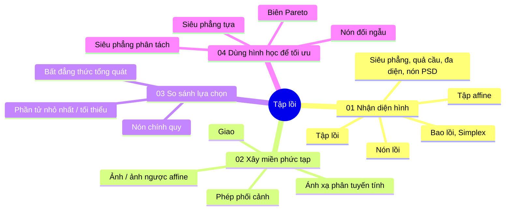
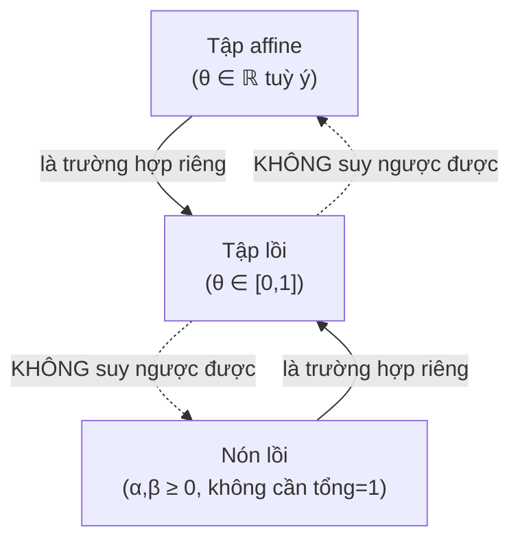
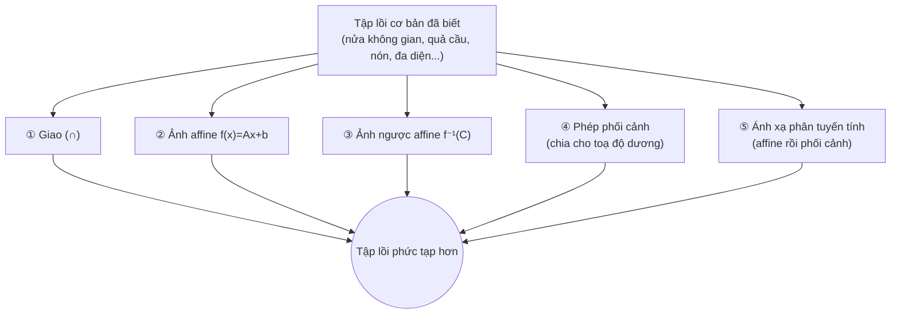
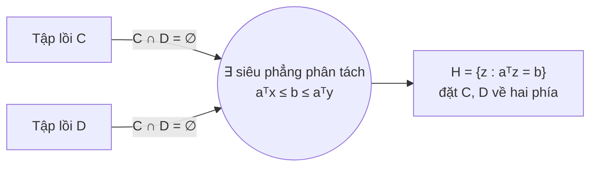

<!-- File: docs/co-so-toan-ai/bai-02-tap-loi.md -->
---
title: "Bài 02 · Tập lồi: Hình học của những lựa chọn"
description: "Ôn tập chuyên đề: tập affine/lồi/nón, các tập lồi kinh điển, phép bảo toàn tính lồi, nón chính quy, siêu phẳng phân tách/tựa, nón đối ngẫu và Pareto."
---

# Bài 02 · Tập lồi: Hình học của những lựa chọn

> *"Một bài toán đại số có thể trở nên trực quan hơn khi ta nhìn thấy hình học của nó."* — Hermann Minkowski đã nghĩ vậy khi viết *Geometrie der Zahlen* ("Hình học của các số", 1896–1910 [H1]); bài này áp dụng đúng tinh thần đó cho các bài toán tối ưu.

[[toc]]

## 0. Vì sao lại cần "nhìn hình" thay vì chỉ đọc bất đẳng thức?

Xét miền $C=\{(x_1,x_2): x_1^2+x_2^2\le 2.25\}$ — một hình tròn bán kính $1.5$. Bên trong và trên biên của nó có đúng **9 điểm nguyên**: $(0,0)$, bốn điểm $(\pm1,0),(0,\pm1)$ và bốn điểm $(\pm1,\pm1)$.

::: tip Câu hỏi tương tác — hãy tự trả lời trước khi đọc tiếp
Đoạn thẳng nối hai điểm bất kỳ *trong hình tròn* có luôn nằm trong hình tròn không? Còn đoạn nối hai trong 9 điểm nguyên đó thì sao?
:::

Đáp án: **hình tròn là lồi** (đoạn nối luôn ở trong), nhưng **tập 9 điểm nguyên thì không** — ví dụ đoạn nối $(1,0)$ và $(0,1)$ đi qua điểm $(0.5,0.5)$, một điểm **không** nằm trong tập 9 điểm rời rạc đó.

::: info Bản chất: tập lồi sinh ra để giải quyết vấn đề gì?
Trong tối ưu, **miền khả thi lồi** là điều kiện để "trộn hai phương án hợp lệ luôn cho ra một phương án hợp lệ khác" — đây chính là điều kiện để các thuật toán tối ưu (gradient descent, LP solver...) có thể *di chuyển an toàn* bên trong miền mà không "rơi ra ngoài". Bài này xây dựng một bộ từ vựng hình học đầy đủ để nhận diện, xây dựng và so sánh các tập lồi — nền tảng bắt buộc trước khi học **hàm lồi** và **đối ngẫu Lagrange** (Bài 03).
:::

### Bản đồ bài học



---

## 1. Tập affine, tập lồi và nón — ba mức độ "được phép trộn"

**Ẩn dụ chủ đạo của cả mục này:** cho hai điểm $p,q$, xét họ điểm

$$x(\theta)=\theta p+(1-\theta)q$$

Điều gì xảy ra phụ thuộc hoàn toàn vào việc bạn cho phép $\theta$ chạy trong tập nào:

| Cho $\theta$ chạy trong | Hình ảnh thu được |
|---|---|
| $\theta\in\mathbb R$ (toàn bộ số thực) | **Toàn bộ đường thẳng** qua $p,q$ |
| $\theta\in[0,1]$ | **Chỉ đoạn thẳng** từ $q$ ($\theta{=}0$) đến $p$ ($\theta{=}1$) |

::: warning Bẫy thi cử — "tổng trọng số bằng 1" chưa đủ để nằm giữa hai điểm
Với $p=(1,1), q=(4,2)$: tại $\theta=1.5$ ta được điểm $(-0.5,0.5)$ — **tổng trọng số vẫn bằng 1** ($1.5+(-0.5)=1$) nhưng điểm này nằm **ngoài** đoạn $pq$, vì $\theta\notin[0,1]$. Sự khác biệt giữa **affine** và **lồi** nằm đúng ở điều kiện *không âm* của trọng số, không phải tổng bằng 1.
:::

### 1.1 Tập affine — giữ cả đường thẳng

$$C \text{ affine} \iff p,q\in C,\ \theta\in\mathbb R \implies \theta p+(1-\theta)q\in C$$

**Ví dụ quan trọng nhất:** $C=\{x:Ax=b\}$. Nếu $x_0$ là một nghiệm của $Ax=b$ thì $C=x_0+\ker A$ — một **không gian con được tịnh tiến**. Chú ý: tập affine *không nhất thiết* đi qua gốc (vd. $x_1+2x_2=4$ không chứa $0$).

::: tip Quan hệ bao trùm — học thuộc chiều mũi tên
**Mọi tập affine đều lồi.** Chiều ngược lại **sai**: một đoạn thẳng là tập lồi nhưng không phải tập affine (không chứa cả đường thẳng).
:::

### 1.2 Tập lồi — không bỏ rơi đoạn nối

$$C\subseteq\mathbb R^n \text{ lồi} \iff \forall p,q\in C,\ \forall\theta\in[0,1]:\ \theta p+(1-\theta)q\in C$$

::: tip Mẹo bác bỏ tính lồi nhanh nhất khi làm bài thi
Chỉ cần tìm **một cặp điểm** trong tập và **một trọng số $\theta$** sao cho đoạn nối đi ra ngoài tập — không cần khảo sát toàn bộ tập.
:::

**Ví dụ AI:** $x_1,x_2$ là số GPU-giờ cấp cho hai tác vụ, tài nguyên chia nhỏ được: $C=\{x: x_1,x_2\ge0,\ x_1+x_2\le10\}$. Hai phương án hợp lệ $p=(8,2)$, $q=(2,8)$; trộn với $\theta=\tfrac14$: $\tfrac14 p+\tfrac34 q=(3.5,6.5)\in C$.

::: danger Bẫy suy luận ngược — "trộn được" không có nghĩa "chất lượng cũng được trộn"
Lồi chỉ nói rằng **trộn hai lựa chọn khả thi vẫn khả thi**. Nó **không** tự động suy ra rằng chất lượng (accuracy, loss...) của hai mô hình AI khi "trộn tuyến tính" (vd. trộn trọng số hai mạng — *model soup*) cũng được nội suy tuyến tính. Đây là hai khái niệm hoàn toàn độc lập: một cái nói về **tập** (miền tham số hợp lệ), một cái nói về **hàm** (chất lượng mô hình) trên tập đó.
:::

**Hai phản ví dụ kinh điển:**

| Tập | Vì sao không lồi |
|---|---|
| Đường tròn $S=\{x:x_1^2+x_2^2=1\}$ | $p=(1,0), q=(-1,0)\in S$ nhưng trung điểm $(0,0)\notin S$ |
| Quyết định rời rạc $D=\{(1,0),(0,1)\}$ | $\tfrac12(1,0)+\tfrac12(0,1)=(\tfrac12,\tfrac12)\notin D$ |

::: warning Chỉ cần đổi "=" thành "≤", hoặc bỏ điều kiện nguyên, hình học đổi hẳn
$\{x:x_1^2+x_2^2\le1\}$ (hình tròn **đặc**) là lồi, nhưng $\{x:x_1^2+x_2^2=1\}$ (chỉ đường **biên**) thì không. Đây là bẫy trắc nghiệm cực kỳ phổ biến: đọc lướt qua dấu "=" và "≤" có thể đổi ngược đáp án.
:::

### 1.3 Tổ hợp lồi và Bao lồi (convex hull)

$$x=\sum_{i=1}^k\theta_ix_i,\quad \theta_i\ge0,\quad \sum_i\theta_i=1$$

là một **tổ hợp lồi**. Bằng quy nạp từ định nghĩa 2 điểm, một tập lồi chứa **mọi** tổ hợp lồi của hữu hạn điểm trong nó.

$$\operatorname{conv} S = \left\{\sum_{i=1}^k\theta_ix_i : x_i\in S,\ \theta_i\ge0,\ \sum_i\theta_i=1,\ k<\infty\right\}$$

**Hai cách hiểu tương đương:** (1) tập tất cả tổ hợp lồi của các điểm thuộc $S$; (2) **tập lồi nhỏ nhất chứa $S$**. Trực giác: căng một sợi dây thun bao quanh các điểm rời rạc — phần được bao kín (kể cả bên trong, không chỉ đường viền) chính là $\operatorname{conv}S$.

#### Simplex — bao lồi đặc biệt quan trọng nhất cho AI

$$\Delta_3=\{p\in\mathbb R^3: p_i\ge0,\ p_1+p_2+p_3=1\}=\operatorname{conv}\{e_1,e_2,e_3\}$$

::: info Toán học này dùng ở đâu trong AI? (kết nối trực tiếp, cực kỳ quan trọng)
**Simplex xác suất chính là không gian đầu ra của hàm `softmax`** trong mọi bài toán phân loại: mỗi vector xác suất $(p_1,\dots,p_C)$ với $p_i\ge0,\sum p_i=1$ là **một điểm trong simplex $\Delta_C$**. Tương tự, **trọng số attention** trong Transformer ($\alpha_1,\dots,\alpha_n\ge0,\sum\alpha_i=1$) cũng là một điểm trong simplex — mỗi hàng của ma trận attention sau `softmax` là một tổ hợp lồi!
:::

### 1.4 Nón lồi — cho phép thay đổi cả quy mô

$$x=\alpha p+\beta q,\quad \alpha,\beta\ge0 \quad(\text{không yêu cầu }\alpha+\beta=1)$$

Một tập không rỗng $K$ là **nón lồi** nếu nó chứa mọi tổ hợp nón của các điểm thuộc $K$. Ví dụ $p=(1,0), q=(1,1)$: $K=\operatorname{cone}\{p,q\}=\{(u,v):u\ge v\ge0\}$ — một **hình quạt** vô hạn mở ra từ gốc toạ độ.

### 1.5 Bảng phân biệt ba loại tổ hợp — bảng quan trọng nhất của cả mục 1

| Loại tổ hợp | $\theta_i\ge0$? | $\sum_i\theta_i=1$? | Hình học điển hình |
|---|:---:|:---:|---|
| **Affine** | Không bắt buộc | Có | Đường thẳng, mặt phẳng |
| **Lồi** | **Có** | **Có** | Đoạn thẳng, tam giác đặc |
| **Nón** | **Có** | Không bắt buộc | Tia, miền hình quạt |

::: tip Mẹo ghi nhớ nhanh khi làm bài
Trước mỗi phép kiểm tra, tự hỏi đúng hai câu: **"Trọng số có âm được không?"** và **"Tổng trọng số có bắt buộc bằng 1 không?"** — Tập affine ⟹ tập lồi. Nón lồi ⟹ tập lồi. Nhưng **tập lồi $\not\Rightarrow$ affine** và **tập lồi $\not\Rightarrow$ nón**.
:::



---

## 2. Những tập lồi quan trọng — "từ điển hình học" phải thuộc lòng

### 2.1 Siêu phẳng và nửa không gian

$$H=\{x\in\mathbb R^n: a^Tx=b\},\quad a\ne0$$

Nếu $x,x_0\in H$ thì $a^T(x-x_0)=0$ — nghĩa là **$a$ vuông góc với mọi hướng nằm trong $H$**: $a$ chính là **vectơ pháp tuyến**. Trong $\mathbb R^2$, siêu phẳng là đường thẳng; trong $\mathbb R^3$, là mặt phẳng — và **siêu phẳng luôn vừa affine vừa lồi**.

Nửa không gian $C=\{x:a^Tx\le b\}$ là **một bất đẳng thức affine duy nhất** — và nó tạo ra một tập lồi ngay lập tức: nếu $a^Tp,a^Tq\le b$ thì $a^T(\theta p+(1-\theta)q)\le b$.

::: info Toán học này dùng ở đâu trong AI? (kết nối trực tiếp)
$a^Tx=b$ chính xác là **ranh giới quyết định (decision boundary)** của mọi bộ phân loại tuyến tính: **Perceptron, Logistic Regression, SVM tuyến tính**. Nửa không gian $a^Tx\le b$ là "vùng lớp âm", $a^Tx>b$ là "vùng lớp dương" — toàn bộ lý thuyết phân loại tuyến tính là lý thuyết về nửa không gian.
:::

### 2.2 Đa diện (polyhedron)

$$P=\{x: Ax\preceq b,\ Cx=d\}$$

($\preceq$: bất đẳng thức theo từng thành phần). Đa diện là **giao của hữu hạn nửa không gian và siêu phẳng** — luôn lồi, nhưng **không nhất thiết bị chặn** (một nửa không gian đơn lẻ cũng là một đa diện suy biến).

::: info Toán học này dùng ở đâu trong AI?
Đây chính là miền khả thi của mọi bài toán **Quy hoạch tuyến tính** (Bài 01, mục 3.2) và là cơ sở hình học của **nghiệm nằm ở đỉnh** trong thuật toán đơn hình.
:::

### 2.3 Quả cầu chuẩn và Ellipsoid

$$B(x_c,r)=\{x:\|x-x_c\|_2\le r\} = \{x_c+ru: \|u\|_2\le1\}$$

$$E=\{x:(x-x_c)^TP^{-1}(x-x_c)\le1\},\quad P=P^T\succ0$$

**Hai công thức ellipsoid khớp nhau ra sao?** Với $A$ khả nghịch và $P=AA^T$, đặt $x=x_c+Au$:

$$(x-x_c)^TP^{-1}(x-x_c) = u^TA^T(AA^T)^{-1}Au = u^Tu = \|u\|_2^2 \implies E=\{x_c+Au:\|u\|_2\le1\}$$

::: warning Bẫy thi cử — đừng nhầm $A=P$
Quan hệ đúng giữa hai biểu diễn là $P=AA^T$, **không phải** $A=P$. $E$ là **ảnh affine của quả cầu đơn vị** qua $x=x_c+Au$ — điều này giải thích trực tiếp vì sao $E$ là tập lồi (xem mục 3.3).
:::

**Kiểm chứng bằng số** ($A=\text{diag}(2,1)$, $x_c=(1,1)$, $u=(0.3,0.4)$):

```python
import numpy as np

A  = np.diag([2., 1.])
xc = np.array([1., 1.])
u  = np.array([0.3, 0.4])
x  = xc + A @ u
P  = A @ A.T

lhs = (x - xc) @ np.linalg.inv(P) @ (x - xc)
print("||u||^2         =", u @ u)    # 0.25
print("(x-xc)^T P^-1 (..) =", lhs)   # 0.24999999999999994  -> khớp!
```

::: info Toán học này dùng ở đâu trong AI?
- Các bán trục của ellipsoid $=\sqrt{\lambda_i(P)}$ — chính là **giá trị riêng của ma trận hiệp phương sai**. Ellipsoid $\{x:(x-\mu)^T\Sigma^{-1}(x-\mu)\le c\}$ là **vùng đồng mật độ (confidence region)** của phân phối Gauss đa biến $\mathcal N(\mu,\Sigma)$ — nền tảng của khoảng cách **Mahalanobis**.
- Trong tối ưu bậc hai (Newton's method), **vùng tin cậy (trust region)** quanh một điểm chính là một ellipsoid xác định bởi Hessian cục bộ.
:::

### 2.4 Chuẩn (norm) và quả cầu chuẩn — ba hình dạng từ ba chuẩn

$$\|x\|_1=\sum_i|x_i|,\qquad \|x\|_2=\sqrt{\sum_ix_i^2},\qquad \|x\|_\infty=\max_i|x_i|$$

Với $x=(3,-4)$: $\|x\|_1=7,\ \|x\|_2=5,\ \|x\|_\infty=4$.

| $\|x\|_1\le1$ | $\|x\|_2\le1$ | $\|x\|_\infty\le1$ |
|:---:|:---:|:---:|
| Hình thoi đặc | Hình tròn đặc | Hình vuông đặc |

```python
import numpy as np
import matplotlib.pyplot as plt

theta = np.linspace(0, 2*np.pi, 400)
fig, ax = plt.subplots(figsize=(4,4))

# quả cầu L2: tham số hoá bằng lượng giác
ax.plot(np.cos(theta), np.sin(theta), label="||x||_2 <= 1")

# quả cầu L1: hình thoi |x1|+|x2|=1
diamond = np.array([[1,0],[0,1],[-1,0],[0,-1],[1,0]])
ax.plot(diamond[:,0], diamond[:,1], label="||x||_1 <= 1")

# quả cầu L_inf: hình vuông max(|x1|,|x2|)=1
square = np.array([[1,1],[-1,1],[-1,-1],[1,-1],[1,1]])
ax.plot(square[:,0], square[:,1], label="||x||_inf <= 1")

ax.set_aspect("equal"); ax.legend(); ax.set_title("Ba quả cầu chuẩn bán kính 1")
plt.show()
```

::: info Toán học này dùng ở đâu trong AI? (một trong những kết nối quan trọng nhất môn học)
- **Quả cầu $L_1$ (hình thoi)** → miền ràng buộc của **LASSO / hồi quy thưa** — hình dạng "có góc nhọn" của nó là lý do trực quan giải thích tại sao nghiệm tối ưu thường rơi đúng vào góc (nhiều toạ độ $=0$ ⟹ **sparsity**).
- **Quả cầu $L_2$ (hình tròn)** → miền ràng buộc của **Ridge regression / weight decay**.
- **Quả cầu $L_\infty$ (hình vuông)** → chính là **vùng nhiễu đối kháng $\epsilon$-ball** dùng để định nghĩa tấn công/phòng thủ đối kháng (FGSM, PGD) trong *adversarial robustness* — perturbation $\delta$ thoả $\|\delta\|_\infty\le\epsilon$ là toàn bộ nền tảng hình học của lĩnh vực này.
:::

### 2.5 Nón chuẩn (norm cone) — "nâng chiều" để biến bán kính thành một biến

$$K=\{(x,t)\in\mathbb R^n\times\mathbb R:\|x\|\le t\}$$

Với chuẩn Euclid, $Q=\{(x,t):\|x\|_2\le t\}$ gọi là **nón bậc hai (second-order cone, SOC)**. Ví dụ $(3,4,5)$ nằm trên biên vì $\sqrt{3^2+4^2}=5$.

::: tip Trực giác
Ràng buộc $\|x\|\le t$ trong không gian $(x,t)$ là một tập lồi — đây là **kỹ thuật nâng chiều (lifting)** cực kỳ hữu ích trong tối ưu: biến một ràng buộc chuẩn thành một ràng buộc nón bằng cách thêm một biến phụ $t$ (giống hệt "biến phụ epigraph" đã dùng ở Bài 01 cho $\ell_\infty,\ell_1$).
:::

### 2.6 Nón PSD (Positive Semidefinite) — khi "điểm" là một ma trận

$$S^n_+=\{X\in S^n: z^TXz\ge0\ \forall z\in\mathbb R^n\}\quad (\text{ký hiệu } X\succeq0)$$

**Kiểm tra bằng giá trị riêng:** $X\succeq0 \iff \lambda_i(X)\ge0\ \forall i$ (và $X\succ0 \iff \lambda_i(X)>0\ \forall i$).

::: danger Bẫy thi cử nghiêm trọng nhất của cả bài
$X\succeq0$ là điều kiện trên **dạng toàn phương** $z^TXz$, **KHÔNG PHẢI** $X_{ij}\ge0$ (từng phần tử không âm)! Hai phản ví dụ đối lập:

- $X_1=\begin{bmatrix}1&-1\\-1&1\end{bmatrix}$ **có phần tử âm** nhưng $z^TX_1z=(z_1-z_2)^2\ge0$ ⟹ **PSD** (giá trị riêng: $0$ và $2$).
- $X_2=\begin{bmatrix}1&2\\2&1\end{bmatrix}$ **mọi phần tử đều dương** nhưng với $z=(1,-1)$: $z^TX_2z=-2<0$ ⟹ **KHÔNG PSD** (giá trị riêng: $-1$ và $3$; $\det X_2=1-4=-3<0$).
:::

```python
import numpy as np

def is_psd(X, tol=1e-8):
    """Kiểm tra ma trận đối xứng X có PSD không, dùng giá trị riêng (ổn định số)."""
    eigvals = np.linalg.eigvalsh(X)      # eigvalsh chuyên cho ma trận đối xứng/Hermitian
    return bool(np.all(eigvals >= -tol)), eigvals

X1 = np.array([[1., -1.], [-1., 1.]])
X2 = np.array([[1.,  2.], [ 2., 1.]])

print(is_psd(X1))   # (True,  array([0., 2.]))
print(is_psd(X2))   # (False, array([-1., 3.]))
```

**Với ma trận $2\times2$**, $X=\begin{bmatrix}u&v\\v&w\end{bmatrix}$: $X\succeq0 \iff u\ge0 \text{ và } uw\ge v^2$ — chỉ kiểm tra đường chéo *hoặc* chỉ kiểm tra định thức đều **chưa đủ**, cần đúng cả hai điều kiện.

**Vì sao $S^n_+$ là một nón lồi?** Lấy $X,Y\succeq0$, $\alpha,\beta\ge0$: với mọi $z$, $z^T(\alpha X+\beta Y)z=\alpha z^TXz+\beta z^TYz\ge0$ ⟹ $\alpha X+\beta Y\succeq0$.

::: info Toán học này dùng ở đâu trong AI? (một trong những kết nối quan trọng bậc nhất môn học)
- **Ma trận hiệp phương sai** của bất kỳ tập dữ liệu nào **luôn PSD** (theo xây dựng) — đây là điều kiện để phân phối Gauss đa biến "hợp lệ".
- **Ma trận Gram / kernel** trong SVM và Gaussian Process phải PSD (điều kiện Mercer) để đảm bảo tồn tại một không gian đặc trưng ẩn tương ứng.
- **Hessian PSD $\iff$ hàm lồi** (Bài 01, mục 4.2) — điều kiện tối ưu bậc hai trong Newton's method.
- **Quy hoạch nửa xác định dương (SDP)** — tối ưu hoá trên $S^n_+$ — được dùng để **relaxation** các bài toán tổ hợp khó (vd. Max-Cut) và để **chứng nhận hằng số Lipschitz** của mạng nơ-ron (robustness certification).
:::

---

## 3. Các phép bảo toàn tính lồi — bộ công cụ "lắp ráp Lego"

**Ẩn dụ:** thay vì chứng minh lại từ định nghĩa mỗi lần, ta xây các tập lồi phức tạp từ những **khối lồi cơ bản đã biết** bằng các phép toán được đảm bảo giữ nguyên tính lồi.



### 3.1 Giao giữ tính lồi; hợp thì KHÔNG

Nếu mỗi $C_i$ lồi thì $C=\bigcap_{i\in I}C_i$ cũng lồi — **kể cả khi $I$ vô hạn**, và kể cả khi giao là tập rỗng (rỗng vẫn thoả định nghĩa lồi một cách "trống rỗng"). Ngược lại, **hợp hai tập lồi rời nhau nói chung không lồi** (vd. hợp hai đĩa tròn tách biệt).

**Ví dụ giao vô hạn (ràng buộc theo thời điểm liên tục):** $p_x(t)=\sum_j x_j\cos(jt)$, $S=\{x: |p_x(t)|\le1\ \forall |t|\le\pi/3\}$. Với **mỗi $t$ cố định**, $p_x(t)$ tuyến tính theo $x$ ⟹ mỗi ràng buộc là giao hai nửa không gian; lấy giao theo **mọi** $t$ trong khoảng ⟹ $S$ lồi.

::: warning Bẫy thi cử — thử hữu hạn điểm không phải là chứng minh cho "mọi $t$"
Chỉ kiểm tra $|p_x(t)|\le1$ tại một vài điểm $t$ rời rạc **có thể bỏ sót vi phạm** ở giữa các điểm đó. Đây không phải chứng minh hợp lệ cho ràng buộc "với mọi $t$" — một lỗi thường gặp khi làm bài tập số.
:::

### 3.2 Ảnh affine và ảnh ngược affine

Cho $f(x)=Ax+b$, $S$ lồi. **Ảnh** $f(S)=\{Ax+b:x\in S\}$ luôn lồi — **không cần $A$ khả nghịch**:

$$\theta f(x_1)+(1-\theta)f(x_2) = f(\theta x_1+(1-\theta)x_2) \in f(S)$$

Các trường hợp quen thuộc: co giãn $f(x)=\alpha x$; tịnh tiến $f(x)=x+b$; chiếu $f(x_1,x_2,x_3)=(x_1,x_2)$; và **ellipsoid** $f(u)=x_c+Au$ trên quả cầu đơn vị (mục 2.3).

Với $C$ lồi, **ảnh ngược** $f^{-1}(C)=\{x:f(x)\in C\}$ cũng lồi — "ảnh ngược" ở đây là **tập mọi đầu vào đưa đến miền đích**, không đòi hỏi $f$ là song ánh (không cần tìm "ma trận nghịch đảo").

::: tip Ứng dụng ngay: Bất đẳng thức ma trận tuyến tính (LMI)
$$C=\left\{x:\sum_{i=1}^m x_iA_i\preceq B\right\} = \left\{x: B-\sum_ix_iA_i\succeq0\right\}$$
đây là **ảnh ngược của nón $S^p_+$** qua ánh xạ affine $x\mapsto B-\sum_ix_iA_i$ ⟹ $C$ lồi. Đây gọi là **LMI (linear matrix inequality)** — công cụ trung tâm của lý thuyết điều khiển hiện đại và robustness certification cho mạng nơ-ron.
:::

::: info Nón hyperbolic — một ảnh ngược tinh tế của SOC
Với $P\succeq0$, đặt $P=R^TR$: $K=\{x:x^TPx\le(c^Tx)^2,\ c^Tx\ge0\}=\{x:\|Rx\|_2\le c^Tx\}$ — đây là ảnh ngược affine của nón bậc hai (SOC) nên lồi. **Bỏ điều kiện $c^Tx\ge0$ sẽ sai**: bất đẳng thức $u^2\le t^2$ (không ràng buộc dấu $t$) chấp nhận cả hai nhánh $t=\pm|u|$, và trung điểm của hai điểm hợp lệ trên hai nhánh khác nhau có thể không còn hợp lệ.
:::

### 3.3 Phép phối cảnh (perspective) — chia cho một toạ độ dương

$$\mathcal P(z,t)=\frac{z}{t},\qquad \operatorname{dom}\mathcal P=\{(z,t):t>0\}$$

Các điểm trên **cùng một tia** từ gốc cho cùng kết quả (vd. $\mathcal P(2,2)=\mathcal P(3,3)=1$). Phép phối cảnh **không phải ánh xạ affine**, nhưng ảnh và ảnh ngược của một tập lồi qua nó vẫn lồi — miễn là làm việc trong miền $t>0$.

::: danger Bẫy thi cử tinh vi — bảo toàn tính lồi KHÔNG có nghĩa bảo toàn đúng trọng số
Với $u=(0,1),v=(4,2)$: $\mathcal P(u)=0$, $\mathcal P(v)=2$, nhưng $\mathcal P\!\left(\frac{u+v}{2}\right)=\mathcal P(2,1.5)=\frac{2}{1.5}=\frac43\ne\frac{0+2}{2}=1$. Ảnh của **trung điểm** không phải là **trung điểm của hai ảnh** — trọng số $\theta$ bị "biến dạng" thành $\beta=\dfrac{\theta t_1}{\theta t_1+(1-\theta)t_2}$. Đoạn thẳng vẫn là đoạn thẳng (tính lồi được giữ), nhưng vị trí điểm trên đoạn thì không.
:::

### 3.4 Ánh xạ phân tuyến tính (linear-fractional) — affine rồi phối cảnh

$$f(x)=\frac{Ax+b}{c^Tx+d},\qquad \operatorname{dom}f=\{x:c^Tx+d>0\}$$

Đây là **hợp của một ánh xạ affine rồi một phép phối cảnh**: $x\mapsto(Ax+b,\ c^Tx+d)\xrightarrow{\mathcal P}f(x)$. Nếu $S\subseteq\operatorname{dom}f$ lồi thì $f(S)$ lồi; nếu $C$ lồi thì $\{x\in\operatorname{dom}f: f(x)\in C\}$ cũng lồi.

::: warning
"Mẫu dương" ($c^Tx+d>0$) phải được đảm bảo trong toàn miền đang xét — không áp dụng kết quả này trên một miền tuỳ ý cắt ngang qua nơi mẫu số bằng 0.
:::

### 3.5 Thực hành: bảng nhận diện nhanh phép bảo toàn

| Khi thấy dạng | Hãy nghĩ đến |
|---|---|
| $Ax=b$ | Tập affine, **luôn lồi** |
| $Ax\preceq b$ | Giao nửa không gian — **đa diện** |
| $\|Ax-b\|\le r$ | **Ảnh ngược affine của quả cầu chuẩn** |
| $\|Ax+b\|_2\le c^Tx+d$ | **Ảnh ngược của nón bậc hai (SOC)** |
| $M(x)\succeq0$, $M$ affine theo $x$ | **Ảnh ngược của nón PSD — LMI** |
| $z/t$ với $t>0$ | Phép phối cảnh — lồi được bảo toàn, **trọng số bị đổi** |

---

## 4. Nón chính quy và bất đẳng thức tổng quát — so sánh khi có nhiều tiêu chí

**Ẩn dụ:** so sánh hai chiếc laptop theo *giá* và *hiệu năng* — không phải lúc nào cái này cũng "tốt hơn" cái kia ở **mọi** mặt. Ta cần một khái niệm so sánh tổng quát hơn phép so sánh số thực thông thường.

### 4.1 Nón chính quy (proper cone) — ba điều kiện

Một nón lồi $K\subseteq\mathbb R^n$ là **nón chính quy** nếu:

| Điều kiện | Ý nghĩa |
|---|---|
| **Đóng** (closed) | Chứa các điểm giới hạn của mọi dãy trong $K$ |
| **Có điểm trong** (solid) | $\operatorname{int}K\ne\varnothing$ — có một quả cầu mở nằm hoàn toàn trong nón |
| **Nhọn** (pointed) | Không chứa đường thẳng qua gốc: $K\cap(-K)=\{0\}$ |

**Bảng phản ví dụ — thiếu một điều kiện cũng khác hẳn:**

| Tập | Đóng | Có điểm trong | Nhọn |
|---|:---:|:---:|:---:|
| $\mathbb R^2_+=\{(u,v):u,v\ge0\}$ | ✓ | ✓ | ✓ (nón chính quy) |
| Tia $\{(u,0):u\ge0\}\subset\mathbb R^2$ | ✓ | ✗ | ✓ |
| Nửa mặt phẳng $\{(u,v):v\ge0\}$ | ✓ | ✓ | ✗ (chứa đường thẳng $u$-trục) |
| $\{0\}\cup\{(u,v):u>0,v>0\}$ | ✗ | ✓ | ✓ |

::: warning Một tia không có điểm trong $\mathbb R^2$
Dù có "điểm trong tương đối" trên chính đường thẳng chứa nó, một tia **không** có điểm trong khi xét trong không gian bao quanh $\mathbb R^2$. $\mathbb R^n_+$ và $S^n_+$ (nội điểm chính là $S^n_{++}$) đều là các ví dụ nón chính quy quan trọng nhất.
:::

### 4.2 Bất đẳng thức tổng quát

$$x\preceq_K y \iff y-x\in K, \qquad x\prec_K y \iff y-x\in\operatorname{int}K$$

Với $K=\mathbb R^n_+$: $x\preceq y \iff x_i\le y_i\ \forall i$ (so sánh **từng thành phần**).

::: danger Bẫy thi cử — đây là thứ tự BỘ PHẬN, không phải thứ tự TOÀN PHẦN
Với $x=(1,4), y=(2,3)$: $y-x=(1,-1)\notin\mathbb R^2_+$ và $x-y=(-1,1)\notin\mathbb R^2_+$ ⟹ **không có** $x\preceq y$ cũng **không có** $y\preceq x$. Khác hẳn với số thực (luôn so sánh được), bất đẳng thức tổng quát có thể để lại hai phần tử **không so sánh được với nhau**.
:::

**Thứ tự ma trận** ($K=S^n_+$) dùng lại đúng ký hiệu $\preceq$ nhưng ý nghĩa hoàn toàn khác: $X\preceq Y \iff Y-X\succeq0 \iff z^TXz\le z^TYz\ \forall z$ — **không** có nghĩa từng phần tử $X_{ij}\le Y_{ij}$!

Các quy tắc số học quen thuộc **vẫn đúng**: cộng bất đẳng thức ($x\preceq y, u\preceq v\Rightarrow x+u\preceq y+v$), nhân với số không âm, và phản đối xứng ($x\preceq y$ và $y\preceq x\Rightarrow x=y$, vì $K\cap(-K)=\{0\}$ — cần tính **nhọn**). Nhưng **không suy ra** mọi cặp đều so sánh được.

### 4.3 Phần tử nhỏ nhất (minimum) vs. Phần tử tối thiểu (minimal) — phân biệt quan trọng nhất mục 4

| | Phần tử nhỏ nhất (minimum) | Phần tử tối thiểu (minimal) |
|---|---|---|
| Định nghĩa | $x\in S$ và $x\preceq_K y\ \forall y\in S$ | $x\in S$ và ($y\in S, y\preceq_K x\Rightarrow y=x$) |
| Diễn giải | Không lớn hơn **bất kỳ** lựa chọn nào khác | Không có lựa chọn khác **nhỏ hơn hoặc bằng** nó |
| Số lượng | **Duy nhất** nếu tồn tại | Có thể có **nhiều** |

::: tip Ghi nhớ
"Minimum phải so sánh **thuận lợi với tất cả**; minimal chỉ cần **không bị lựa chọn khác trội hơn**." Và tuyệt đối không nhầm "minimal" với "cực tiểu địa phương" (local minimum) của một hàm số — đây là hai khái niệm hoàn toàn khác nhau (một cái về *thứ tự trên tập hợp*, một cái về *hàm số*).
:::

**Ví dụ chatbot — 5 cấu hình, mỗi cấu hình là một điểm $(thời gian, bộ nhớ)$, cả hai tiêu chí đều muốn nhỏ:**

| Cấu hình | Thời gian | Bộ nhớ | Tối thiểu? |
|---|:---:|:---:|:---:|
| A | 1 | 6 | ✓ |
| B | 2 | 4 | ✓ |
| C | 4 | 2 | ✓ |
| D | 3 | 6 | ✗ (bị B trội: $2\le3, 4\le6$) |
| E | 5 | 4 | ✗ (bị C trội: $4\le5, 2\le4$) |

A, B, C đều **tối thiểu** (không ai trội hơn chúng); D, E bị **trội (dominated)**. **Không có phần tử nhỏ nhất** trong 5 cấu hình này — không ai đồng thời tốt hơn hoặc bằng cả 4 cấu hình còn lại.

**Đối lập:** $S_1=\{(u,v):u\ge1,v\ge2\}$ **có** phần tử nhỏ nhất $(1,2)$. Nhưng $S_2=\{(u,v):u,v\ge0,u+v\ge4\}$ thì **mọi điểm** trên đoạn $\{u+v=4,u,v\ge0\}$ đều tối thiểu — không có phần tử nhỏ nhất.

::: info Toán học này dùng ở đâu trong AI? (ứng dụng thực tế hàng ngày của kỹ sư ML)
Đây chính xác là bài toán **tối ưu đa mục tiêu (multi-objective optimization)**: chọn kiến trúc mạng cân bằng *độ chính xác*, *độ trễ (latency)*, *kích thước mô hình* trong **Neural Architecture Search**. Tập các mô hình "tối thiểu" (không bị mô hình nào khác trội hơn ở mọi tiêu chí) chính là **biên Pareto (Pareto front)** mà kỹ sư ML lựa chọn mô hình triển khai thực tế — không có một "mô hình nhỏ nhất" tuyệt đối, chỉ có các lựa chọn *đánh đổi (trade-off)*.
:::

---

## 5. Siêu phẳng phân tách và siêu phẳng tựa

**Ẩn dụ:** vẽ một đường ranh giới thẳng giữa hai phe — đây chính là ý tưởng hình học cốt lõi đứng sau **SVM** và giải thích trực tiếp *tại sao* bài toán XOR "đánh sập" perceptron tuyến tính trong lịch sử AI.

### 5.1 Định lý phân tách (separating hyperplane)

Nếu $C,D\subseteq\mathbb R^n$ lồi, không rỗng và $C\cap D=\varnothing$, thì tồn tại $a\ne0, b$ sao cho

$$a^Tx\le b\ \ \forall x\in C, \qquad a^Ty\ge b\ \ \forall y\in D$$



::: warning Bẫy thi cử — không được tự ý đổi thành dấu chặt ($<$)
Xét $C=(-\infty,0)$, $D=[0,+\infty)$ trong $\mathbb R$: chọn $b=0$ thì $x\le0$ trên $C$ và $y\ge0$ trên $D$ đều đúng, nhưng **không tồn tại** ngưỡng $b$ thoả $x<b<y$ với mọi $x\in C,y\in D$ (vì $0\in D$ buộc $b<0$, khi đó vẫn có $x\in C$ với $x>b$). Muốn phân tách **nghiêm ngặt**, cần thêm điều kiện — ví dụ $C$ đóng, lồi, khác rỗng và $D=\{p\}$ với $p\notin C$.
:::

::: info Toán học này dùng ở đâu trong AI? (kết nối lịch sử nổi tiếng nhất của môn học)
**Lớp âm** $\{(0,0),(1,1)\}$, **lớp dương** $\{(2,2),(3,1)\}$ — tách được bằng đường $x_1+x_2=3$.

**Bài toán XOR** (Minsky & Papert, 1969) — lý do lịch sử dẫn đến "mùa đông AI" đầu tiên: lớp A $=\{(0,0),(1,1)\}$, lớp B $=\{(1,0),(0,1)\}$. Bao lồi của hai lớp **giao nhau** tại đúng điểm $(0.5,0.5)$:

```python
import numpy as np
A0, A1 = np.array([0., 0.]), np.array([1., 1.])
B0, B1 = np.array([1., 0.]), np.array([0., 1.])

mid_A = 0.5 * A0 + 0.5 * A1   # tổ hợp lồi của lớp A
mid_B = 0.5 * B0 + 0.5 * B1   # tổ hợp lồi của lớp B
print(mid_A, mid_B)           # [0.5 0.5]  [0.5 0.5]  -- trùng nhau!
```
Vì hai bao lồi giao nhau, **không thể** đặt chúng vào hai nửa không gian mở đối nhau ⟹ **không một perceptron tuyến tính nào phân loại đúng XOR**. Đây chính là động lực toán học trực tiếp dẫn đến **mạng nơ-ron nhiều tầng (MLP)** — thêm một tầng ẩn phi tuyến để "bẻ cong" không gian sao cho hai bao lồi (trong không gian đặc trưng mới) không còn giao nhau.
:::

### 5.2 Siêu phẳng tựa (supporting hyperplane)

Tại một điểm biên $x_0$ của $C$, siêu phẳng tựa có dạng $H=\{x:a^Tx=a^Tx_0\}$, $a\ne0$, thoả $a^Tx\le a^Tx_0\ \forall x\in C$ — **chạm biên nhưng không cắt xuyên qua tập**.

> **Định lý siêu phẳng tựa:** nếu $C$ lồi, tại **mỗi** điểm biên có ít nhất một siêu phẳng tựa (có thể nhiều hơn một — ví dụ tại một đỉnh đa giác).

**Ví dụ — siêu phẳng tựa cũng là một chứng nhận nghiệm tối ưu:** $C=\{x:x_1^2+x_2^2\le1\}$, $a=(3,4)$. Theo Cauchy–Schwarz:

$$3x_1+4x_2=a^Tx\le\|a\|_2\|x\|_2\le5$$

Dấu bằng đạt tại $x_0=(3/5,4/5)$ ⟹ $\max_{x\in C}(3x_1+4x_2)=5$, và đường $3x_1+4x_2=5$ là siêu phẳng tựa tại $x_0$.

::: tip Nguyên lý chung
Một bất đẳng thức **đúng trên toàn miền**, đạt **dấu bằng** tại một điểm khả thi, chính là **một chứng nhận tối ưu toàn cục** — nguyên lý này sẽ trở lại mạnh mẽ hơn khi học **đối ngẫu Lagrange** ở Bài 03.
:::

---

## 6. Nón đối ngẫu và lựa chọn Pareto

### 6.1 Định nghĩa và trực giác

$$K^\* = \{y: y^Tx\ge0\ \ \forall x\in K\}$$

Đọc theo hình học Euclid: với $x,y\ne0$, $y^Tx\ge0$ nghĩa là **góc giữa chúng không quá $90°$**. $K^\*$ là tập hợp mọi **hướng đánh giá** đồng thuận (không âm) với **mọi** hướng của $K$.

::: warning Có chữ "mọi" trong định nghĩa
Một tích vô hướng dương với **một** điểm của $K$ là chưa đủ để kết luận $y\in K^\*$ — phải đúng với **toàn bộ** $K$.
:::

**Tính từ các tia sinh:** $K=\operatorname{cone}\{(1,0),(1,1)\}$. Chỉ cần kiểm tra hai tia sinh: $y^T(1,0)=y_1\ge0$ và $y^T(1,1)=y_1+y_2\ge0$ ⟹ $K^\*=\{y:y_1\ge0,y_1+y_2\ge0\}$ (nón sinh bởi hữu hạn vectơ biến thành **giao hữu hạn nửa không gian** ở đối ngẫu).

```python
import numpy as np

def in_dual_by_generators(y, generators):
    """Với nón sinh bởi hữu hạn tia, y thuộc K* khi và chỉ khi y^T g >= 0 với MỌI tia sinh g."""
    return all(np.dot(y, g) >= -1e-9 for g in generators)

gens = [np.array([1., 0.]), np.array([1., 1.])]
print(in_dual_by_generators(np.array([1., -0.5]), gens))   # True   (y1=1>=0, y1+y2=0.5>=0)
print(in_dual_by_generators(np.array([1., -1.5]), gens))   # False  (y1+y2=-0.5<0)
```

### 6.2 Một số nón tự đối ngẫu ($K^\*=K$)

| Nón $K$ | Nón đối ngẫu $K^\*$ |
|---|---|
| $\mathbb R^n_+$ | $\mathbb R^n_+$ |
| $S^n_+$ (với $\langle X,Y\rangle=\operatorname{tr}(XY)$) | $S^n_+$ |
| $\{(x,t):\|x\|_2\le t\}$ (SOC) | $\{(y,s):\|y\|_2\le s\}$ |
| $\{(x,t):\|x\|_1\le t\}$ | $\{(y,s):\|y\|_\infty\le s\}$ |

::: tip Ghi chú
Ba dòng đầu **tự đối ngẫu** ($K^\*=K$). Cặp $\ell_1$/$\ell_\infty$ minh hoạ rằng **đối ngẫu không phải lúc nào cũng trùng chính nó** — chuẩn $\ell_1$ và $\ell_\infty$ là *chuẩn đối ngẫu* của nhau, một sự thật sẽ quay lại khi học lý thuyết đối ngẫu Lagrange.
:::

**Vì sao $S^n_+$ tự đối ngẫu? (chứng minh hai chiều)**

- **Chiều 1** ($Y\succeq0\Rightarrow Y\in(S^n_+)^\*$): phân tích phổ $X=\sum_i\lambda_iu_iu_i^T,\ \lambda_i\ge0$ với $X\succeq0$ bất kỳ. Khi đó $\operatorname{tr}(YX)=\sum_i\lambda_i\operatorname{tr}(Yu_iu_i^T)=\sum_i\lambda_iu_i^TYu_i\ge0$.
- **Chiều 2** ($Y\in(S^n_+)^\*\Rightarrow Y\succeq0$): với mọi $z$, ma trận $zz^T$ là PSD (hạng một). Do đó $\operatorname{tr}(Yzz^T)=z^TYz\ge0$ — chính là định nghĩa $Y\succeq0$.

::: tip Mẹo chứng minh PSD
Chỉ cần thử trên các ma trận **hạng một** $zz^T$ là đủ để chứng minh chiều khó của tính tự đối ngẫu — một kỹ thuật rất hay tái sử dụng.
:::

### 6.3 Đối ngẫu tạo ra bất đẳng thức tổng quát: tối ưu tổng trọng số cho một phần tử tối thiểu

Nếu $K$ là nón chính quy thì $K^\*$ cũng là nón chính quy. Với $\lambda\in\operatorname{int}K^\*$: $\lambda^Tv>0\ \forall v\in K\setminus\{0\}$ — nghĩa là **trọng số dương nghiêm không bỏ qua bất kỳ tiêu chí nào**.

**Định lý (chiều dễ):** nếu $\lambda\in\operatorname{int}K^\*$ và $x^\*$ là nghiệm của $\min_{x\in S}\lambda^Tx$, thì $x^\*$ là **phần tử tối thiểu** của $S$ theo $K$.

*Chứng minh ngắn:* giả sử $\exists y\in S, y\preceq_Kx^\*, y\ne x^\*$. Khi đó $x^\*-y\in K\setminus\{0\}$, nên $\lambda^T(x^\*-y)>0\Rightarrow\lambda^Ty<\lambda^Tx^\*$ — mâu thuẫn với việc $x^\*$ tối ưu $\lambda^Tz$. Vậy $x^\*$ tối thiểu. □

**Ba phát biểu đối ngẫu — giữ đúng lượng từ, đây là bảng dễ nhầm nhất của mục 6:**

| Phát biểu | Chiều | Điều kiện |
|---|---|---|
| $x$ là **phần tử nhỏ nhất** theo $K$ $\iff$ với **mọi** $\lambda\in\operatorname{int}K^\*$, $x$ là nghiệm **duy nhất** của $\min_{z\in S}\lambda^Tz$ | hai chiều | — |
| Nếu $x$ tối ưu $\lambda^Tz$ trên $S$ cho **một** $\lambda\in\operatorname{int}K^\*$, thì $x$ **tối thiểu** | một chiều (đủ) | không cần $S$ lồi |
| Nếu $S$ lồi và $x$ tối thiểu, tồn tại $\lambda\in K^\*\setminus\{0\}$ sao cho $x$ tối ưu $\lambda^Tz$ trên $S$ | chiều ngược | **cần $S$ lồi**; $\lambda$ có thể ở **biên** $K^\*$, không nhất thiết ở $\operatorname{int}K^\*$ |

::: danger Bẫy thi cử — đừng tự ý thay $\lambda\in K^\*$ bằng $\lambda\in\operatorname{int}K^\*$
Chiều ngược (từ "tối thiểu" suy ra "tồn tại trọng số tối ưu hoá nó") chỉ đảm bảo $\lambda\in K^\*\setminus\{0\}$ — có thể nằm **trên biên**. Tự động nâng cấp thành $\lambda\in\operatorname{int}K^\*$ là một lỗi suy luận thường gặp.
:::

### 6.4 Ví dụ số: đổi trọng số, đổi cấu hình tối ưu

Chuẩn hoá $x=(\text{thời gian}/1\text{s}, \text{bộ nhớ}/1\text{GB})$:

| Cấu hình | $x$ | $3x_1+x_2$ | $3x_1+2x_2$ | $x_1+3x_2$ |
|---|---|:---:|:---:|:---:|
| A | $(1,6)$ | 9 | 15 | 19 |
| B | $(2,4)$ | **10** | 14 | 14 |
| C | $(4,2)$ | 14 | 16 | **10** |
| D | $(3,6)$ | 15 | 21 | 21 |
| E | $(5,4)$ | 19 | 23 | 17 |

Ưu tiên thời gian ($\lambda=(3,1)$) → chọn A. Cân bằng ($\lambda=(3,2)$) → chọn B. Ưu tiên bộ nhớ ($\lambda=(1,3)$) → chọn C. **Cả ba vẫn chỉ là các phần tử tối thiểu** — không có "cấu hình nhỏ nhất" tuyệt đối.

::: info Toán học này dùng ở đâu trong AI? (điều mọi kỹ sư ML đều đã làm mà không để ý)
Mỗi khi bạn viết `total_loss = ce_loss + lambda_reg * reg_loss` hay `total_loss = alpha * task1_loss + beta * task2_loss` (multi-task learning), bạn đang **chọn một trọng số $\lambda$ trong nội nón đối ngẫu $\operatorname{int}(\mathbb R^2_+)$** để tìm **một điểm cụ thể trên biên Pareto** giữa các mục tiêu — không có "một" cách kết hợp đúng tuyệt đối, chỉ có các lựa chọn đánh đổi mà $\lambda$ mã hoá mức độ ưu tiên. Đây chính là cơ sở lý thuyết của **scalarization** trong tối ưu đa mục tiêu.
:::

### 6.5 Ví dụ gốc: biên sản xuất hiệu quả (Pareto front)

Mỗi phương pháp sản xuất dùng một vectơ tài nguyên $x$ (vd. lao động, nhiên liệu); tập $P$ chứa mọi phương pháp khả thi. Một phương pháp **hiệu quả theo Pareto** nếu không có phương pháp khác dùng **không nhiều hơn** ở mọi tài nguyên và **ít hơn** ở ít nhất một tài nguyên — chính là **phần tử tối thiểu theo $\mathbb R^n_+$**.

---

## 7. Tổng kết và tự kiểm tra

### 7.1 Bảng "khi nhìn thấy X, hãy nghĩ đến Y" — cheat-sheet cuối bài

| Khi nhìn thấy | Hãy nghĩ đến |
|---|---|
| $Ax=b$ | Tập affine, luôn lồi |
| $Ax\preceq b$ | Giao nửa không gian — đa diện |
| $\|Ax-b\|\le r$ | Ảnh ngược affine của quả cầu chuẩn |
| $\|Ax+b\|_2\le c^Tx+d$ | Ảnh ngược của nón bậc hai (SOC) |
| $M(x)\succeq0$, $M$ affine | Ảnh ngược của nón PSD; LMI |
| $y-x\in K$ | Bất đẳng thức tổng quát $x\preceq_Ky$ |
| $\lambda^Tx,\ \lambda\in\operatorname{int}K^\*$ | Tối ưu tổng trọng số → phần tử tối thiểu |

::: warning Miền khả thi lồi chỉ là MỘT NỬA câu chuyện
Miền khả thi lồi mới đảm bảo *cấu trúc hình học tốt*; còn phải xét **hàm mục tiêu** có lồi hay không mới kết luận được cả bài toán là tối ưu lồi. Nội dung **hàm lồi** (convex functions) thuộc Bài tiếp theo.
:::

### 7.2 Bảng thuật ngữ Anh–Việt (đọc tài liệu gốc Boyd & Vandenberghe)

| English | Tiếng Việt |
|---|---|
| Affine set / convex set | Tập affine / tập lồi |
| Convex combination / convex hull | Tổ hợp lồi / bao lồi |
| Convex cone / proper cone | Nón lồi / nón chính quy |
| Image / inverse image | Ảnh / ảnh ngược (tiền ảnh) |
| Generalized inequality | Bất đẳng thức tổng quát |
| Minimum / minimal element | Phần tử nhỏ nhất / phần tử tối thiểu |
| Separating / supporting hyperplane | Siêu phẳng phân tách / siêu phẳng tựa |
| Dual cone / self-dual cone | Nón đối ngẫu / nón tự đối ngẫu |
| Positive semidefinite (PSD) | Nửa xác định dương |

::: danger Lưu ý dịch thuật quan trọng
"**Minimal element**" **không** dịch thành "nghiệm cực tiểu địa phương". Đây là một khái niệm về **thứ tự trên một tập hợp** (Pareto), hoàn toàn khác khái niệm "local minimum" của giải tích.
:::

### 7.3 Exit ticket — Đúng/Sai kèm lập luận

1. Tập lồi luôn chứa mọi tổ hợp **affine** của các điểm trong tập.
2. Ảnh ngược affine của một tập lồi là lồi, kể cả khi ma trận không khả nghịch.
3. Ma trận đối xứng có mọi phần tử không âm thì là PSD.
4. Một điểm tối ưu tổng trọng số dương luôn là phần tử nhỏ nhất.
5. Trong phép phối cảnh, ảnh của trung điểm luôn là trung điểm của hai ảnh.

::: details Xem lời giải đầy đủ
**1. SAI.** Tập lồi chỉ đảm bảo chứa **tổ hợp lồi** ($\theta_i\ge0,\sum\theta_i=1$), không phải tổ hợp affine ($\theta_i$ tuỳ ý miễn tổng $=1$). Phản ví dụ: đoạn thẳng $[0,1]\subset\mathbb R$ là lồi nhưng tổ hợp affine $2\cdot1+(-1)\cdot0=2\notin[0,1]$.

**2. ĐÚNG.** $f^{-1}(C)=\{x:Ax+b\in C\}$ lồi với mọi $A$ (không cần khả nghịch) — chứng minh trực tiếp từ $f(\theta x_1+(1-\theta)x_2)=\theta f(x_1)+(1-\theta)f(x_2)\in C$ khi $f(x_1),f(x_2)\in C$.

**3. SAI.** Phản ví dụ kinh điển: $X_2=\begin{bmatrix}1&2\\2&1\end{bmatrix}$, mọi phần tử $\ge0$, nhưng $\det X_2=-3<0$ nên **không** PSD (thử $z=(1,-1)$: $z^TX_2z=-2<0$).

**4. SAI (nói chung).** Chỉ **đủ** để kết luận **tối thiểu (minimal)**, không đảm bảo là **nhỏ nhất (minimum)** — trừ khi $\lambda\in\operatorname{int}K^\*$ **và** thêm điều kiện nghiệm duy nhất cho **mọi** $\lambda\in\operatorname{int}K^\*$ (xem bảng 3 phát biểu đối ngẫu, mục 6.3).

**5. SAI.** Phản ví dụ đã tính ở mục 3.3: $u=(0,1),v=(4,2)$, $\mathcal P\left(\frac{u+v}2\right)=\frac43\ne\frac{\mathcal P(u)+\mathcal P(v)}2=1$. Phối cảnh bảo toàn *tính lồi của đoạn thẳng*, không bảo toàn *vị trí trọng số* trên đoạn.
:::

---

## 8. Tổng hợp các bẫy thi cử trong bài

::: warning 7 bẫy đã xuất hiện ở trên — ôn lại trước khi thi
1. Nhầm "tổng trọng số $=1$" với "trọng số không âm" — đây là ranh giới giữa affine và lồi.
2. Đổi "=" thành "≤" (hoặc ngược lại) làm đổi hẳn tính lồi (đường tròn vs. hình tròn đặc).
3. Nhầm $A$ với $P$ trong hai công thức ellipsoid ($P=AA^T$, không phải $A=P$).
4. Kết luận PSD chỉ từ dấu các phần tử ma trận, thay vì kiểm tra dạng toàn phương / giá trị riêng.
5. Kiểm tra ràng buộc "với mọi $t$" bằng cách chỉ thử vài giá trị $t$ rời rạc.
6. Coi bất đẳng thức tổng quát $\preceq_K$ như một thứ tự toàn phần (luôn so sánh được hai phần tử bất kỳ).
7. Nâng cấp $\lambda\in K^\*$ thành $\lambda\in\operatorname{int}K^\*$ khi lập luận theo chiều ngược của định lý đối ngẫu.
:::

---

## 9. Tài liệu tham khảo

- S. Boyd, L. Vandenberghe, *Convex Optimization*, Cambridge University Press, 2004 — **Chương 2 (Convex sets)** là nguồn gốc chính của toàn bộ nội dung bài này: [web.stanford.edu/~boyd/cvxbook](https://web.stanford.edu/~boyd/cvxbook/).
- Stephen Boyd, khoá **EE364a – Convex Optimization I** (Stanford): [web.stanford.edu/class/ee364a](https://web.stanford.edu/class/ee364a/index.html).
- Grant Sanderson (3Blue1Brown), *Essence of Linear Algebra* — trực giác không gian, phép chiếu, giá trị riêng cần cho ellipsoid và PSD: [3b1b.co/eola](http://3b1b.co/eola).
- R. A. Tapia, *The Remarkable Life of the Isoperimetric Problem*, Rice University — liên hệ với bất đẳng thức đẳng chu đã dùng ở Bài 01.
- NumPy, `numpy.linalg.eigvalsh` — tài liệu API chính thức cho kiểm tra PSD: [numpy.org/doc/stable/reference/generated/numpy.linalg.eigvalsh.html](https://numpy.org/doc/stable/reference/generated/numpy.linalg.eigvalsh.html).
- Minsky, M. & Papert, S., *Perceptrons* (1969) — nguồn gốc lịch sử của ví dụ XOR và giới hạn của perceptron tuyến tính.

**← Bài trước:** [Bài 01: Nhập môn — Giới thiệu về Tối ưu](./bai-01-nhap-mon-toi-uu.md)
