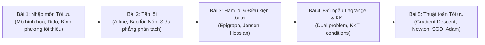

# Cơ Sở Toán Cho AI 🤖📐

Môn học **Cơ sở Toán cho Trí tuệ Nhân tạo** (Mathematics for AI / Optimization for Machine Learning) trang bị tư duy toán học và công cụ tối ưu hoá nền tảng cho AI: giải bài toán tối ưu, hình học tập lồi, hàm lồi, đối ngẫu Lagrange và các thuật toán tối ưu hoá hiện đại.

---

## 🗺️ Lộ trình Môn học

---

## 📚 Danh mục Bài học

| Bài | Tên bài học | Trạng thái |
|---|---|---|
| **Bài 01** | [**Nhập môn: Giới thiệu về Tối ưu**](./bai-01-nhap-mon-toi-uu.md) *(Mô hình hoá, bài toán Dido, bình phương tối thiểu, quy hoạch tuyến tính và tính lồi)* | ✅ **Đã hoàn thành** |
| **Bài 02** | [**Tập lồi: Hình học của những lựa chọn**](./bai-02-tap-loi.md) *(Tập affine/lồi/nón, phép bảo toàn tính lồi, nón chính quy, siêu phẳng phân tách/tựa, nón đối ngẫu)* | ✅ **Đã hoàn thành** |
| **Bài 03** | Hàm lồi và các phép kiểm tra tính lồi | ⏳ Đang biên soạn |
| **Bài 04** | Đối ngẫu Lagrange và Điều kiện KKT | ⏳ Đang biên soạn |
| **Bài 05** | Các thuật toán Tối ưu bậc một và bậc hai | ⏳ Đang biên soạn |

---

## 🌐 Tài nguyên Tham khảo Chất lượng Cao

- **Boyd & Vandenberghe:** *"Convex Optimization"* (Cambridge University Press) — Cuốn sách gối đầu giường kinh điển số 1 thế giới về tối ưu hoá lồi.
- **Stanford EE364a:** *Convex Optimization I* (Prof. Stephen Boyd).
- **Hermann Minkowski:** *Geometrie der Zahlen* (Hình học của các số) — nguồn cảm hứng hình học cho tập lồi.
