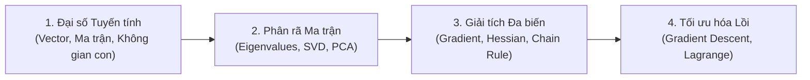

# Cơ Sở Toán Cho AI 🤖📐

Môn học **Cơ sở Toán cho Trí tuệ Nhân tạo** (Mathematics for AI) trang bị nền tảng Đại số tuyến tính, Giải tích đa biến, Tối ưu hóa và Xác suất ứng dụng trực tiếp trong Machine Learning và Deep Learning.

---

## 🗺️ Lộ trình Ôn tập Trọng tâm

- **Chương 1:** Vector, Ma trận và Ý nghĩa Hình học (Linear Transformation)
- **Chương 2:** Giá trị riêng, Vector riêng & Phân rã SVD (Singular Value Decomposition)
- **Chương 3:** Giảm chiều dữ liệu với PCA (Principal Component Analysis)
- **Chương 4:** Gradient và Đạo hàm ma trận trong Lan truyền ngược (Backpropagation)
- **Chương 5:** Các thuật toán Tối ưu hóa: Gradient Descent, SGD, Adam
