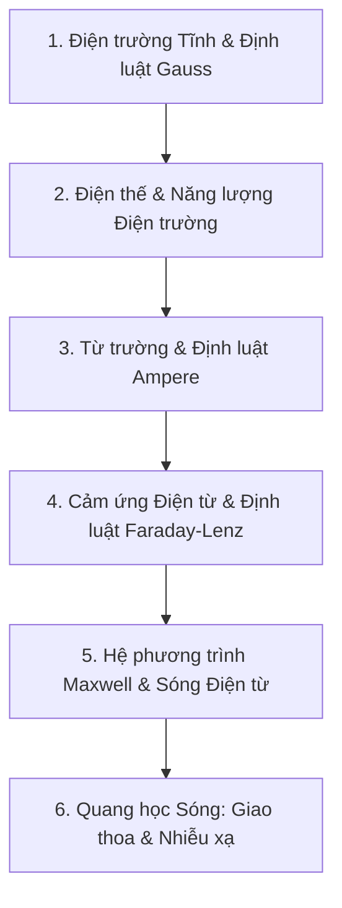

# Vật Lý Đại Cương 2 ⚡🧲

Môn học **Vật lý Đại cương 2** trang bị kiến thức nền tảng về Điện từ trường, Sóng ánh sáng và Quang học sóng — cơ sở vật lý cho phần cứng máy tính và truyền thông không dây.

---

## 🗺️ Lộ trình Ôn tập Trọng tâm

- **Chương 1:** Định luật Coulomb, Điện trường và Định luật Gauss (mặt Gauss kín)
- **Chương 2:** Điện thế, Hiệu điện thế, Tụ điện và Năng lượng điện trường
- **Chương 3:** Từ trường, Lực Lorentz và Định luật Biot-Savart, Định luật Ampere
- **Chương 4:** Hiện tượng Cảm ứng điện từ, Định luật Faraday, Quy tắc Lenz và Suất điện động tự cảm
- **Chương 5:** Hệ 4 phương trình Maxwell và Sóng điện từ
- **Chương 6:** Giao thoa ánh sáng (khe Young, màng mỏng) và Nhiễu xạ ánh sáng
