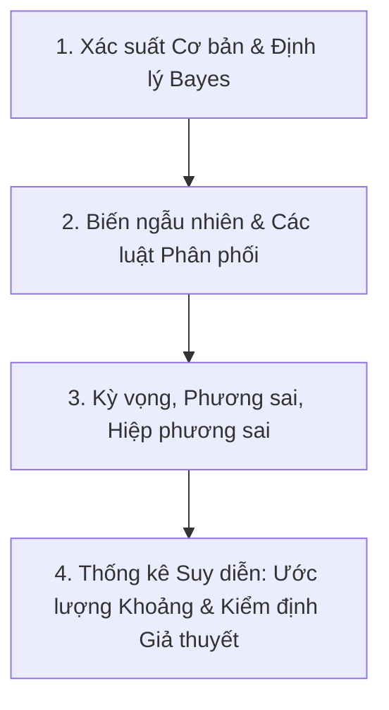

# Xác Suất Thống Kê 🎲📊

Môn học **Xác suất Thống kê** giúp bạn xây dựng tư duy phân tích sự bất định, mô hình hóa dữ liệu ngẫu nhiên và đưa ra quyết định dựa trên dữ liệu.

---

## 🗺️ Lộ trình Ôn tập Trọng tâm

- **Chương 1:** Không gian mẫu, Biến cố, Xác suất có điều kiện và Định lý Bayes
- **Chương 2:** Biến ngẫu nhiên rời rạc (Bernoulli, Nhị thức, Poisson, Hình học)
- **Chương 3:** Biến ngẫu nhiên liên tục (Đều, Mũ, Chuẩn Gauss)
- **Chương 4:** Luật số lớn và Định lý Giới hạn Trung tâm (CLT)
- **Chương 5:** Ước lượng tham số (Điểm, Khoảng tin cậy)
- **Chương 6:** Kiểm định giả thuyết (Z-test, T-test, Chi-square)
