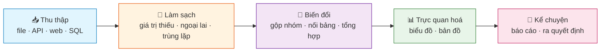
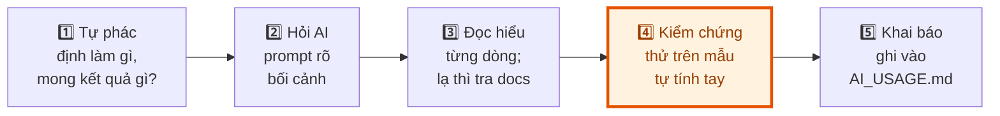

<!-- File: docs/lap-trinh-xu-ly-du-lieu/bai-01-tong-quan-cong-cu-chinh-sach-ai.md -->

# Bài 1: Tổng quan môn học, công cụ & chính sách AI

::: tip 🎯 Sau bài này bạn phải trả lời được
1. "Xử lý dữ liệu" là một **chuỗi công đoạn** — kể tên đủ 5 công đoạn và giải thích vì sao sai thứ tự (ví dụ trực quan hoá trước khi làm sạch) sẽ cho ra biểu đồ đẹp nhưng **sai**.
2. `venv` + `requirements.txt` + `.python-version` cùng nhau giải quyết vấn đề gì mà việc "cứ `pip install` thẳng vào máy" không giải quyết được?
3. Cho một tình huống làm bài cụ thể, phân loại được đó là chế độ 🚫 đóng hay ✅ mở, và nêu đủ 3 trách nhiệm khi dùng AI ở chế độ mở.
:::

## 0. Nhập môn bằng một ẩn dụ: gian bếp nhà hàng

Trước khi nói về Python hay pandas, hãy hình dung môn học này qua một ẩn dụ hoàn toàn không-công-nghệ: **một gian bếp nhà hàng**.

- **Nguyên liệu thô** vừa được giao đến — rau còn dính đất, thịt còn nguyên khối, cá chưa làm sạch vảy. Đây chính là *dữ liệu thô*: file CSV tải từ Inside Airbnb, dòng nào cũng có khả năng "bẩn".
- Đầu bếp **không thể nấu** ngay khi nguyên liệu còn bẩn — phải rửa, gọt, lọc xương trước (*làm sạch*).
- Sau đó mới **thái, ướp, phối trộn** nguyên liệu theo công thức (*biến đổi*: gộp nhóm, nối bảng, tổng hợp).
- Món ăn được **bày biện đẹp mắt** ra đĩa (*trực quan hoá*: biểu đồ, bản đồ).
- Cuối cùng, người phục vụ **giới thiệu món ăn** cho khách, giải thích vì sao chọn nguyên liệu này, nấu theo cách này (*kể chuyện*: báo cáo, khuyến nghị ra quyết định).

Một đầu bếp giỏi mà bỏ qua bước rửa rau để tiết kiệm thời gian thì món ăn nhìn vẫn có thể đẹp — nhưng ăn vào có thể ngộ độc. Trong xử lý dữ liệu, "ngộ độc" đó chính là **kết luận sai được rút ra từ dữ liệu bẩn mà không ai nhận ra.**



::: info Định nghĩa cốt lõi
**Xử lý dữ liệu** (data processing) = toàn bộ quy trình biến dữ liệu thô, rời rạc, không đáng tin cậy thành **thông tin đủ tin cậy để ra quyết định**. Đây không phải một bước, mà là một *pipeline* gồm nhiều bước nối tiếp, mỗi bước có thể tự động hoá bằng code.
:::

## 1. Dữ liệu thật trông như thế nào?

Đây là lý do môn học tồn tại: dữ liệu ngoài đời **không** đến dưới dạng số sạch sẽ như trong bài toán Toán rời rạc.

**Trước — một trích đoạn thật từ Inside Airbnb:**

| id | name | price | minimum_nights | review_scores_rating |
|---|---|---|---|---|
| 52811 | Room w/ view — metro 5min | `"$45,647.00"` | 2 | 4.87 |
| 78230 | Cozy studio!!! | *(trống)* | 1 | *(trống)* |
| 99182 | APT LUXO ★★★★★ | `"$1.00"` | 999 | 3.2 |

Đọc kỹ bảng trên, có ít nhất 4 loại "bẩn" khác nhau ẩn trong 3 dòng:

::: warning 🔍 Soi lỗi — bài tập tư duy trước khi vào code
- Cột `price` là **chuỗi ký tự** (`"$45,647.00"`) chứ không phải số — không thể cộng trừ trực tiếp.
- Dòng 2 có ô **trống** ở `price` và `review_scores_rating` — "không có dữ liệu" khác với "giá bằng 0".
- Dòng 3: giá `$1.00` mà tối thiểu `999` đêm — rất có thể là **giá trị ngoại lai/lỗi nhập liệu**, không phải một căn hộ thật cho thuê 1 đôla/đêm.
- Việc quyết định "loại bỏ dòng 3" hay "giữ lại vì biết đâu là thật" là một **quyết định phân tích**, không phải một sự thật khách quan — và đây chính là nơi con người (bạn) phải ra quyết định, AI không thể tự quyết thay.
:::

Nếu tính trung bình giá trên bảng này *mà không xử lý gì*, con số ra sẽ vô nghĩa — vừa vì kiểu dữ liệu sai (chuỗi), vừa vì bị kéo lệch bởi ngoại lai. Đây là lý do vì sao khoá học dành phần lớn thời gian cho **bước chuẩn bị** thay vì bước "phân tích" hào nhoáng.

::: tip Trực giác cốt lõi
Trong nghề dữ liệu thực tế, tỉ lệ thời gian phổ biến là: **~70–80% thu thập/làm sạch/chuẩn hoá, ~20–30% mô hình hoá/phân tích**. Mô hình chỉ đáng tin khi "phần chìm của tảng băng" (làm sạch) được làm tốt. Đề thi UET rất hay ra câu hỏi kiểu "vì sao bước X quan trọng hơn bước phân tích" — câu trả lời luôn quay về ý này.
:::

## 2. Môn học này nằm ở đâu trong lộ trình?

| Giai đoạn | Bài | Nội dung |
|---|---|---|
| **Nền tảng** | 1–5 | Công cụ, Python cho dữ liệu, NumPy, pandas |
| **Dữ liệu thật** | 6, 7, 8, 10 | File/API/SQL, xử lý chuỗi & regex, dữ liệu thời gian, làm sạch dữ liệu có cấu trúc |
| **Hiện đại** | 11–14 | LLM cho dữ liệu phi cấu trúc, trực quan hoá cơ bản & nâng cao, kể chuyện bằng dữ liệu |
| **Đánh giá** | 9, 15 | Thi giữa kỳ · Vấn đáp bài tập lớn |

**Vị trí:** tiên quyết là *Tư duy tính toán* (đã biết Python cơ bản); môn này dạy làm chủ dữ liệu bằng NumPy/pandas/trực quan hoá/LLM; các môn sau (Học máy, Khoa học dữ liệu) sẽ dùng lại toàn bộ kỹ năng này làm nền.

## 3. Công cụ làm việc

### 3.1 Vì sao là Python?

Ẩn dụ: nếu coi các ngôn ngữ lập trình là "dụng cụ bếp", thì Python giống một **con dao đầu bếp đa năng** — không chuyên biệt nhất cho một việc đơn lẻ, nhưng dùng được xuyên suốt từ thái rau (thử nghiệm nhanh trên notebook) đến chế biến món chính (xây pipeline sản xuất), và là ngôn ngữ chính để "nói chuyện" với các mô hình AI/LLM.

### 3.2 Hai môi trường làm việc — dùng khi nào?

| Tiêu chí | 📓 Google Colab | 💻 VS Code + venv |
|---|---|---|
| Cài đặt | Không cần cài gì, chạy trên cloud | Tự cài Python, thư viện trên máy |
| Thư viện | Có sẵn phần lớn | Tự quản lý qua `requirements.txt` |
| Chia sẻ | Như Google Docs (link, đồng chỉnh sửa) | Qua Git/GitHub |
| Dùng khi nào | Học trên lớp, thử nghiệm nhanh, bài lab | **Bài tập lớn** — cần một pipeline chạy lại được (reproducible) |
| Kiểm soát phiên bản thư viện | Hạn chế, phụ thuộc Google | Toàn quyền, cố định bằng file |

::: info Notebook là gì?
Notebook (`.ipynb`) là tài liệu "sống": mỗi *cell* chứa code hoặc văn bản mô tả, chạy độc lập và giữ lại kết quả ngay bên dưới — code, giải thích và kết quả nằm chung một chỗ, thuận tiện để vừa học vừa chạy thử ngay cả khi chưa hiểu hết dòng code.
:::

### 3.3 Vì sao cần `venv`? — bài toán "đôi giày đi mượn"

Hãy tưởng tượng hai dự án A và B cùng cài trên một máy: dự án A cần `pandas==1.5`, dự án B cần `pandas==2.2`. Nếu cài thẳng vào máy (global), cài bản sau sẽ ghi đè bản trước — dự án A đột nhiên "hỏng" mà không ai động vào code của nó. `venv` giải quyết đúng vấn đề này bằng cách tạo cho **mỗi dự án một "đôi giày riêng"** — một thư mục thư viện độc lập, không đụng chạm dự án khác.

```bash
# Tạo một môi trường ảo tên .venv ngay tại thư mục dự án
python -m venv .venv

# "Bước vào" môi trường đó — mọi lệnh pip sau đây chỉ ảnh hưởng riêng .venv
source .venv/bin/activate        # Windows: .venv\Scripts\activate

# Cài thư viện — chỉ nằm trong .venv, không đụng máy chung
pip install pandas matplotlib
```

Khi dự án kết thúc, xoá thẳng thư mục `.venv/` mà không ảnh hưởng đến bất kỳ dự án nào khác trên máy.

### 3.4 Tái lập được (reproducible) = 3 mảnh ghép bắt buộc

::: warning Bẫy thi/chấm bài tập lớn thường gặp
Một pipeline "chạy được trên máy tôi" nhưng **không tái lập được trên máy khác** vẫn bị coi là lỗi nghiêm trọng khi chấm bài tập lớn. Ba tệp sau là bắt buộc, thiếu một cũng không đạt chuẩn tái lập:
:::

| Tệp | Vai trò | Lệnh liên quan |
|---|---|---|
| `.python-version` | Ghi đúng **phiên bản Python** đã kiểm thử (ví dụ `3.12.3`) | Tạo thủ công, 1 dòng |
| `requirements.txt` | Ghi đúng **phiên bản từng thư viện** đã dùng | `pip freeze > requirements.txt` |
| `README.md` | Ghi **hệ điều hành + các bước**: cài Python → tạo venv → cài thư viện → chạy | Viết tay |

Lưu ý: `.python-version` chỉ là một dòng *ghi lại* phiên bản đã dùng — bản thân nó **không tự cài hay tự chuyển đổi** phiên bản Python; người chạy lại vẫn phải tự chọn đúng bản khi tạo `venv`.

```bash
# Trong venv của dự án, sau khi cài xong mọi thư viện cần dùng:
python -m pip freeze > requirements.txt

# Trên một máy khác, sau khi tạo venv mới:
python -m pip install -r requirements.txt
```

### 3.5 Git & GitHub

Git ghi lại **lịch sử từng thay đổi** của code theo thời gian — có thể quay lại phiên bản cũ, và biết chính xác ai sửa dòng nào, khi nào. Bài tập lớn nộp bằng repo GitHub **private** của nhóm; lịch sử commit là một phần căn cứ chấm điểm làm việc nhóm (không chỉ sản phẩm cuối).

## 4. Học và làm việc với AI có trách nhiệm

### 4.1 AI viết code dữ liệu rất giỏi — nhưng giỏi không có nghĩa là đúng

Hỏi một chatbot bất kỳ: *"Tính giá trung bình theo loại phòng"*, AI gần như chắc chắn trả lời đúng cú pháp:

```python
import pandas as pd

df = pd.read_csv("listings.csv")
df.groupby("room_type")["price"].mean()
```

Đoạn code này **chạy được** — nhưng "chạy được" và "đúng với ý định phân tích của bạn" là hai chuyện khác nhau. Đây chính là trọng tâm của phần chính sách AI.

**Trước → Sau: một quy ước bị AI "âm thầm" chọn hộ bạn**

| Bước | Nội dung | Giải thích |
|---|---|---|
| Trước | `prices = [100, 200, None, None, 300]` | 5 quan sát, 2 ô thiếu giá trị |
| Code | `pd.Series(prices).mean()` | Theo mặc định, `.mean()` dùng `skipna=True` — **bỏ qua** các ô thiếu |
| Sau | `200.0` | = (100+200+300) ÷ **3**, không phải ÷ 5 |

Nếu ô trống có nghĩa là "phòng tạm ngừng cho thuê" thì bỏ qua là hợp lý. Nhưng nếu ô trống là "chủ nhà quên khai giá" thì kết quả `200.0` đã **âm thầm sai lệch** — và AI sẽ không tự cảnh báo bạn điều này trừ khi bạn hỏi.

::: danger Bài học cốt lõi của cả môn học
Mục tiêu năm 2026 **không phải** là tự tay gõ từng dòng code — mà là **chỉ đạo** được công cụ (kể cả AI) và **kiểm chứng** được kết quả nó tạo ra. Nhưng muốn chỉ đạo và kiểm chứng, bạn buộc phải **hiểu code đến từng dòng**. Không hiểu `mean()` bỏ qua NaN → không nhận ra báo cáo sai → nộp một kết luận sai mà không hề biết.
:::

### 4.2 Hai chế độ đánh giá — phân biệt rõ để tránh mất điểm oan

| | 🚫 Đóng — không dùng AI | ✅ Mở — được dùng AI |
|---|---|---|
| Áp dụng cho | Quiz trên lớp · Thi giữa kỳ · Vấn đáp bài tập lớn | Bài thực hành (lab) · Bài tập về nhà · Làm bài tập lớn tại nhà |
| Đo cái gì | Nền tảng kiến thức **của chính bạn** | Khả năng **chỉ đạo & kiểm chứng** công cụ AI |

::: warning Quy tắc an toàn khi không chắc
Mọi bài tập phải được gắn nhãn 🚫 đóng hoặc ✅ mở ngay trên đề. **Nếu không thấy nhãn, mặc định hỏi giảng viên trước khi dùng AI** — đừng tự suy đoán.
:::

### 4.3 Ba trách nhiệm bắt buộc ở chế độ mở



1. **Khai báo** — dùng công cụ AI nào, cho việc gì (bài tập lớn: điền vào `AI_USAGE.md`). Khai báo đầy đủ **không bị trừ điểm**; che giấu mới là vấn đề.
2. **Hiểu** — phải giải thích được *mọi dòng* mình nộp; buổi vấn đáp sẽ hỏi trực tiếp từng thành viên.
3. **Kiểm chứng** — tự chịu trách nhiệm đúng/sai của kết quả. "AI bảo thế" **không phải** một câu trả lời chấp nhận được khi vấn đáp.

Bước 4 (kiểm chứng) là bước hay bị bỏ qua nhất trong thực tế — vì nó chậm và có vẻ "thừa" khi code đã chạy không lỗi. Nhưng chạy không lỗi ≠ kết quả đúng.

### 4.4 Ranh giới gian lận — ghi nhớ để tránh vô tình vi phạm

::: danger Bị coi là gian lận
- Dùng AI trong quiz / thi giữa kỳ / vấn đáp (chế độ 🚫 đóng).
- Khai man hoặc **giấu** việc đã dùng AI.
- Chép bài nhóm khác — kể cả hình thức "nhờ AI viết lại cho khác đi" để né đạo văn.
:::

::: tip Không bị coi là gian lận
Nộp code do AI viết mà **bạn hiểu, đã kiểm chứng, và có khai báo đầy đủ**. Rủi ro duy nhất: nếu khi vấn đáp bạn không giải thích được một phần cụ thể nào đó, **phần đó nhận 0 điểm cá nhân** — nhưng đây là rủi ro về điểm, không phải cáo buộc gian lận.
:::

## 5. Vận hành môn học

### 5.1 Cơ cấu điểm

| Đầu điểm | Trọng số | Chế độ |
|---|---|---|
| Thực hành — nộp bài lab | 10% | ✅ mở |
| Kiểm tra trên lớp (2 bài giấy, 15 phút) | 10% | 🚫 đóng |
| Thi giữa kỳ | 20% | 🚫 đóng |
| **Bài tập lớn nhóm + vấn đáp** | **60%** | ✅ mở (riêng vấn đáp 🚫 đóng) |

::: warning Trọng số cần khắc cốt ghi tâm
Bài tập lớn chiếm **60%** tổng điểm — và phần vấn đáp trong đó lại là 🚫 đóng. Nói cách khác: bạn có thể dùng AI để *làm* bài tập lớn, nhưng không thể dùng AI để *trả lời vấn đáp về* bài tập lớn đó. Đây là lý do "Hiểu" (trách nhiệm #2 ở trên) quan trọng ngang với việc code chạy đúng.
:::

### 5.2 Bài tập lớn: Inside Airbnb

Cả lớp dùng chung **một đề bài** (phân tích thị trường Airbnb) nhưng mỗi nhóm nhận **một thành phố riêng**. Sản phẩm là một pipeline chạy được bằng một lệnh duy nhất: thu thập → QA (kiểm tra chất lượng) → tính KPI → vẽ biểu đồ → xuất báo cáo, có thêm hợp phần dùng LLM xử lý dữ liệu review dạng văn bản. Việc chấm điểm dùng một bộ test chung chạy trực tiếp trên repo của từng nhóm, cộng với vấn đáp từng thành viên.

## Tổng kết nhanh

- Xử lý dữ liệu = pipeline 5 bước: **Thu thập → Làm sạch → Biến đổi → Trực quan hoá → Kể chuyện** — sai thứ tự cho ra kết luận sai dù biểu đồ vẫn đẹp.
- `venv` + `requirements.txt` + `.python-version` cùng nhau đảm bảo pipeline **tái lập được** trên máy khác.
- AI được phép dùng ở chế độ ✅ mở, đi kèm 3 trách nhiệm bắt buộc: **khai báo — hiểu — kiểm chứng**; các bài đánh giá 🚫 đóng (quiz, giữa kỳ, vấn đáp) tuyệt đối không dùng AI.

## 🧠 Mẹo thi & bẫy thường gặp

::: warning Câu hỏi trắc nghiệm hay đánh lừa
- **"Notebook chạy không lỗi thì báo cáo chắc chắn đúng"** → SAI. Chạy không lỗi chỉ chứng minh cú pháp hợp lệ, không chứng minh giả định phân tích (ví dụ cách xử lý NaN) là đúng với ngữ cảnh dữ liệu.
- **"Dùng AI viết bài tập về nhà (không ghi nhãn) là được phép vì bài tập về nhà thường ở chế độ mở"** → SAI, cần kiểm tra nhãn trên từng đề cụ thể; không có nhãn thì phải hỏi trước, không tự suy đoán.
- **"Khai báo dùng AI sẽ bị trừ điểm vì lộ ra là 'không tự làm'"** → SAI, khai báo đầy đủ không bị trừ điểm; **giấu diếm** mới là vấn đề bị xử lý nặng.
- **".python-version tự động cài đúng bản Python khi người khác chạy lại"** → SAI, tệp này chỉ *ghi lại* thông tin, người chạy vẫn phải tự cài/chọn đúng phiên bản.
:::

## 📚 Đọc thêm & tài nguyên

- McKinney, *Python for Data Analysis*, 3rd ed. — chương 1 (miễn phí tại [wesmckinney.com/book](https://wesmckinney.com/book/)).
- [Python venv — tài liệu chính thức](https://docs.python.org/3/library/venv.html)
- [pip freeze / requirements.txt — tài liệu pip chính thức](https://pip.pypa.io/en/stable/reference/requirements-file-format/)
- [Pro Git Book (miễn phí, tiếng Anh)](https://git-scm.com/book/en/v2) — chương 1–2 đủ dùng cho môn này.
- [The Turing Way — Reproducible Research](https://the-turing-way.netlify.app/reproducible-research/reproducible-research) — góc nhìn rộng hơn về "tái lập được" trong khoa học dữ liệu.

::: info 🤖 Làm việc với AI thì sao?
**AI làm tốt:** giải thích khái niệm bạn thấy lạ ("`venv` là gì?"), gợi ý lệnh, viết code nháp cho thao tác chuẩn.
**AI hay sai:** áp dụng một quy ước ngầm mà không nói rõ (như `mean()` bỏ qua NaN); đề xuất cú pháp không tồn tại ở đúng phiên bản thư viện bạn đang dùng.
**Kiểm chứng bằng cách nào:** chạy thử code AI đưa trên một mẫu nhỏ **tự tính tay được** trước khi tin; gặp hàm lạ, ưu tiên đọc tài liệu chính thức thay vì chỉ hỏi lại AI.
:::
