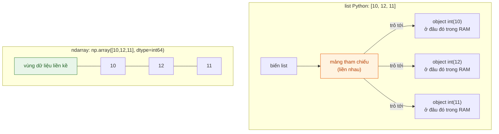
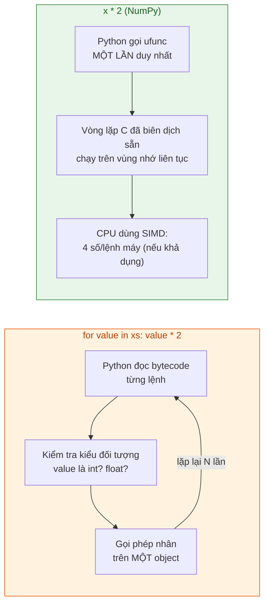

<!-- File: docs/lap-trinh-xu-ly-du-lieu/bai-03-numpy.md -->

# Bài 3: NumPy và tư duy vector hoá

::: tip 🎯 Sau bài này bạn phải trả lời được
1. Vì sao `ndarray` tính nhanh hơn `list` + vòng `for` — trả lời được ở **cả hai tầng**: cách lưu trong bộ nhớ, và cách CPU thực thi phép toán.
2. Cho `shape` và `strides` của một mảng, tính được **địa chỉ byte** của một phần tử bất kỳ, và dự đoán được view nào chia sẻ bộ nhớ với mảng gốc.
3. Áp dụng đúng quy tắc broadcasting để cộng một vector vào từng **hàng** hoặc từng **cột** của ma trận — không cần `for`.
:::

## 0. Nhập môn bằng một ẩn dụ: dây chuyền đóng bánh và người thợ thủ công

Hãy tưởng tượng bạn cần phủ socola lên 1 triệu chiếc bánh **giống hệt nhau về kích thước**.

- **Cách 1 — người thợ thủ công (Python `list` + `for`):** mỗi lần lấy một chiếc bánh, thợ phải **nhìn lại** xem đây có đúng là bánh không, kích thước bao nhiêu, rồi mới phủ socola. 1 triệu chiếc = 1 triệu lần "nhìn lại rồi làm" — dù thao tác thực tế rất đơn giản.
- **Cách 2 — dây chuyền băng tải (NumPy `ndarray`):** vì tất cả bánh **cùng một kích thước, xếp liền kề nhau** trên băng chuyền, nhà máy chỉ cần lắp **một cỗ máy phủ socola cố định** (một *ufunc*) chạy dọc theo băng chuyền — không cần "nhìn lại" từng chiếc, và máy còn có thể phủ **4 chiếc cùng lúc** bằng một cần gạt duy nhất (SIMD).

Sự khác biệt cốt lõi không nằm ở "phép tính" (đều là phủ socola / nhân với 2) mà nằm ở **cách tổ chức dữ liệu**: `list` lưu các bánh (đối tượng) rải rác, chỉ có một dãy "địa chỉ" trỏ tới chúng; `ndarray` lưu **chính các giá trị**, liền kề nhau, cùng một kiểu. Đây là lý do vì sao bài học bắt đầu từ *cách lưu dữ liệu* trước khi nói đến tốc độ.



::: info Định nghĩa cốt lõi
`ndarray` là cấu trúc mảng của NumPy: một vùng bộ nhớ **liền kề**, lưu trực tiếp các giá trị cùng một `dtype` (kiểu dữ liệu cố định), đi kèm **metadata** mô tả cách đọc vùng đó — quan trọng nhất là `shape` (hình dạng) và `dtype` (kiểu phần tử).
:::

## 1. Cấu trúc mảng NumPy

### 1.1 Ba thuộc tính đầu tiên cần đọc trên mọi mảng

```python
import numpy as np

A = np.array([[10, 12, 11],
              [20, 21, 24],
              [30, 33, 31],
              [40, 44, 42]], dtype=np.int64)
```

| Thuộc tính | Giá trị | Ý nghĩa |
|---|---|---|
| `A.shape` | `(4, 3)` | 4 hàng, 3 cột |
| `A.ndim` | `2` | Số chiều |
| `A.dtype` | `int64` | Mỗi phần tử là số nguyên 64 bit |

::: tip Giữ nguyên `A` xuyên suốt bài
Mọi ví dụ minh hoạ trong bài đều dùng lại đúng 12 giá trị của `A` này — khi cần sửa dữ liệu, luôn tạo `B = A.copy()` trước để `A` không đổi. Thói quen này giúp so sánh trực tiếp kết quả giữa các slide.
:::

### 1.2 Dung lượng bộ nhớ = kích thước × số byte mỗi phần tử

`A` có 4 hàng, 3 cột, mỗi số `int64` chiếm 8 byte:

$$
\text{nbytes} = 4 \times 3 \times 8 = 96 \text{ byte (chưa tính metadata)}
$$

| Kiểm tra bằng NumPy | Kết quả | Ý nghĩa |
|---|---|---|
| `A.itemsize` | `8` | Byte mỗi phần tử (thuộc tính, không có `()`) |
| `A.nbytes` | `96` | `= A.size * A.itemsize` — byte của toàn bộ phần tử |

::: warning So sánh thật: `list` so với `ndarray` trên 10.000 số nguyên
Đo trên CPython 3.12.3 + NumPy 2.5.2, cùng lưu 10.000 giá trị ngẫu nhiên trong khoảng 1000–10999:

| Cấu trúc | Dung lượng đo được |
|---|---|
| `list` (Python) | ≈ 351,6 KiB |
| `ndarray` (`int64`) | ≈ 78,2 KiB |

Chênh lệch đến từ việc `list` phải lưu **cả vùng tham chiếu lẫn từng đối tượng `int` riêng lẻ** (mỗi đối tượng `int` của Python có kèm header quản lý bộ nhớ), trong khi `ndarray` chỉ lưu **giá trị thô liên tục**. Đây là con số đo trên một máy cụ thể — mấu chốt cần nhớ là **tỉ lệ chênh lệch**, không phải con số tuyệt đối.
:::

### 1.3 Kích thước cố định → có thể tràn số (overflow)

**Trước → Sau: cộng 1 vào giá trị lớn nhất của `int8`**

| Bước | Code / Trạng thái | Giải thích |
|---|---|---|
| Trước | `x8 = np.array([127], dtype=np.int8)` | `int8` chỉ biểu diễn được từ **−128 đến 127** |
| Code | `x8 + 1` | Cộng vượt quá giới hạn kiểu dữ liệu |
| Sau | `[-128]` | **Tràn số** — "quay vòng" về giá trị âm nhỏ nhất, không báo lỗi! |

```python
x8 = np.array([127], dtype=np.int8)
print(x8 + 1)                        # [-128]  — tràn số, KHÔNG có lỗi/cảnh báo

print(x8.astype(np.int16) + 1)       # [128]   — đổi kiểu TRƯỚC khi cộng mới đúng
```

::: danger Bẫy: đổi kiểu sau khi tính đã quá muộn
So sánh với Python thuần: `127 + 1 = 128` luôn đúng vì `int` của Python tự động mở rộng số byte khi cần. NumPy thì **không** — kiểu dữ liệu cố định ngay từ đầu là đánh đổi để lấy tốc độ và bộ nhớ nhỏ gọn. Muốn tránh tràn số, phải `.astype()` **trước** phép tính, không phải sau.
:::

### 1.4 Ít byte hơn → độ chính xác số thực thấp hơn

| Giá trị | Byte | Chuỗi hiển thị (12 chữ số) |
|---|---|---|
| $\frac{1}{3}$ (giá trị toán học) | — | `0.333333333333…` |
| `float32` | 4 | `0.333333343267` |
| `float64` | 8 | `0.333333333333` |

Cả hai kiểu đều chỉ lưu **giá trị gần đúng** của $\frac{1}{3}$; `float64` dùng gấp đôi bộ nhớ để đổi lấy độ chính xác cao hơn. Đây chính là đánh đổi (trade-off) cốt lõi giữa bộ nhớ và độ chính xác mà mọi hệ thống số máy tính đều gặp phải.

### 🔍 Dry Run — Bài tập 1: đổi kiểu lúc nào mới đúng?

```python
x = np.array([50, 100, 120], dtype=np.int8)
a = (x * 2).astype(np.int16)     # nhân TRƯỚC, đổi kiểu SAU
b = x.astype(np.int16) * 2       # đổi kiểu TRƯỚC, nhân SAU
```

| Phần tử `x` (int8) | `x * 2` tính trong `int8` (có tràn!) | `a` = kết quả trên, ép sang int16 | `b` = `x` đổi sang int16 rồi mới ×2 |
|---|---|---|---|
| 50 | 100 (không tràn) | 100 | 100 |
| 100 | **−56** (200 tràn vòng lại) | **−56** | 200 |
| 120 | **−16** (240 tràn vòng lại) | **−16** | 240 |

| Kiểm tra | `x.nbytes` | `a.nbytes` | `b.nbytes` |
|---|---|---|---|
| Giá trị | 3 | 6 | 6 |

::: warning Bài học
`a` và `b` có **cùng `dtype`, cùng dung lượng** (`int16`, 6 byte) nhưng **giá trị khác nhau** — vì phép nhân của `a` đã chạy (và tràn) trong `int8` từ trước khi đổi kiểu. **Cùng dtype và dung lượng không đảm bảo cùng giá trị.** Đây là câu hỏi bẫy kinh điển trong đề thi.
:::

## 2. Vì sao NumPy tính nhanh?

### 2.1 So sánh trực tiếp: vòng lặp thủ công so với vector hoá

```python
# Cách 1 — list comprehension: Python phải LẶP TỪNG PHẦN TỬ
xs = [10, 12, 11]
print([value * 2 for value in xs])
```
```text
[20, 24, 22]
```

```python
# Cách 2 — NumPy: MỘT lệnh áp dụng cho toàn bộ mảng
x = np.array(xs, dtype=np.int64)
print(x * 2)
```
```text
[20 24 22]
```

Cả hai cho **cùng kết quả** — khác biệt nằm ở việc *ai* phải làm việc lặp lại: interpreter Python (cách 1) hay vòng lặp C đã biên dịch sẵn bên trong NumPy (cách 2).

::: info `ufunc` (universal function) là gì?
`ufunc` là hàm NumPy áp dụng **một phép toán lên từng phần tử** của mảng. `x * 2` thực chất tương đương `np.multiply(x, 2)` — một ufunc hai đầu vào, trong đó `2` được **dùng lại cho mọi phần tử**. NumPy không "biên dịch vòng `for` của bạn lúc chạy" — các vòng lặp C này đã được biên dịch sẵn từ trước, khi xây dựng thư viện.
:::

### 2.2 Ba tầng giải thích vì sao nhanh hơn



| Tầng | Vòng `for` trên `list` | Phép toán NumPy |
|---|---|---|
| **Lưu trữ** | Tham chiếu rải rác tới các object | Giá trị liền kề, cùng `dtype` |
| **Thực thi** | Interpreter đọc bytecode mỗi lượt, kiểm tra kiểu | Vòng lặp C biên dịch sẵn, không kiểm tra kiểu lại mỗi phần tử |
| **Phần cứng** | Khó tận dụng SIMD (dữ liệu không liền kề, kiểu không cố định) | Có thể dùng **SIMD**: một lệnh máy xử lý nhiều số cùng lúc |
| **Cache CPU** | Truy cập object rải rác → hay "cache miss" | Truy cập liên tiếp → tận dụng tốt cache CPU |

::: tip SIMD (Single Instruction, Multiple Data)
Một lệnh máy thực hiện cùng một thao tác trên **nhiều số cùng lúc** — ví dụ nhân 4 số `int64` bằng một chuỗi lệnh AVX2 duy nhất, trên **một lõi CPU**, không cần chia việc cho nhiều luồng. `x * 2` vì vậy **có thể nhanh hơn vòng `for`** ngay cả khi chỉ chạy trên một luồng duy nhất. (Ngược lại, phép nhân ma trận `A @ B` mới là phép toán hay tận dụng **nhiều luồng** qua thư viện BLAS.)
:::

### 🔍 Dry Run — Bài tập 2: thay `for` bằng biểu thức mảng

```python
x = np.array([10, 12, 11, 20])
y = np.array([12, 11, 15, 20])

ket_qua = []
for u, v in zip(x, y):
    ket_qua.append((v - u) ** 2)
```

| Cặp `(u, v)` | `v - u` | `(v - u) ** 2` |
|---|---|---|
| (10, 12) | 2 | 4 |
| (12, 11) | −1 | 1 |
| (11, 15) | 4 | 16 |
| (20, 20) | 0 | 0 |

→ `ket_qua = [4, 1, 16, 0]`. Viết lại bằng NumPy, **không dùng `for`**:

```python
ket_qua_np = (y - x) ** 2      # một biểu thức, chạy trên cả 4 phần tử cùng lúc
```

Bản viết lại vẫn tính trên **từng cặp số** như vòng `for` — điểm khác biệt là phép trừ và phép bình phương chạy trong **mã NumPy đã biên dịch sẵn**, không phải bytecode Python xử lý từng object, nên với mảng lớn (hàng nghìn/triệu phần tử) tốc độ chênh lệch rất rõ rệt.

## 3. Chỉ mục, lát cắt và bài toán View vs Copy

### 3.1 Từ chỉ mục đến địa chỉ ô nhớ: `strides`

`strides` là bước dịch chuyển (tính bằng **byte**) để đi từ phần tử này sang phần tử kế tiếp theo mỗi chiều. Với `A` (shape `(4,3)`, `int64`): `A.strides = (24, 8)` — mỗi hàng cách nhau 24 byte (3 số × 8 byte), mỗi cột cách nhau 8 byte.

**Tính địa chỉ của `A[2, 1]` (giá trị 33):**

$$
\text{offset} = 2 \times 24 + 1 \times 8 = 56 \text{ byte kể từ đầu vùng dữ liệu}
$$

### 🔍 Dry Run — Bài tập 3: định vị phần tử bằng strides

Cho `A.shape = (4, 3)`, `A.strides = (24, 8)`.

| Câu hỏi | Cách tính | Đáp án |
|---|---|---|
| `A[1, 2]` cách đầu vùng dữ liệu bao nhiêu byte? | $1 \times 24 + 2 \times 8$ | **40 byte** |
| Ô cách đầu vùng dữ liệu 80 byte là ô nào? | $80 = i \times 24 + j \times 8 \Rightarrow i=3, j=1$ | Giá trị **44**, tại `A[3, 1]` |
| `B = A.astype(np.int32)` (4 byte/số) có `strides` bằng bao nhiêu? | Tỷ lệ 8→4 byte, giữ nguyên `shape` | `(12, 4)` |

### 3.2 View và Copy — bẫy quan trọng nhất của cả bài

**Trước → Sau: sửa một *view* khiến mảng gốc cũng đổi theo**

| Bước | Code | Trạng thái `B` |
|---|---|---|
| Trước | `B = A.copy()` | `B[0] = [10, 12, 11]` |
| Tạo view | `V = B[:2, 1:]` | `V` **dùng chung vùng dữ liệu** với `B` |
| Sửa `V` | `V[0, 0] = 999` | — |
| Sau | `print(B[0])` | `[10, 999, 11]` ⚠️ `B` bị đổi dù ta không đụng trực tiếp vào `B`! |

```python
B = A.copy()
V = B[:2, 1:]        # lát cắt cơ bản → VIEW, không copy dữ liệu
V[0, 0] = 999
print(B[0])           # [ 10 999  11] — B cũng đổi!

print(np.shares_memory(B, V))   # True — hai object khác nhau, chung 1 vùng dữ liệu
```

::: danger Quy tắc bắt buộc thuộc lòng: khi nào là View, khi nào là Copy?
| Cách lấy dữ liệu | Kết quả | Sửa kết quả có ảnh hưởng mảng gốc? |
|---|---|---|
| **Lát cắt cơ bản** `A[:2, 1:]`, `A[::2]` | **View** | **CÓ** — dùng chung vùng dữ liệu |
| **Mảng chỉ mục** `A[[0,2], [1,2]]`, mặt nạ bool `A[mask]`, `np.ix_` | **Bản sao (Copy)** | KHÔNG — vùng dữ liệu độc lập |
| **Gán trực tiếp** `A[mask] = -1`, `A[chon] = -1` (vế trái phép gán) | Sửa tại chỗ | **LUÔN sửa mảng gốc**, bất kể cách chọn ở trên |

Đây chính là "họ hàng" của lỗi *view vs copy* / `SettingWithCopyWarning` sẽ gặp lại trong pandas (Bài 4–5) — gốc rễ là cùng một khái niệm *aliasing* đã học ở Bài 2 (`ban_sao = goc`).
:::

Kiểm chứng nhanh bằng `np.shares_memory(a, b)` — trả về `True`/`False` cho biết hai mảng có dùng chung vùng dữ liệu hay không (kể cả khi chuyển vị: `np.shares_memory(A, A.T)` cũng là `True`).

### 3.3 Lọc bằng mặt nạ bool (boolean masking)

**Trước → Sau: lọc và gán bằng mặt nạ**

| Thao tác | Code | Kết quả |
|---|---|---|
| Đọc (tạo bản sao) | `mask = A >= 30`<br>`B = A[mask]` | Mảng 1 chiều mới, độc lập với `A` |
| Gán (sửa tại chỗ) | `A[mask] = -1` | Mọi ô ≥ 30 trong `A` bị đổi thành `-1` |

```python
mask = (A >= 20) & (A < 40)     # PHẢI dùng &, |, ~ — KHÔNG dùng and/or
print(A[mask])
```
```text
[20 21 24 30 33 31]
```

::: warning Bẫy cú pháp hay gặp
Phải đặt **mỗi điều kiện trong ngoặc** và dùng `&` `|` `~` (toán tử theo từng phần tử) thay vì `and` `or` `not` (chỉ áp dụng cho một giá trị boolean đơn lẻ) — dùng nhầm sẽ báo lỗi `ValueError: truth value of an array is ambiguous`.
:::

## 4. Broadcasting — tính toán trên các mảng khác `shape`

### 4.1 Hai ví dụ đối lập: cộng theo cột vs cộng theo hàng

| Muốn cộng… | Vector cần | Shape vector | Phép tính |
|---|---|---|---|
| … từng **cột** một số riêng (`[1,2,3]` cho cột 0,1,2) | `b = np.array([1,2,3])` | `(3,)` | `A + b` → `(4,3) + (3,)` |
| … từng **hàng** một số riêng (`[10,20,30,40]` cho hàng 0–3) | `d_cot = d[:, None]` | `(4,1)` | `A + d_cot` → `(4,3) + (4,1)` |

```python
b = np.array([1, 2, 3])
A + b                        # cộng 1,2,3 lần lượt vào MỖI HÀNG (dùng lại b cho mọi hàng)

d = np.array([10, 20, 30, 40])
d_cot = d[:, None]           # thêm 1 chiều: (4,) → (4,1) — None tương đương np.newaxis
A + d_cot                    # cộng 10,20,30,40 lần lượt vào MỖI CỘT của từng hàng
```

::: info Quy tắc broadcasting — ghép shape từ bên phải
Đặt các `shape` thẳng hàng về bên **phải**, so sánh từng chiều:
- Bằng nhau → ghép trực tiếp.
- Một bên bằng `1` → "dùng lại" giá trị đó cho toàn bộ chiều kia.
- Chiều bị thiếu → coi như bằng `1`.
- Còn lại (khác nhau và không có bên nào bằng 1) → **lỗi**, không ghép được.

$$
\underbrace{(4,\ 3)}_{A} \quad + \quad \underbrace{(\phantom{4,}\ 3)}_{b\text{, thiếu chiều đầu} \to \text{coi là }1} \quad \Rightarrow \quad \text{hợp lệ, kết quả } (4,3)
$$
:::

::: danger Vì sao `A + d` (không có `[:, None]`) báo lỗi?
```text
A.shape       (4, 3)
d.shape          (4,)
                  ↑
             3 không khớp 4, và không có bên nào bằng 1
```
NumPy ghép shape từ chiều **cuối cùng** trở về trước — nó **không tự đoán** rằng 4 số trong `d` là "dành cho 4 hàng". Phải chủ động thêm chiều bằng `d[:, None]` để biến `(4,)` thành `(4, 1)`, lúc đó chiều cuối (`1` so với `3`) mới hợp lệ để broadcasting.
:::

### 🔍 Dry Run — Bài tập 5: cộng đồng thời theo cả hàng và cột

Yêu cầu: `B[i,j] = A[i,j] + b[j] + d[i]`, với `b = [1,2,3]` (cộng theo cột) và `d = [10,20,30,40]` (cộng theo hàng).

```python
B = A + b + d[:, None]        # (4,3) + (3,) + (4,1) → tất cả broadcast về (4,3)
```

| Hàng `A[0]` | `+ b` | `+ d[0]=10` | `B[0]` |
|---|---|---|---|
| `[10, 12, 11]` | `[11, 14, 14]` | `+10` mỗi phần tử | `[21, 24, 24]` |

### 4.2 Tổng hợp theo `axis` — trục nào "biến mất"?

```python
A.mean(axis=0)                        # gộp theo TRỤC 0 (dọc theo hàng) → kết quả có shape (3,): TB mỗi CỘT
A.mean(axis=1)                        # gộp theo TRỤC 1 (dọc theo cột) → kết quả có shape (4,): TB mỗi HÀNG
A.mean(axis=1, keepdims=True)         # giữ lại chiều đã gộp với kích thước 1 → shape (4,1)
```

::: tip Mẹo nhớ `axis`
`axis=k` nghĩa là **"gộp dọc theo trục thứ k"** — trục đó sẽ *biến mất* khỏi kết quả trừ khi dùng `keepdims=True`. `axis=0` → mất chiều hàng, kết quả theo **cột**; `axis=1` → mất chiều cột, kết quả theo **hàng**. Đây cũng chính là quy ước `axis` mà pandas dùng lại nguyên vẹn ở Bài 4–5.
:::

**Vì sao `keepdims=True` bắt buộc khi định trừ ngược lại `A`:**

| Cách tính trung bình hàng | Shape | `A - tb` có hợp lệ không? |
|---|---|---|
| `A.mean(axis=1)` | `(4,)` | ❌ Broadcasting ghép nhầm theo **cột** (vì `(4,)` ghép vào chiều cuối `3` không khớp → lỗi, hoặc tệ hơn là ghép sai ý định nếu số chiều trùng hợp) |
| `A.mean(axis=1, keepdims=True)` | `(4, 1)` | ✅ `(4,3) - (4,1)` → trừ đúng theo từng hàng |

## 5. Thống kê mô tả và lấy mẫu ngẫu nhiên

### 5.1 Trung bình vs Trung vị — chọn số nào cho báo cáo?

$$
\text{mean} = \bar{x} = \frac{1}{n}\sum_{i=1}^{n} x_i
\qquad\qquad
\text{median} = \text{giá trị ở giữa dãy đã sắp xếp}
$$

**Trước → Sau: một giá trị ngoại lai (outlier) kéo lệch trung bình như thế nào**

| Dãy giá (USD/đêm) | `mean` | `median` |
|---|---|---|
| `[40, 50, 60, 70, 80]` | 60 | 60 |
| `[40, 50, 60, 70, **380**]` | **120** | 60 (không đổi!) |

```python
gia = np.array([40, 50, 60, 70, 380])
np.mean(gia)      # 120.0 — bị kéo lệch mạnh bởi 380
np.median(gia)    #  60.0 — không đổi, vì chỉ quan tâm vị trí giữa
```

::: warning Câu hỏi thi hay gặp: "dùng số nào để mô tả mức giá điển hình?"
Khi phân phối **lệch** (có giá trị rất lớn/nhỏ bất thường), **trung vị đại diện tốt hơn cho "giá trị điển hình"**; trung bình vẫn hữu ích khi cần liên hệ đến **tổng** (ví dụ tổng doanh thu = mean × số lượng). Không có đáp án đúng tuyệt đối — phải nêu rõ *câu hỏi phân tích đang trả lời là gì*.
:::

### 5.2 Độ lệch chuẩn — đo độ "tản mát" quanh trung bình

$$
\sigma^2 = \text{Var}(x) = \frac{1}{n}\sum_{i=1}^{n}(x_i - \bar{x})^2
\qquad\qquad
\sigma = \sqrt{\sigma^2}
$$

| Khu vực | Giá (USD/đêm) | Trung bình | Độ lệch chuẩn |
|---|---|---|---|
| X | `[60, 60, 60, 60]` | 60 | **0** (không tản mát) |
| Y | `[30, 30, 90, 90]` | 60 | **30** (tản mát nhiều dù trung bình bằng nhau!) |

::: danger Bẫy: "trung bình bằng nhau ⇒ dữ liệu giống nhau"
Hai khu vực X và Y có **cùng trung bình (60)** nhưng phân bố giá hoàn toàn khác nhau. Một báo cáo chỉ ghi "giá trung bình 60 USD" mà bỏ qua độ lệch chuẩn sẽ **che giấu mất sự khác biệt quan trọng này**. NumPy mặc định `ddof=0` (chia cho $n$); dùng `ddof=1` (chia cho $n-1$) khi coi dữ liệu là **mẫu** để ước lượng phương sai của **tổng thể**.
:::

### 5.3 Lấy mẫu ngẫu nhiên để kiểm tra — và sai số đi kèm

```python
rng = np.random.default_rng(42)              # seed = 42, để lặp lại được kết quả
chi_muc = rng.choice(len(gia), size=3, replace=False)   # replace=False: không chọn trùng
print(gia[chi_muc])
```

| Nguồn | Giá trung bình tính được |
|---|---|
| Toàn bộ 5 giá | 120,00 |
| 3 giá lấy mẫu, `seed=42` | 163,33 |
| 3 giá lấy mẫu, `seed=7` | 170,00 |

::: warning Ghi nhớ cho bài tập lớn
`seed` giúp **lặp lại được** một phép lấy mẫu (tái lập kết quả), nhưng **không đảm bảo mẫu đại diện** cho toàn bộ dữ liệu. Với bài tập lớn: tính thống kê trên **toàn bộ dữ liệu hợp lệ** khi có thể; chỉ dùng mẫu ngẫu nhiên để **đọc và kiểm tra nhanh** từng dòng, không dùng mẫu nhỏ để suy ra kết luận thống kê cuối cùng.
:::

## 📋 Cheat Sheet — 7 lệnh NumPy phải nhớ

| # | Cú pháp | Công dụng |
|---|---|---|
| 1 | `A.shape`, `A.dtype`, `A.ndim` | 3 thuộc tính đầu tiên cần đọc trên mọi mảng |
| 2 | `A.astype(np.int32)` **trước** phép tính | Đổi kiểu để tránh tràn số / mất độ chính xác |
| 3 | `A[a:b:step]`, `A[mask]`, `A[[i,j],[k,l]]` | Lát cắt = view; chỉ mục nâng cao/mask = copy |
| 4 | `np.shares_memory(x, y)` | Kiểm tra hai mảng có dùng chung dữ liệu không |
| 5 | `d[:, None]` hoặc `d.reshape(-1,1)` | Biến vector `(n,)` thành cột `(n,1)` để broadcasting theo hàng |
| 6 | `A.mean(axis=1, keepdims=True)` | Tổng hợp theo trục, giữ chiều để broadcast ngược lại |
| 7 | `np.random.default_rng(seed).choice(n, size=k, replace=False)` | Lấy mẫu ngẫu nhiên tái lập được |

## Tổng kết

- Cách lưu dữ liệu (liền kề, cùng `dtype`) quyết định chi phí và giới hạn của phép tính — đây là gốc rễ giải thích vì sao NumPy nhanh hơn `list` + `for`, không chỉ là "thư viện tối ưu hơn".
- **Vector hoá** = suy nghĩ về quan hệ giữa các phần tử (theo hàng? theo cột? theo cặp?) *trước*, rồi mới chọn hàm NumPy phù hợp — không phải chỉ đổi cú pháp `for` sang `.method()`.
- **View và Copy** không phải chi tiết cài đặt phụ — nhầm lẫn giữa chúng là nguồn lỗi phổ biến nhất khi thao tác mảng.
- Kết quả tính đúng cú pháp **chưa chắc** đúng ý định phân tích — luôn kiểm tra `shape` trước/sau và đối chiếu với một phép tính tay trên mẫu nhỏ.

## 🧠 Mẹo thi & bẫy thường gặp

::: warning Tổng hợp các câu hỏi hay đánh lừa
- **"Đổi `dtype` sau khi tính vẫn cho kết quả đúng nếu đổi sang kiểu đủ lớn"** → SAI, nếu phép tính gốc đã tràn số ở kiểu nhỏ, `astype` sau đó chỉ chuyển "giá trị sai" sang kiểu mới, không sửa lại được.
- **"Lát cắt `A[::2]` tạo ra một mảng độc lập, an toàn để sửa"** → SAI, đây vẫn là **view**, sửa nó sẽ ảnh hưởng mảng gốc.
- **"`A[mask] = -1` chỉ ảnh hưởng bản sao vì `A[mask]` đứng một mình cũng tạo bản sao khi đọc"** → SAI, đọc và gán là **hai việc khác nhau**: đọc (`B = A[mask]`) tạo bản sao, nhưng gán trực tiếp (`A[mask] = -1`) luôn sửa `A` bất kể cách chọn phần tử.
- **"`A + d` với `d.shape=(4,)` sẽ tự hiểu là cộng theo hàng vì `A` có 4 hàng"** → SAI, NumPy ghép `shape` từ bên phải, không suy luận theo "ý nghĩa" của số chiều.
- **"Trung bình bằng nhau nghĩa là hai tập dữ liệu giống nhau"** → SAI, cần nhìn thêm độ lệch chuẩn/phương sai (ví dụ khu vực X và Y ở mục 5.2).
:::

## 📚 Đọc thêm & tài nguyên

- McKinney, *Python for Data Analysis*, 3rd ed. — [chương 4: NumPy Basics](https://wesmckinney.com/book/numpy-basics) (miễn phí online).
- Tài liệu chính thức NumPy: [Broadcasting](https://numpy.org/doc/stable/user/basics.broadcasting.html) · [Copies and Views](https://numpy.org/doc/stable/user/basics.copies.html) · [Universal functions (ufunc)](https://numpy.org/doc/stable/user/basics.ufuncs.html) · [SIMD](https://numpy.org/doc/stable/reference/simd/index.html)
- [100 numpy exercises (GitHub)](https://github.com/rougier/numpy-100) — luyện phản xạ vector hoá bằng bài tập ngắn, có lời giải.
- VanderPlas, *Python Data Science Handbook*, 2nd ed. — [Chapter 2: Introduction to NumPy](https://jakevdp.github.io/PythonDataScienceHandbook/) — cách trình bày trực quan khác cho cùng chủ đề.

::: info 🤖 Làm việc với AI thì sao?
**AI làm tốt:** gợi ý cách viết biểu thức vector hoá, tìm đúng hàm NumPy cần dùng, tạo ví dụ nhỏ để thử ngay.
**AI hay sai:** ghép sai hàng/cột khi broadcasting; khẳng định "cách này nhanh hơn" mà chưa hề đo; áp dụng công thức thống kê mà không kiểm tra giả định (ví dụ dùng `mean` cho phân phối lệch mạnh).
**Kiểm chứng bằng cách nào:** so kết quả AI đưa ra với phép tính tay/vòng `for` trên mảng nhỏ; kiểm tra lại `shape` ở từng bước; nếu AI khẳng định "nhanh hơn", yêu cầu đo bằng `%timeit` thay vì tin theo lời khẳng định suông.
:::
