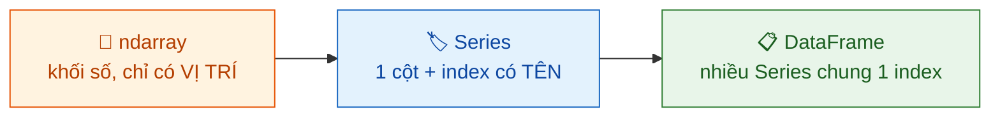

<!-- File: docs/lap-trinh-xu-ly-du-lieu/bai-04-lam-quen-pandas.md -->

# Bài 4: Làm quen với pandas

::: tip 🎯 Sau bài này bạn phải trả lời được
1. Vì sao `DataFrame` giải quyết đúng nhược điểm lớn nhất của `ndarray` (mảng chỉ có *vị trí*, không có *tên*)?
2. Thực hiện đủ "thói quen 5 bước" với một dataset lạ *trước khi* viết bất kỳ phân tích nào.
3. Phân biệt `df["price"]` với `df[["price"]]`, và `loc` với `iloc` — chỉ ra chính xác khi nào mỗi cú pháp trả về `Series` hay `DataFrame`.
:::

## 0. Nhập môn bằng một ẩn dụ: từ nhà kho đến bảng kê hàng hoá

Ở Bài 3, `ndarray` giống một nhà kho chứa các thùng hàng **giống hệt nhau, chỉ đánh số thứ tự** — muốn biết thùng số 3 chứa gì, bạn phải tự nhớ (hoặc tra riêng) rằng "cột 3 là giá" hay "cột 3 là vĩ độ". Rất dễ nhầm khi kho có hàng chục cột.

**pandas** giải quyết đúng vấn đề đó: mỗi thùng hàng giờ có **nhãn dán rõ ràng** (index), và toàn bộ nhà kho được sắp xếp thành một **bảng kê** với tên cột cụ thể (`DataFrame`). Bên dưới lớp nhãn này, dữ liệu vẫn là các mảng NumPy — nghĩa là gần như mọi kỹ năng vector hoá, mặt nạ bool, `axis` đã học ở Bài 3 **dùng lại được nguyên vẹn**.



## 1. Series & DataFrame là gì?

### 1.1 `Series` = mảng NumPy + nhãn (index)

```python
import pandas as pd

gia = pd.Series([45647, 19856, 46776],
                index=["phong_A", "phong_B", "phong_C"])
```
```text
phong_A    45647
phong_B    19856
phong_C    46776
dtype: int64
```

Bên trong `Series` vẫn là một mảng NumPy thuần (truy cập qua `gia.values`) — nhưng giờ tra cứu được **theo tên**: `gia["phong_B"]` thay vì phải nhớ vị trí `1`.

### 1.2 `DataFrame` = nhiều `Series` dùng chung một index

```python
df = pd.DataFrame({
    "gia":  [45647, 19856, 46776],
    "loai": ["Private", "Private", "Entire home"],
})
```
```text
     gia         loai
0  45647      Private
1  19856      Private
2  46776  Entire home
```

Mỗi cột có `dtype` riêng (số, chuỗi…) — đây là điểm khác biệt căn bản so với `ndarray` (vốn bắt buộc **toàn bộ mảng** chung một `dtype`). `DataFrame` biểu diễn một bảng dữ liệu thuận tiện hơn hẳn cấu trúc "list các dict" đã dùng tạm ở Bài 2.

::: tip Trực giác cốt lõi
Phần lớn kỹ năng NumPy ở Bài 3 — vector hoá, mặt nạ bool, tính theo `axis` — áp dụng **trực tiếp** trên từng cột của `DataFrame`, vì mỗi cột chính là một `Series`, và mỗi `Series` bên trong chính là một `ndarray`.
:::

## 2. Đọc dữ liệu thật & nhìn tổng quan

Dữ liệu dùng xuyên suốt bài: **18.534 phòng Airbnb ở Santiago, Chile.**

```python
URL = ("https://data.insideairbnb.com/chile/rm/santiago/"
       "2026-06-29/visualisations/listings.csv")
df = pd.read_csv(URL)
df.shape
```
```text
(18534, 19)
```

Một lệnh `read_csv` đọc toàn bộ 18.534 dòng × 19 cột, đồng thời **tự suy luận kiểu dữ liệu** cho từng cột — tiện lợi hơn hẳn việc tự parse CSV bằng `csv.DictReader` ở Bài 2 (nơi mọi giá trị đều là chuỗi).

### 📋 Thói quen 5 bước với dataset lạ — làm đủ TRƯỚC khi phân tích

| # | Bước | Trả lời câu hỏi | Lệnh |
|---|---|---|---|
| 1 | `shape` | To cỡ nào? | `df.shape` |
| 2 | `head`/`sample` | Trông ra sao? | `df.head(3)`, `df.sample(5)` |
| 3 | `info` | Kiểu gì, thiếu ở đâu? | `df.info()` |
| 4 | `describe` | Phân phối cột số có gì lạ? | `df["price"].describe()` |
| 5 | `value_counts` | Cột phân loại có những nhóm nào? | `df["room_type"].value_counts()` |

::: warning Đặc biệt quan trọng khi dùng AI
Làm đủ 5 bước này **trước khi** viết bất kỳ phân tích nào — nhất là khi code phân tích do AI viết. Không làm bước này, bạn sẽ không phát hiện được cột `price` thiếu 846 giá trị hay `room_type` chỉ có 4 nhóm cho đến khi kết quả cuối cùng đã sai.
:::

**Bước 3 — `df.info()`: cấu trúc và mức thiếu**

```text
RangeIndex: 18534 entries, 0 to 18533
 #   Column               Non-Null Count  Dtype
---  ------               --------------  -----
 10  price                17688 non-null  float64
 13  last_review          15243 non-null  str
```

Đọc ngay được: cột `price` thiếu $18534 - 17688 = 846$ ô.

**Bước 4 — `df["price"].describe()`:**

```text
count       17688.0
mean       118200.0
std       1226089.0
min           979.0
50%         59000.0
max      97000045.0
```

::: danger Tín hiệu cảnh báo cần đọc ra ngay từ bảng `describe()`
Trung bình (118.200 CLP) gần **gấp đôi** trung vị (59.000 CLP), và giá trị lớn nhất lên tới **97 triệu CLP/đêm** (~2,6 tỷ đồng). Đây là dấu hiệu **phân phối lệch mạnh, có giá trị cần kiểm tra kỹ** — đúng bài học về mean vs median đã học ở Bài 3, giờ xuất hiện ngay trên dữ liệu thật. Bài 10 sẽ trình bày cách xử lý những trường hợp này.
:::

**Bước 5 — `df["room_type"].value_counts()`:**

```text
room_type
Entire home/apt    15004
Private room        3413
Shared room           61
Hotel room            56
```

81% listing là nguyên căn (`Entire home/apt`) — cho thấy loại hình này chiếm phần lớn thị trường Santiago. Thêm `normalize=True` để tính trực tiếp tỷ lệ thay vì phải tự chia.

## 3. Chọn cột, lọc hàng

### 3.1 Chọn cột: 1 dấu ngoặc vs 2 dấu ngoặc

**Trước → Sau: cùng là chọn cột nhưng kết quả khác kiểu**

| Cú pháp | Kiểu kết quả | Ghi chú |
|---|---|---|
| `df["price"]` | `Series` | Một tên cột |
| `df[["name", "price"]]` | `DataFrame` | **List** tên cột — chú ý 2 lớp ngoặc! |

::: danger Bẫy `KeyError` kinh điển
```python
df["name", "price"]     # ❌ SAI — thiếu 1 lớp ngoặc, pandas hiểu đây là MỘT tuple khoá
                         #     → KeyError: ('name', 'price')
df[["name", "price"]]   # ✅ ĐÚNG — truyền một LIST tên cột
```
:::

### 3.2 Lọc hàng bằng mặt nạ bool — quy tắc giống hệt NumPy

**Trước → Sau: lọc theo hai điều kiện đồng thời**

| Trước | Điều kiện | Sau |
|---|---|---|
| 18.534 dòng (toàn bộ) | `room_type == "Entire home/apt"` **VÀ** `price < 50000` | 4.273 dòng thoả cả hai điều kiện |

```python
re_va_nguyen_can = df[(df["room_type"] == "Entire home/apt")
                      & (df["price"] < 50000)]
len(re_va_nguyen_can)     # 4273
```

Vẫn đúng quy tắc của NumPy: `&` `|` `~` kèm **ngoặc quanh từng điều kiện** — không dùng `and`/`or`.

### 3.3 `isin`: lọc theo danh sách giá trị

```python
khu_sang = df[df["neighbourhood"].isin(["Providencia", "Las Condes"])]
len(khu_sang)     # 5859
```

Ngắn gọn hơn hẳn việc nối nhiều điều kiện `==` bằng `|`, và đọc thành câu tự nhiên: *"neighbourhood nằm trong danh sách này"*.

### 3.4 `loc` và `iloc`: chọn theo nhãn hay theo vị trí?

| | `df.loc[hàng, cột]` | `df.iloc[hàng, cột]` |
|---|---|---|
| Chọn theo | **Nhãn** (tên cột, giá trị index) | **Số thứ tự** (vị trí, luật lát cắt như NumPy) |
| Ví dụ | `df.loc[df["price"] < 30000, ["neighbourhood", "price"]]` | `df.iloc[:3, :2]` (3 dòng đầu, 2 cột đầu) |
| Tương tự | `M[hàng, cột]` của NumPy, nhưng dùng nhãn | `M[hàng, cột]` của NumPy, y hệt vị trí |

```python
df.loc[df["price"] < 30000, ["neighbourhood", "price"]].head(3)
```
```text
  neighbourhood    price
1      Recoleta  19856.0
3      Recoleta  25572.0
9         Maipú  24013.0
```

::: tip Khi index còn là 0, 1, 2, …
Ở bài này, `loc` và `iloc` cho kết quả **trùng nhau về số** vì index mặc định đúng bằng thứ tự dòng. Bài 5 sẽ cho thấy chúng **khác nhau hoàn toàn** khi index không còn là dãy số liên tục (ví dụ sau khi `set_index("id")`).
:::

### 3.5 Thêm cột mới: công thức vector hoá từ cột cũ

**Trước → Sau: thêm cột quy đổi tiền tệ**

| Trước (`price`, đơn vị CLP) | Code | Sau (thêm cột `price_trieu_vnd`) |
|---|---|---|
| `45647.0` | `df["price"] * 28 / 1e6` | `≈ 1.28` (triệu đồng) |
| `19856.0` | (1 CLP ≈ 28 VND) | `≈ 0.56` |

```python
df["price_trieu_vnd"] = df["price"] * 28 / 1e6
df["price_trieu_vnd"].median().round(2)      # 1.65
```

Đúng phép toán vector hoá đã học ở Bài 3: công thức viết **một lần**, chạy trên **18.534 dòng** cùng lúc — không có vòng `for` nào ở đây.

## 4. Thống kê & sắp xếp

### 4.1 Thống kê trực tiếp trên `Series` kiểu bool

```python
(df["room_type"] == "Entire home/apt").mean()     # 0.81
```

Quy tắc "mảng bool có thể tính `.mean()` để ra tỷ lệ" đã học ở Bài 3 dùng nguyên được ở pandas: *tỷ lệ nguyên căn = 81%* — không cần đếm thủ công rồi chia.

### 4.2 Nếm trước `groupby` (nội dung chính của Bài 5)

**Trước → Sau: từ cột giá rời rạc đến trung vị theo từng nhóm**

```python
df.groupby("room_type")["price"].median()
```
```text
room_type
Entire home/apt     64900.0
Hotel room         117138.5
Private room        34235.0
Shared room         20541.0
```

Đọc thành câu: *"chia theo `room_type`, lấy cột `price`, tính trung vị mỗi nhóm"* — một chuỗi thao tác duy nhất thay thế hoàn toàn cho vòng lặp thủ công cộng dồn vào `dict` mà bạn có thể đã nghĩ đến từ thói quen Bài 2.

### 4.3 `nlargest` và chuỗi thao tác đọc như câu văn

```python
df.nlargest(2, "price")[["name", "price"]]
```
```text
                                    name       price
4485  Apartasuites EL CALEÑO 2 con e…  97000045.0
513   Apartamentos totalmente equipa…  82566932.0
```

Hai "căn hộ" gần trăm triệu CLP/đêm là ví dụ về **ngoại lai (outlier)** trong dữ liệu thực — đúng những con số bất thường đã thấy ở bước `describe()`.

```python
(df[df["room_type"] == "Entire home/apt"]
   .groupby("neighbourhood")["price"]
   .median()
   .nlargest(3))
```
```text
neighbourhood
Lo Barnechea    441669.0
Vitacura        148353.0
La Granja       114118.0
```

Mỗi dòng trong chuỗi trên tương ứng một bước: **lọc → nhóm → trung vị → top 3**. Kết quả của `La Granja` cần kiểm tra thêm vì nhóm này có thể chỉ chứa rất ít phòng (Bài 5 và Bài 10 sẽ trình bày cách đánh giá độ tin cậy của một nhóm nhỏ).

## 5. Giá trị thiếu (giới thiệu) & ghi file

### 5.1 Đo mức thiếu — chưa xử lý vội

**Trước → Sau: từ bảng 19 cột đến bảng xếp hạng mức độ thiếu**

```python
df.isna().sum().sort_values(ascending=False).head(4)
```
```text
neighbourhood_group    18534
license                18355
reviews_per_month       3291
price                    846
```

`neighbourhood_group` trống **100%** (`18534/18534`) — cột này **không cung cấp thông tin gì** trong snapshot hiện tại. Các ô `NaN` ở đây chính là những ô trống của NumPy đã gặp ở Bài 3.

::: warning Quan trọng: đo ≠ xử lý
`dropna()` (bỏ dòng thiếu) và `fillna(x)` (điền giá trị thay thế) đều là **quyết định phân tích**, không phải thao tác kỹ thuật đơn thuần: 846 phòng không có giá — bỏ hay giữ tuỳ thuộc *câu hỏi bạn đang trả lời*. Bài này chỉ dừng ở việc **biết đo** mức thiếu; toàn bộ cách xử lý dành cho Bài 10.
:::

### 5.2 Ghi kết quả ra file

```python
ket_qua = df.groupby("room_type")["price"].median()
ket_qua.to_csv("gia_theo_loai.csv")

df.to_parquet("listings.parquet")   # nhanh hơn CSV + GIỮ NGUYÊN dtype (chi tiết ở Bài 6)
```

::: tip Tham số hay bị quên: `index=False`
Khi ghi `DataFrame` ra CSV mà index chỉ là số thứ tự mặc định (0, 1, 2, …), thêm `index=False`. Bỏ qua tham số này, lần đọc file sau có thể xuất hiện thêm một cột lạ tên `"Unnamed: 0"`.
:::

## 📋 Cheat Sheet — 7 lệnh pandas phải nhớ

| # | Cú pháp | Công dụng |
|---|---|---|
| 1 | `pd.read_csv(url_hoặc_path)` | Đọc bảng, tự suy luận dtype |
| 2 | `df.shape / .head() / .info() / .describe() / .value_counts()` | Thói quen 5 bước với dataset lạ |
| 3 | `df[["a","b"]]` (2 lớp ngoặc) | Chọn nhiều cột → `DataFrame` |
| 4 | `df[(cond1) & (cond2)]` | Lọc hàng bằng mặt nạ bool nhiều điều kiện |
| 5 | `df.loc[hàng, cột]` / `df.iloc[hàng, cột]` | Chọn theo nhãn / theo vị trí |
| 6 | `df.groupby(khoá)[cột].agg_func()` | Thống kê theo nhóm (xem sâu ở Bài 5) |
| 7 | `df.isna().sum()` | Đo mức thiếu từng cột trước khi xử lý |

## Tổng kết

- `DataFrame` = các `Series` dùng chung một index; phần lớn thao tác NumPy (vector hoá, mặt nạ bool, `axis`) vẫn áp dụng được trực tiếp trên từng cột.
- Thói quen 5 bước bắt buộc với dataset lạ: `shape → head → info → describe → value_counts` — làm **trước** khi phân tích, đặc biệt khi dùng code do AI viết.
- Lọc bằng mặt nạ bool, `loc[hàng, cột]`, và tạo cột mới bằng công thức vector hoá là ba thao tác nền tảng dùng lại liên tục trong suốt môn học.
- `isna().sum()` giúp **đo** mức thiếu — quyết định **xử lý thế nào** (`dropna`/`fillna`) để dành cho Bài 10.

## 🧠 Mẹo thi & bẫy thường gặp

::: warning Câu hỏi hay đánh lừa
- **`df["name", "price"]`** → lỗi `KeyError`, thiếu một lớp ngoặc; phải viết `df[["name", "price"]]`.
- **"`describe()` cho thấy `mean` cao hơn `median` nghĩa là dữ liệu bị lỗi"** → không hẳn: đây là dấu hiệu **phân phối lệch** (có thể do outlier thật hoặc lỗi nhập liệu), cần kiểm tra thêm bằng `nlargest`, chưa thể kết luận ngay là lỗi.
- **"`loc` và `iloc` luôn cho cùng kết quả"** → chỉ đúng khi index là dãy số 0,1,2,… liên tục; sai ngay khi `set_index()` bằng cột khác (xem Bài 5).
- **"Cột thiếu 100% dữ liệu là lỗi khi đọc file"** → không nhất thiết, có thể snapshot đó thực sự không có thông tin (như `neighbourhood_group`) — cần xác nhận bằng nguồn dữ liệu gốc.
- **Quên `index=False` khi `to_csv`** → sinh ra cột thừa `"Unnamed: 0"` ở lần đọc lại sau.
:::

## 📚 Đọc thêm & tài nguyên

- McKinney, *Python for Data Analysis*, 3rd ed. — [chương 5: pandas Basics](https://wesmckinney.com/book/pandas-basics) (miễn phí online).
- VanderPlas, *Python Data Science Handbook*, 2nd ed. — Phần 3, các mục đầu về `Series`/`DataFrame`.
- [10 minutes to pandas (pandas docs chính thức)](https://pandas.pydata.org/docs/user_guide/10min.html) — tổng quan nhanh, đối chiếu tốt với bài giảng.
- [pandas User Guide — Indexing and selecting data](https://pandas.pydata.org/docs/user_guide/indexing.html) — tài liệu gốc cho `loc`/`iloc`.

::: info 🤖 Làm việc với AI thì sao?
**AI làm tốt:** chuyển câu hỏi tiếng Việt thành chuỗi thao tác pandas hợp lý (ví dụ "median giá theo quận, chỉ nguyên căn").
**AI hay sai:** bỏ qua 846 ô giá trống mà không nêu rõ; dùng `mean` khi phân phối lệch phù hợp hơn với `median`; dùng tên cột không tồn tại trong **đúng bộ dữ liệu của bạn** (AI có thể nhớ nhầm tên cột từ một bộ Airbnb khác).
**Kiểm chứng bằng cách nào:** chạy thói quen 5 bước **trước**, để biết chắc cột nào có thật và thiếu bao nhiêu — rồi mới đối chiếu với code AI đưa ra; với một con số AI tính ra, tự tính lại bằng cách khác (lọc trực tiếp + `describe`) để so sánh.
:::
