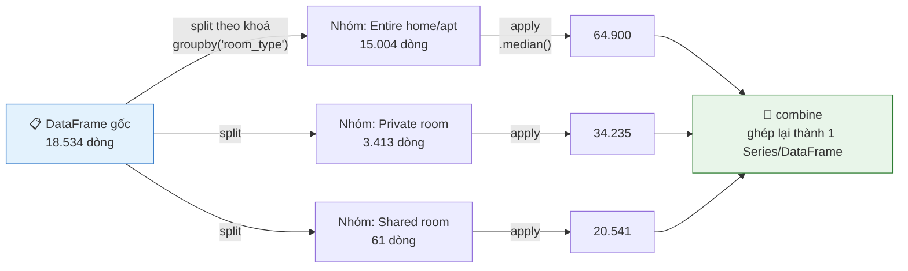
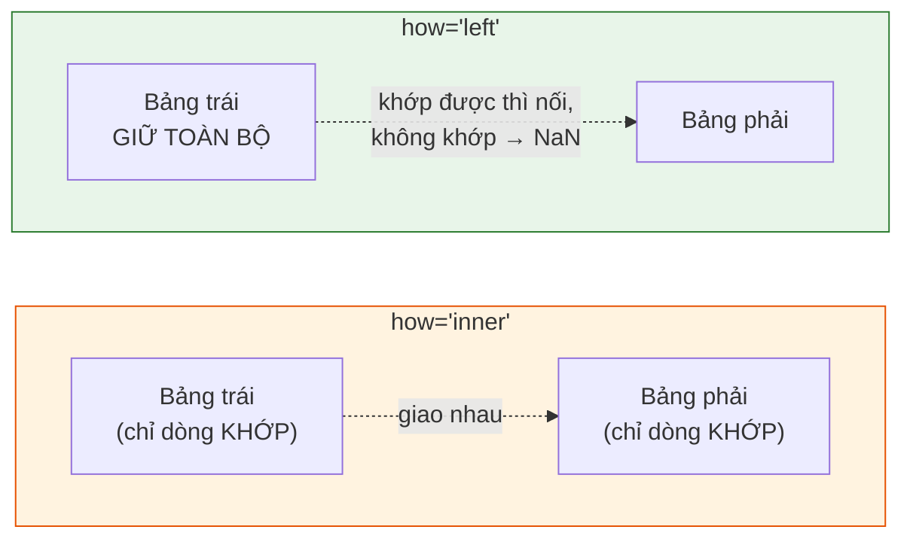

<!-- File: docs/lap-trinh-xu-ly-du-lieu/bai-05-series-dataframe-chuyen-sau.md -->

# Bài 5: Series & DataFrame chuyên sâu

::: tip 🎯 Sau bài này bạn phải trả lời được
1. Vì sao `df.loc[2]` và `df.iloc[2]` có thể trả về **hai dòng hoàn toàn khác nhau** — và vì sao phép toán giữa hai `Series` có thể âm thầm sinh ra `NaN` mà không báo lỗi.
2. Chọn đúng công cụ biến đổi cột theo thứ tự ưu tiên: **vector hoá → `map` → `apply`** — giải thích được vì sao thứ tự này không phải ngẫu nhiên.
3. Phân biệt `agg` và `transform`; chọn đúng `how` khi `merge`, và biết kiểm tra kết quả `merge` để phát hiện dòng bị nhân bản hoặc mất khớp.
:::

## 0. Nhập môn bằng một ẩn dụ: chứng minh nhân dân của một dòng dữ liệu

**Index** không phải "số thứ tự xếp hàng" — nó là **chứng minh nhân dân (CMND)** của mỗi dòng dữ liệu, dùng để *nhận diện*, không phải để *đếm vị trí*.

- `iloc[2]` giống như hỏi: *"người đứng ở vị trí thứ 3 trong hàng là ai?"* (đếm theo chỗ đứng vật lý).
- `loc[2]` giống như hỏi: *"người mang CMND số 2 là ai?"* (tra theo danh tính) — người này **có thể đang đứng bất kỳ đâu** trong hàng.

Nếu hàng người xếp đúng thứ tự CMND 0, 1, 2, 3, … thì hai câu hỏi tình cờ cho cùng một người. Nhưng ngay khi thứ tự xếp hàng bị xáo trộn (rất phổ biến sau khi lọc, sắp xếp, hoặc `set_index` bằng một cột khác), hai câu hỏi trả về **hai người khác nhau hoàn toàn**.

## 1. Index là gì?

### 1.1 `set_index`: biến một cột thành "CMND" tra cứu

```python
d = df.set_index("id")
d.loc[978070332077815549, ["neighbourhood", "price"]]
```
```text
neighbourhood      Ñuñoa
price            45647.0
```

Giờ có thể tìm phòng theo **ID thật** thay vì phải nhớ vị trí dòng — đúng bản chất "tra theo danh tính" chứ không phải "đếm theo vị trí".

::: info Ghi chú thực tế
ID Airbnb tạo từ năm 2022 dài 18–19 chữ số — chiếm 82% listing tại Santiago; ID cũ hơn chỉ có 5–8 chữ số. Đây là lý do vì sao ID trong ví dụ trên trông "khổng lồ" so với các số ID quen thuộc.
:::

### 🔍 Dry Run — `loc` theo nhãn vs `iloc` theo vị trí

```python
s = pd.Series([10, 20, 30], index=[2, 0, 1])
```

| Vị trí vật lý (0,1,2,…) | 0 | 1 | 2 |
|---|---|---|---|
| Nhãn (index) | 2 | 0 | 1 |
| Giá trị | 10 | 20 | 30 |

| Truy vấn | Cách đọc | Kết quả |
|---|---|---|
| `s.loc[2]` | "giá trị mang **nhãn** 2" | `10` (nhãn 2 nằm ở vị trí đầu tiên!) |
| `s.iloc[2]` | "giá trị ở **vị trí thứ 3**" | `30` |

```python
s.loc[2], s.iloc[2]     # (10, 30) — hai kết quả khác hẳn nhau
```

::: danger Bẫy nghiêm trọng nhất của mục này
Khi index là **số nhưng không phải dãy 0,1,2,… liên tục** (rất thường gặp sau khi lọc hoặc sắp xếp `DataFrame`), `loc[2]` và `iloc[2]` gần như chắc chắn **không trỏ tới cùng một dòng**. Đề thi hay cho một `DataFrame` đã qua lọc/sắp xếp rồi hỏi kết quả của `loc` so với `iloc` tại cùng một số — luôn phải kẻ bảng "nhãn ↔ vị trí" như trên trước khi trả lời.
:::

### 1.2 Alignment: phép toán tự động khớp theo nhãn (index)

**Trước → Sau: hai Series không cùng thứ tự, không cùng đầy đủ nhãn**

```python
t9  = pd.Series({"Centro": 50, "Ñuñoa": 40, "Vitacura": 120})
t12 = pd.Series({"Ñuñoa": 44, "Centro": 55, "La Reina": 35})

((t12 - t9) / t9 * 100).round(1)
```

| Nhãn | Có ở `t9`? | Có ở `t12`? | Kết quả `(t12-t9)/t9*100` |
|---|---|---|---|
| Centro | ✅ 50 | ✅ 55 | `10.0` |
| Ñuñoa | ✅ 40 | ✅ 44 | `10.0` |
| Vitacura | ✅ 120 | ❌ | **`NaN`** |
| La Reina | ❌ | ✅ 35 | **`NaN`** |

pandas ghép **"Centro" với "Centro", "Ñuñoa" với "Ñuñoa"** theo *nhãn* — hoàn toàn không quan tâm thứ tự lưu trữ trong mỗi `Series`.

::: danger Alignment vừa là lợi thế, vừa là cái bẫy lớn nhất của pandas
**Lợi:** không cần tự sắp xếp lại hai bảng trước khi tính toán — pandas tự ghép đúng theo nhãn dù thứ tự khác nhau.
**Bẫy:** một nhãn chỉ xuất hiện ở **một trong hai** `Series` sẽ cho kết quả `NaN` — **không hề có lỗi hay cảnh báo nào được in ra**. Rất dễ vô tình "mất" dữ liệu của `Vitacura`/`La Reina` mà không nhận ra.

**Quy tắc bắt buộc:** sau *mọi* phép toán giữa hai `Series`/`DataFrame`, đếm ngay `isna().sum()` — nếu số `NaN` mới xuất hiện > 0, đó chính là dấu hiệu có nhãn không khớp giữa hai bên.
:::

### 1.3 `reset_index`: trả nhãn về làm cột thường

```python
gia_quan = df.groupby("neighbourhood")["price"].median()   # kết quả: khoá nằm Ở INDEX
gia_quan.reset_index().head(2)
```
```text
  neighbourhood    price
0     Cerrillos  45500.0
1   Cerro Navia  36992.0
```

`groupby` luôn trả kết quả với khoá nhóm nằm ở `index`. Dùng `reset_index()` khi cần đưa khoá đó về lại thành **cột thông thường** — thường là bước bắt buộc trước khi `merge`, vẽ biểu đồ, hoặc ghi ra file phẳng.

## 2. Biến đổi giá trị: vector hoá → `map` → `apply`

### 2.1 Ba nấc thang tốc độ — đúng tinh thần "tư duy vector hoá" của Bài 3

| Nấc | Cú pháp | Tốc độ | Khi nào dùng |
|---|---|---|---|
| **1. Vector hoá có sẵn** | `df["price"] * 28`, `.str.lower()` | ⚡⚡⚡ nhanh nhất | Luôn ưu tiên đầu tiên — phép toán/toán tử pandas viết sẵn |
| **2. `map`** | `s.map(clean_price)`, `s.map(dict_tra_cuu)` | ⚡⚡ trung bình | Cần áp một hàm/dict lên **từng giá trị** của một cột, không có sẵn vector hoá tương ứng |
| **3. `apply(axis=1)`** | `df.apply(f, axis=1)` | 🐌 chậm nhất | Logic cần **nhiều cột trong cùng một dòng** cùng lúc, không thể vector hoá |

::: tip Nguyên tắc quyết định — hỏi theo đúng thứ tự này
1. *"Có toán tử/phương thức pandas có sẵn làm được việc này không?"* → dùng nó.
2. *"Có phải áp một hàm/dict lên từng giá trị của MỘT cột không?"* → `map`.
3. *"Có bắt buộc phải nhìn NHIỀU cột trong cùng một dòng cùng lúc không?"* → mới cần `apply(axis=1)`, và **luôn kiểm tra lại** xem có cách viết vector hoá thay thế được không trước khi chấp nhận dùng `apply`.
:::

### 2.2 `map` với `dict`: đổi tên hàng loạt

**Trước → Sau: chuẩn hoá nhãn tiếng Anh sang tiếng Việt**

| Trước (`room_type`) | Code | Sau (`loai`) |
|---|---|---|
| `"Entire home/apt"` | | `"Nguyên căn"` |
| `"Private room"` | `df["room_type"].map(viet_hoa)` | `"Phòng riêng"` |

```python
viet_hoa = {"Entire home/apt": "Nguyên căn",
            "Private room": "Phòng riêng",
            "Shared room": "Phòng chung",
            "Hotel room": "Khách sạn"}
df["loai"] = df["room_type"].map(viet_hoa)
```

::: warning Bẫy: giá trị ngoài `dict` biến thành `NaN` âm thầm
Nếu `room_type` có một giá trị không nằm trong `viet_hoa` (ví dụ do dữ liệu mới phát sinh thêm loại phòng), `map` sẽ trả về `NaN` cho dòng đó — **không báo lỗi**. Luôn `isna().sum()` cột kết quả sau khi `map` bằng `dict` để chắc chắn không "làm rơi" giá trị nào.
:::

### 2.3 `map` với hàm — dùng lại `clean_price` từ Bài 2

```python
gia_chuoi = pd.Series(["$45,647.00", "N/A", "$19,856.00"])
gia_chuoi.map(clean_price)          # hàm viết ở Bài 2, giờ chạy trên CẢ CỘT
```
```text
0    45647.0
1        NaN
2    19856.0
dtype: float64
```

Chính hàm `clean_price` viết bằng `def`/`try-except` ở Bài 2 — không cần viết lại — chỉ cần `map` để áp dụng lên toàn bộ cột thay vì gọi từng giá trị bằng tay.

### 2.4 `apply(axis=1)` — chỉ dùng khi thực sự cần nhiều cột

```python
def diem_hap_dan(r):
    if pd.isna(r["price"]) or r["price"] == 0:
        return None
    return r["number_of_reviews_ltm"] / r["price"] * 10_000

df["hap_dan"] = df.apply(diem_hap_dan, axis=1)     # 🐌 chậm — gọi hàm Python cho TỪNG DÒNG
```

::: danger Bẫy AI hay mắc nhất ở Bài 5
Ví dụ trên **có thể viết lại hoàn toàn bằng vector hoá**, nhanh hơn nhiều:
```python
df["hap_dan"] = df["number_of_reviews_ltm"] / df["price"] * 1e4   # ⚡⚡⚡
```
`apply(axis=1)` gọi một hàm Python thuần cho **từng dòng riêng lẻ**, mất đi toàn bộ lợi thế vector hoá đã học ở Bài 3. AI rất hay đề xuất `apply(axis=1)` như phản xạ đầu tiên vì cú pháp "trông tổng quát" — luôn tự hỏi lại: *"phép tính này có viết được bằng các cột trực tiếp không?"* trước khi chấp nhận.
:::

## 3. `groupby` — chia để trị

### 3.1 Cơ chế split–apply–combine



`groupby` **chia** bảng theo khoá, **áp** phép tính cho từng nhóm riêng biệt, rồi **ghép** kết quả lại — toàn bộ ba bước này được biểu diễn trong **một câu lệnh** duy nhất.

### 3.2 Nhóm lồng nhau (nhiều khoá) → `MultiIndex`

```python
df.groupby(["neighbourhood", "room_type"])["price"].median().head(4)
```
```text
neighbourhood  room_type
Cerrillos      Entire home/apt    52116.0
               Private room       29100.0
               Shared room        40169.0
Cerro Navia    Entire home/apt    51261.0
```

Kết quả mang **`MultiIndex`** (nhãn hai tầng: quận + loại phòng). Dùng `reset_index()` khi cần thao tác với các khoá này như cột thông thường.

### 3.3 `agg` đặt tên — thống kê đi kèm cỡ nhóm

**Trước → Sau: từ cột giá thô đến bảng xếp hạng đã lọc theo độ tin cậy**

```python
tk = df.groupby("neighbourhood")["price"].agg(
    trung_vi="median", so_phong="size")

tk[tk["so_phong"] >= 500].nlargest(3, "trung_vi")
```
```text
               trung_vi  so_phong
neighbourhood
Lo Barnechea   426230.0       824
Las Condes      97460.0      2862
Providencia     72845.0      2997
```

::: warning Bài học từ Bài 4, áp dụng lại ở đây
Lọc **cỡ nhóm ≥ 500** *trước khi* xếp hạng bằng `nlargest` — tránh kết luận dựa trên một nhóm chỉ có vài phòng (như trường hợp `La Granja` đáng ngờ đã thấy ở Bài 4).
:::

### 3.4 `transform`: đưa kết quả nhóm quay lại từng dòng

**So sánh trực tiếp `agg` và `transform` — điểm khác biệt hay bị nhầm nhất**

| | `agg` | `transform` |
|---|---|---|
| Số dòng kết quả | **Một dòng mỗi nhóm** | **Đúng bằng độ dài bảng gốc** |
| Dùng để | Tạo bảng tổng hợp riêng | So **từng dòng gốc** với "chuẩn" của nhóm nó |

```python
trung_vi_quan = df.groupby("neighbourhood")["price"].transform("median")
df["he_so_gia"] = df["price"] / trung_vi_quan

df[df["he_so_gia"] > 20].shape[0]    # 23 — phòng đắt gấp hơn 20 lần trung vị QUẬN MÌNH
```

23 phòng có `he_so_gia > 20` là các **ứng viên ngoại lai** cần kiểm tra thêm — phát hiện được chính nhờ `transform` giữ nguyên độ dài bảng để so sánh **theo từng dòng**, điều mà `agg` không làm được.

### 3.5 `pivot_table`: bảng chéo hai chiều

**Trước → Sau: từ groupby hai khoá đến bảng "quận × loại phòng"**

```python
df.pivot_table(values="price", index="neighbourhood",
               columns="room_type", aggfunc="median")
```
```text
room_type      Entire home/apt  Private room
neighbourhood
Las Condes            106129.0       40366.0
Providencia            81709.0       38400.0
Santiago               49352.0       31250.0
```

::: info `pivot_table` thực chất là gì?
`pivot_table` = `groupby` theo **hai khoá** (`index` + `columns`) rồi **trải một khoá ra thành các cột** thay vì để cả hai khoá xếp chồng trong một `MultiIndex`. Định dạng bảng "quận × loại phòng" này rất phổ biến khi trình bày trong báo cáo — dễ đọc hơn nhiều so với `MultiIndex` phẳng ở mục 3.2.
:::

::: tip Nhận diện khi nào cần `groupby`
Bất cứ khi nào câu hỏi có dạng *"…theo từng quận / mỗi loại phòng / hàng tháng…"*, hãy nghĩ ngay đến khuôn mẫu: `groupby(khoá)[cột].phép_tính()`.
:::

## 4. Ghép bảng: `concat` và `merge`

### 4.1 `concat`: ghép DỌC theo snapshot (cùng cấu trúc cột)

```python
t9["snapshot"] = "2025-09"        # gắn nguồn gốc TRƯỚC khi concat
t6["snapshot"] = "2026-06"

ca_hai = pd.concat([t9, t6], ignore_index=True)
ca_hai.groupby("snapshot").size()
```
```text
snapshot
2025-09    16772
2026-06    18534
```

::: tip Mẹo quan trọng
Luôn thêm một cột đánh dấu **nguồn gốc** (ví dụ `snapshot`) *trước khi* `concat` — nếu không, sau khi ghép sẽ **không còn cách nào phân biệt** dòng nào đến từ bảng nào.
:::

### 4.2 `merge`: ghép NGANG theo khoá chung



| `how=` | Giữ lại | Dùng khi nào |
|---|---|---|
| `"inner"` | Chỉ dòng **khớp ở cả hai bảng** | Chỉ quan tâm dữ liệu đầy đủ cả hai phía |
| `"left"` | **Toàn bộ** bảng trái, điền `NaN` nếu không khớp | Muốn giữ nguyên bảng chính, chỉ *bổ sung thêm* thông tin nếu có |

**Trước → Sau: bổ sung cột `vung` (vùng) vào bảng listings gốc**

```python
vung = pd.DataFrame({
    "neighbourhood": ["Santiago", "Providencia", "Las Condes", "Ñuñoa"],
    "vung": ["Trung tâm", "Đông", "Đông", "Đông"],
})
m = df.merge(vung, on="neighbourhood", how="left")

m.groupby("vung")["price"].median()
```
```text
vung
Trung tâm    47755.0
Đông         76628.5
```

| Trước (`df`) | Sau (`m`) |
|---|---|
| 19 cột, không có thông tin vùng | 20 cột, thêm `vung` (hoặc `NaN` nếu quận chưa có trong bảng tra cứu) |

Nhờ `merge`, có thể phân tích giá theo vùng dù dữ liệu gốc **chưa hề có cột này**.

### 4.3 Kiểm tra bắt buộc sau mọi `merge`

```python
len(df), len(m), m["vung"].isna().sum()
```
```text
(18534, 18534, 3680)
```

::: danger Merge có thể âm thầm cho kết quả sai — không có gì báo lỗi
- Nếu **số dòng tăng** sau `merge` (`len(m) > len(df)`) → khoá bên phải khả năng cao **bị trùng lặp**, khiến mỗi dòng bên trái bị nhân bản.
- Có 3.680 giá trị `vung = NaN` ở ví dụ trên → 3.680 quận **chưa có mặt** trong bảng tra cứu `vung` — không phải lỗi hệ thống, nhưng là điều **bắt buộc phải biết** trước khi phân tích tiếp theo cột này.
:::

```python
m = df.merge(vung, on="neighbourhood",
             how="left", validate="m:1")
# nghĩa là: nhiều listing (m) khớp với ĐÚNG 1 dòng vùng (1)
# nếu vi phạm quan hệ này -> pandas tự phát sinh MergeError
```

::: tip `validate=` — "lưới an toàn" cho merge
Tham số `validate` (`"1:1"`, `"1:m"`, `"m:1"`, `"m:m"`) buộc pandas **kiểm tra quan hệ khoá** và chủ động báo lỗi (`MergeError`) nếu quan hệ thực tế không đúng như khai báo — thay vì để bạn tự phát hiện qua việc "số dòng tự nhiên tăng lên" một cách khó hiểu.
:::

## 📋 Cheat Sheet — 7 lệnh pandas chuyên sâu phải nhớ

| # | Cú pháp | Công dụng |
|---|---|---|
| 1 | `df.set_index("col")` / `.reset_index()` | Đổi cột ↔ index |
| 2 | `s.loc[nhãn]` vs `s.iloc[vị_trí]` | Tra theo danh tính vs theo chỗ đứng |
| 3 | `isna().sum()` sau mọi phép toán giữa 2 Series | Phát hiện NaN do alignment lệch nhãn |
| 4 | vector hoá → `s.map(f)` → `df.apply(f, axis=1)` | Thứ tự ưu tiên tốc độ khi biến đổi cột |
| 5 | `df.groupby(k)[c].agg(ten="hàm")` vs `.transform("hàm")` | 1 dòng/nhóm vs giữ nguyên độ dài bảng |
| 6 | `df.pivot_table(values=, index=, columns=, aggfunc=)` | Bảng chéo hai chiều cho báo cáo |
| 7 | `a.merge(b, on=, how=, validate=)` | Ghép ngang có kiểm tra quan hệ khoá |

## Tổng kết

- Index là **danh tính** của dòng, không phải vị trí: `loc` tra theo nhãn, `iloc` tra theo số thứ tự — hai giá trị này chỉ tình cờ trùng nhau khi index là dãy 0,1,2,… liên tục.
- **Alignment** tự động ghép hai `Series`/`DataFrame` theo nhãn — tiện lợi nhưng sinh `NaN` âm thầm khi nhãn không khớp đủ ở cả hai bên; luôn kiểm tra `isna().sum()` sau phép toán.
- Thứ tự ưu tiên biến đổi cột: **vector hoá có sẵn → `map` → `apply`** — chỉ "hạ cấp" xuống nấc chậm hơn khi nấc trên thực sự không làm được.
- `agg` cho một dòng mỗi nhóm; `transform` giữ nguyên độ dài bảng để so sánh từng dòng với "chuẩn" của nhóm nó; `pivot_table` là cách trình bày groupby hai khoá dưới dạng bảng chéo.
- Sau mọi `merge`: kiểm tra số dòng có tăng bất thường không, đếm `NaN` ở cột mới, và cân nhắc dùng `validate=` để pandas tự phát hiện vi phạm quan hệ khoá.

## 🧠 Mẹo thi & bẫy thường gặp

::: warning Câu hỏi hay đánh lừa trong đề UET
- **"`df.loc[2]` và `df.iloc[2]` luôn cho cùng một dòng"** → chỉ đúng khi index là 0,1,2,… liên tục; sai ngay sau khi lọc/sắp xếp hoặc `set_index` bằng cột khác — đề hay cho một `DataFrame` đã qua `sort_values` rồi hỏi kết quả `loc`/`iloc`.
- **"Phép trừ hai `Series` báo lỗi nếu thiếu nhãn ở một bên"** → SAI, kết quả vẫn chạy, chỉ sinh `NaN` cho nhãn không khớp, **không có lỗi hay cảnh báo**.
- **"`agg` và `transform` chỉ khác nhau ở tên gọi, dùng hàm nào cũng ra kết quả tương tự"** → SAI, khác nhau ở **số dòng kết quả**: `agg` rút gọn về 1 dòng/nhóm, `transform` giữ nguyên độ dài bảng gốc.
- **"Sau `merge`, số dòng bằng bảng trái nghĩa là merge đúng"** → chưa chắc; vẫn cần đếm `NaN` ở cột mới để biết có bao nhiêu dòng "khớp giả" (không tìm thấy đối tác, bị điền `NaN`).
- **"`apply(axis=1)` là cách tổng quát nên luôn an toàn để dùng"** → an toàn về mặt kết quả, nhưng **chậm hơn đáng kể** so với vector hoá; đề hay hỏi "viết lại đoạn `apply` sau bằng vector hoá" — luôn kiểm tra khả năng này trước.
:::

## 📚 Đọc thêm & tài nguyên

- McKinney, *Python for Data Analysis*, 3rd ed. — [chương 8: Data Wrangling: Join, Combine, and Reshape](https://wesmckinney.com/book/data-wrangling) · [chương 10: Data Aggregation and Group Operations](https://wesmckinney.com/book/data-aggregation).
- [pandas User Guide — Group by: split-apply-combine](https://pandas.pydata.org/docs/user_guide/groupby.html) (tài liệu chính thức).
- [pandas User Guide — Merge, join, concatenate and compare](https://pandas.pydata.org/docs/user_guide/merging.html) (tài liệu chính thức, có giải thích chi tiết `validate=`).
- [pandas User Guide — Reshaping and pivot tables](https://pandas.pydata.org/docs/user_guide/reshaping.html).

::: info 🤖 Làm việc với AI thì sao?
**AI làm tốt:** viết biểu thức `groupby`/`pivot_table` từ mô tả tiếng Việt; giải thích lỗi liên quan đến `MultiIndex`.
**AI hay sai:** chọn `how` cho `merge` không dựa trên yêu cầu thực tế (mặc định hay chọn `"inner"` dù cần giữ toàn bộ bảng trái); không chủ động kiểm tra dòng bị loại hoặc bị nhân bản sau `merge`; đề xuất `apply(axis=1)` cho phép tính có thể vector hoá trực tiếp.
**Kiểm chứng bằng cách nào:** trước và sau mỗi `merge` do AI viết, in `len()` của cả hai bảng và đếm `NaN` ở cột mới; với `groupby` phức tạp, tách riêng **một nhóm nhỏ**, lọc thủ công và tính lại kết quả để đối chiếu.
:::
