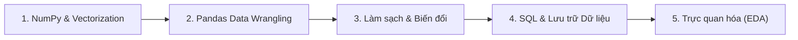

# Lập Trình Xử Lý Dữ Liệu 🐍💻

Môn học **Lập trình Xử lý Dữ liệu** tập trung vào hệ sinh thái phân tích và xử lý dữ liệu mạnh mẽ nhất của Python (NumPy, Pandas, Polars), kỹ thuật làm sạch dữ liệu và xây dựng pipeline xử lý dữ liệu chuẩn công nghiệp.

---

## 🗺️ Lộ trình Ôn tập Trọng tâm

## 📚 Danh mục Bài học

- [x] [**Bài 1: Tổng quan môn học, công cụ & chính sách AI**](./bai-01-tong-quan-cong-cu-chinh-sach-ai.md)
  - Ẩn dụ gian bếp nhà hàng: 5 công đoạn xử lý dữ liệu
  - Môi trường lập trình: `venv`, `requirements.txt`, `.python-version`
  - Chính sách sử dụng AI (Chế độ đóng 🚫 vs Chế độ mở ✅)
- [x] [**Bài 2: Python cơ bản cho xử lý dữ liệu**](./bai-02-python-co-ban.md)
  - So sánh và chọn đúng cấu trúc: `list`, `dict`, `set`, `tuple`
  - Tư duy viết hàm, lambda và xử lý chuỗi dữ liệu
- [x] [**Bài 3: NumPy và tư duy vector hoá**](./bai-03-numpy.md)
  - Bản chất `ndarray` trong bộ nhớ và tại sao nhanh hơn `list`
  - Broadcasting, Vectorization và các hàm toán học mảng
- [x] [**Bài 4: Làm quen với pandas**](./bai-04-lam-quen-pandas.md)
  - Khắc phục nhược điểm của mảng không tên: Cấu trúc Series & DataFrame
  - Đọc ghi file (CSV, Excel), kiểm tra kiểu dữ liệu và tổng quan
- [x] [**Bài 5: Series & DataFrame chuyên sâu**](./bai-05-series-dataframe-chuyen-sau.md)
  - Phân biệt triệt để `loc` vs `iloc`, Index Alignment và bẫy phát sinh `NaN`
  - Lọc dữ liệu điều kiện boolean indexing và các phép biến đổi cốt lõi
