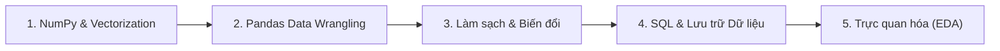

# Lập Trình Xử Lý Dữ Liệu 🐍💻

Môn học **Lập trình Xử lý Dữ liệu** tập trung vào hệ sinh thái phân tích và xử lý dữ liệu mạnh mẽ nhất của Python (NumPy, Pandas, Polars), kỹ thuật làm sạch dữ liệu và xây dựng pipeline xử lý dữ liệu chuẩn công nghiệp.

---

## 🗺️ Lộ trình Ôn tập Trọng tâm

- **Chương 1:** Mảng đa chiều NumPy và Tư duy Vector hóa (Broadcasting, Indexing)
- **Chương 2:** Cấu trúc Series & DataFrame trong Pandas
- **Chương 3:** Kỹ thuật Làm sạch dữ liệu: Xử lý Missing values, Duplicates, Outliers
- **Chương 4:** Biến đổi dữ liệu nâng cao: GroupBy, Aggregations, Pivot Tables, Merge/Join
- **Chương 5:** Truy vấn dữ liệu với SQL và tích hợp Python
- **Chương 6:** Khám phá dữ liệu (EDA) với Matplotlib & Seaborn
